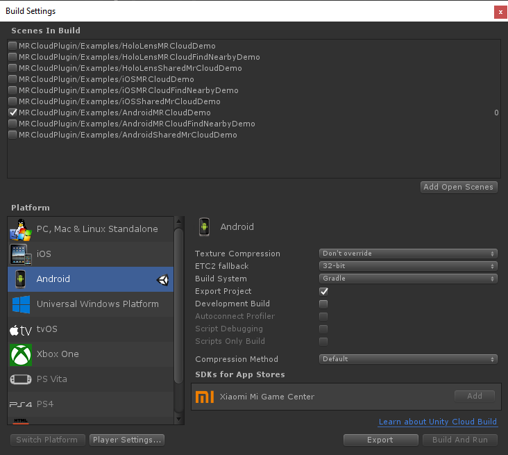

# Quickstart: Create an Android Unity app with Spatial Anchors

[Spatial Anchors](overview.md) is a cross-platform developer service that makes it easy for you to create
Mixed Reality experiences.​ This quickstart shows how to create an Android Unity app using spatial anchors. When you're finished,
you'll have an ARCore Android app built with Unity that can save and recall a spatial anchor.

[!INCLUDE [quickstarts-free-trial-note](../../../includes/quickstarts-free-trial-note.md)]

## Prerequisites

Before you get started, here's a list of prerequisites:

- A macOS or Windows machine with <a href="https://unity3d.com/get-unity/download" target="_blank">Unity 2018.2+</a> and <a href="https://developer.android.com/studio/" target="_blank">Android Studio</a> installed.
- An <a href="https://developers.google.com/ar/discover/supported-devices" target="_blank">ARCore capable</a> Android device.

[!INCLUDE [Create Spatial Anchors resource](../../../includes/spatial-anchors-get-started-create-resource.md)]

## Open the sample project in Unity

[!INCLUDE [Clone Sample Repo](../../../includes/spatial-anchors-clone-sample-repository.md)]

Open Unity and open the project at the `unity\samples` folder.

Open **Build Settings** by selecting **File** -> **Build Settings**.

In the **Platform** section, select **Android**. Then, change the **Build System** to **Gradle** and check the **Export Project** option.

Select **Switch Platform** to change the platform to **Android**.

Close the **Build Settings** window.

## Download and import the ARCore SDK for Unity

Download the `unitypackage` file from the [ARCore SDK for Unity releases](https://github.com/google-ar/arcore-unity-sdk/releases/tag/v1.5.0). Back in the Unity project, select **Assets** -> **Import Package** -> **Custom Package...** and then select the `unitypackage` file you previously downloaded. In the **Import Unity Package** dialog, make sure all of the files are selected and then select **Import**.

## Configure the Spatial Anchors endpoint and account key

In the **Project** pane, navigate to `Assets/MRCloudPlugin/Examples` and open the `AndroidMRCloudDemo.unity` scene file.

[!INCLUDE [Configure Unity Scene](../../../includes/spatial-anchors-unity-configure-scene.md)]

## Export the Android Studio project

Open **Build Settings** by selecting **File** -> **Build Settings**.

Under **Scenes In Build**, place a check mark next to the `MRCloudPlugin/Examples/AndroidMRCloudDemo` scene and clear check marks from all other scenes.

Select **Export** to open a dialog. Then, select a folder to export the Android Studio project.

When the export is complete, a folder will be displayed, which contains the exported Android Studio project.

## Open the Android Studio project

Open Android Studio and select **Open an existing Android Studio project**. Then, select the exported Android Studio project and click **OK**.

Upon opening, a prompt will appear asking to use the Gradle wrapper. Select **OK** to use the Gradle wrapper and to open the project.

Power on the Android device, sign in, and connect it to the PC using a USB cable.

Select **Run** from the Android Studio toolbar.

Select the Android device in the **Select Deployment Target** dialog, and select **OK** to run the app on the Android device.

Follow the instructions in the app to place and recall an anchor.

Stop the app by selecting **Stop** from the Android Studio toolbar.

[!INCLUDE [Clean-up section](../../../includes/clean-up-section-portal.md)]
