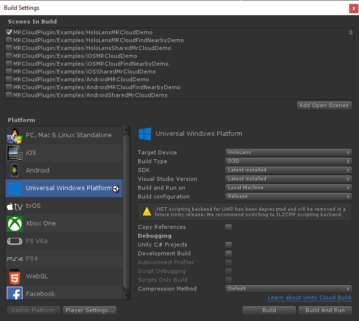

# Quickstart: Create a HoloLens Unity app using Spatial Anchors

[Spatial Anchors](overview.md) is a cross-platform developer service that makes it easy for you to create
Mixed Reality experiences. This quickstart shows how to create a HoloLens Unity app using spatial anchors. When you're finished,
you'll have an HoloLens app built with Unity that can save and recall a spatial anchor.

[!INCLUDE [quickstarts-free-trial-note](../../../includes/quickstarts-free-trial-note.md)]

## Prerequisites

Before you get started, here's a list of prerequisites:

- A Windows machine with <a href="https://unity3d.com/get-unity/download" target="_blank">Unity 2018.2+</a> and <a href="https://www.visualstudio.com/downloads/" target="_blank">Visual Studio 2017</a> installed with the **Universal Windows Platform development** workload.
- A HoloLens device with [developer mode](https://docs.microsoft.com/en-us/windows/mixed-reality/using-visual-studio) enabled.

[!INCLUDE [Create Spatial Anchors resource](../../../includes/spatial-anchors-get-started-create-resource.md)]

## Open the sample project in Unity

[!INCLUDE [Clone Sample Repo](../../../includes/spatial-anchors-clone-sample-repository.md)]

Open Unity and open the project at the `unity\samples` folder.

Open **Build Settings** by selecting **File** -> **Build Settings**.

In the **Platform** section, select **Universal Windows Platform**. Then, change the **Target Device** to **HoloLens**.

Select **Switch Platform** to change the platform to **Universal Windows Platform**.

Close the **Build Settings** window.

## Configure the Spatial Anchors endpoint and account key

In the **Project** pane, navigate to `Assets/MRCloudPlugin/Examples` and open the `HoloLensMRCloudDemo.unity` scene file.

[!INCLUDE [Configure Unity Scene](../../../includes/spatial-anchors-unity-configure-scene.md)]

## Export the HoloLens project

Open **Build Settings** by selecting **File** -> **Build Settings**.

Under **Scenes In Build**, place a check mark next to the `MRCloudPlugin/Examples/HoloLensMRCloudDemo` scene and clear check marks from all other scenes.

Select **Build** to open a dialog. Then, select a folder to export the HoloLens Visual Studio project.

When the export is complete, a folder will be displayed, which contains the exported HoloLens project.

## Open the HoloLens Visual Studio project

In the folder, double-click on `HelloAR U3D.sln` to open the project in Visual Studio.

Change the **Solution Configuration** to **Release**, change **Solution Platform** to **x86**, and select **Device** from the deployment target options.

Power on the HoloLens device, sign in, and connect it to the PC using a USB cable.

Select **Debug** > **Start debugging** to deploy your app and start debugging.

Follow the instructions in the app to place and recall an anchor.

In Visual Studio, stop the app by either selecting **Stop Debugging** or pressing **Shift + F5**.

[!INCLUDE [Clean-up section](../../../includes/clean-up-section-portal.md)]
