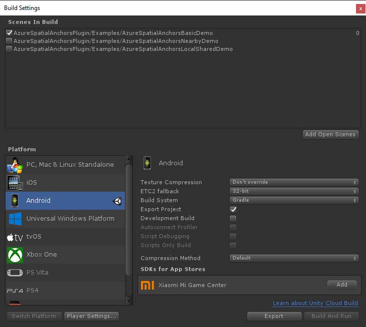

# Quickstart: Create an Android Unity app with Spatial Anchors

[Spatial Anchors](../overview.md) is a cross-platform developer service that allows you to create Mixed Reality experiences
using objects that persist their location across devices over time. This tutorial covers how to create an Android Unity
app using Spatial Anchors. When you're finished, you'll have an ARCore Android app built with Unity that can save and
recall a spatial anchor.

You'll learn how to:

> [!div class="checklist"]
> * Create a Spatial Anchors account
> * Prepare Unity build settings
> * Download and import the ARCore SDK for Unity
> * Configure the Spatial Anchors endpoint and account key
> * Export the Android Studio project
> * Deploy and run on an Android device

[!INCLUDE [quickstarts-free-trial-note](../../../../includes/quickstarts-free-trial-note.md)]

## Prerequisites

To complete this quickstart, make sure you have:

- A Windows or macOS machine with <a href="https://unity3d.com/get-unity/download" target="_blank">Unity 2018.2+</a> and <a href="https://developer.android.com/studio/" target="_blank">Android Studio</a> installed.
- An <a href="https://developers.google.com/ar/discover/supported-devices" target="_blank">ARCore capable</a> Android device.

[!INCLUDE [Create Spatial Anchors resource](../../../../includes/spatial-anchors-get-started-create-resource.md)]

## Open the sample project in Unity

[!INCLUDE [Clone Sample Repo](../../../../includes/spatial-anchors-clone-sample-repository.md)]

Open Unity and open the project at the `Unity` folder.

Open **Build Settings** by selecting **File** -> **Build Settings**.

In the **Platform** section, select **Android**. Then, change the **Build System** to **Gradle** and check the **Export Project** option.

Select **Switch Platform** to change the platform to **Android**.

Close the **Build Settings** window.

## Download and import the ARCore SDK for Unity

Download the `unitypackage` file from the [ARCore SDK for Unity releases](https://github.com/google-ar/arcore-unity-sdk/releases/tag/v1.5.0). Back in the Unity project, select **Assets** -> **Import Package** -> **Custom Package...** and then select the `unitypackage` file you previously downloaded. In the **Import Unity Package** dialog, make sure all of the files are selected and then select **Import**.

[!INCLUDE [Configure Unity Scene](../../../../includes/spatial-anchors-unity-configure-scene.md)]

## Export the Android Studio project

[!INCLUDE [Export Unity Project](../../../../includes/spatial-anchors-unity-export-project-snip.md)]

Select **Export** to open a dialog. Then, select a folder to export the Android Studio project.

When the export is complete, a folder will be displayed containing the exported Android Studio project.

## Deploy the Android application

Open Android Studio and select **Open an existing Android Studio project**. Then, select the exported Android Studio project and click **OK**.

Upon opening, a prompt will appear asking to use the Gradle wrapper. Select **OK** to use the Gradle wrapper and to open the project.

Power on the Android device, sign in, and connect it to the PC using a USB cable.

Select **Run** from the Android Studio toolbar.

Select the Android device in the **Select Deployment Target** dialog, and select **OK** to run the app on the Android device.

Follow the instructions in the app to place and recall an anchor.

Stop the app by selecting **Stop** from the Android Studio toolbar.

[!INCLUDE [Clean-up section](../../../../includes/clean-up-section-portal.md)]
