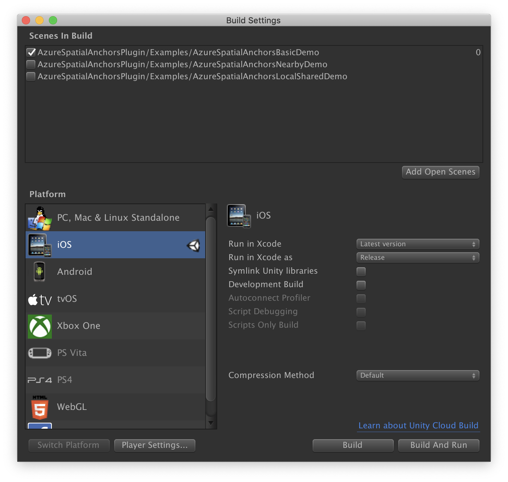
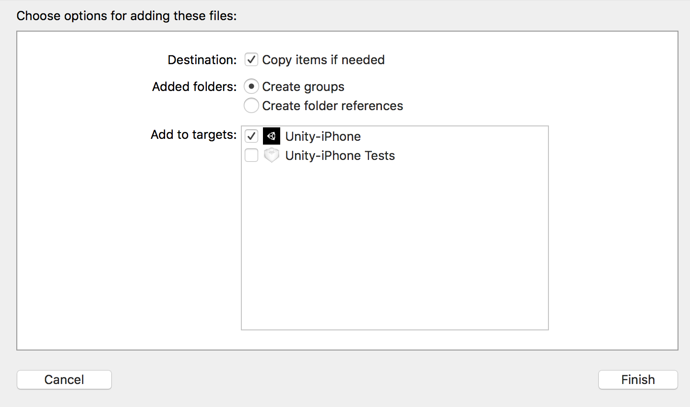

# Quickstart: Create an iOS Unity app with Spatial Anchors

[Spatial Anchors](../overview.md) is a cross-platform developer service that makes it easy for you to create
Mixed Reality experiences. This quickstart shows how to create an iOS Unity app using spatial anchors. When you're finished,
you'll have an ARKit iOS app built with Unity that can save and recall a spatial anchor.

[!INCLUDE [quickstarts-free-trial-note](../../../../includes/quickstarts-free-trial-note.md)]

## Prerequisites

Before you get started, here's a list of prerequisites:

- A macOS machine with <a href="https://unity3d.com/get-unity/download" target="_blank">Unity 2018.2+</a>, <a href="https://geo.itunes.apple.com/us/app/xcode/id497799835?mt=12" target="_blank">Xcode 9.4+</a>, and <a href="https://cocoapods.org" target="_blank">CocoaPods</a> installed.
- A developer enabled <a href="https://developer.apple.com/documentation/arkit/verifying_device_support_and_user_permission" target="_blank">ARKit compatible</a> iOS device.

[!INCLUDE [Create Spatial Anchors resource](../../../../includes/spatial-anchors-get-started-create-resource.md)]

## Open the sample project in Unity

[!INCLUDE [Clone Sample Repo](../../../../includes/spatial-anchors-clone-sample-repository.md)]

Open Unity and open the project at the `unity\samples` folder.

Open **Build Settings** by selecting **File** -> **Build Settings**.

In the **Platform** section, select **iOS**.

Select **Switch Platform** to change the platform to **iOS**.

Close the **Build Settings** window.

## Configure the Spatial Anchors endpoint and account key

In the **Project** pane, navigate to `Assets/MRCloudPlugin/Examples` and open the `iOSMRCloudDemo.unity` scene file.

[!INCLUDE [Configure Unity Scene](../../../../includes/spatial-anchors-unity-configure-scene.md)]

## Export the Xcode project

Open **Build Settings** by selecting **File** -> **Build Settings**.

Under **Scenes In Build**, place a check mark next to the `MRCloudPlugin/Examples/iOSMRCloudDemo` scene and clear check marks from all other scenes.

Select **Build** to open a dialog. Then, select a folder to export the Xcode project.

When the export is complete, a folder will be displayed, which contains the exported Xcode project.

## Open the Xcode project

In the exported Xcode project folder, double-click on `Unity-iPhone.xcodeproj` to open the project in Xcode.

Open the `mixedreality.spatialanchors.samples/native.ios/frameworks` folder in Finder. Drag and drop the `SpatialServiceApi.framework` file under the **Classes** node of the **Project navigator**. In the import dialog, make sure that **Copy items if needed** is checked.

Select the root **Unity-iPhone** node to view the project settings and select the **General** tab.

Under **Signing**, select **Automatically manage signing**. Select **Enable Automatic** in the dialog that appears to reset build settings.

Under **Deployment Info**, make sure the **Deployment Target** is set to `11.0`.

Under **Embedded Binaries**, select **Add items**. In the dialog, select `SpatialServicesApi.framework` and select **Add** to close the dialog.

## Deploy the app to your iOS device

Connect the iOS device to the Mac and set the **active scheme** to your iOS device.

Select **Build and then run the current scheme**.

Follow the instructions in the app to place and recall an anchor.

In Xcode, stop the app by pressing **Stop**.

[!INCLUDE [Clean-up section](../../../../includes/clean-up-section-portal.md)]
