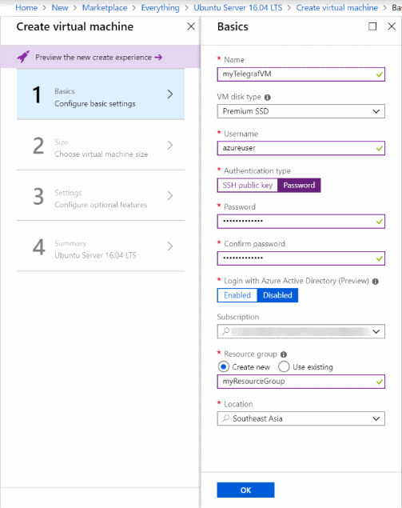
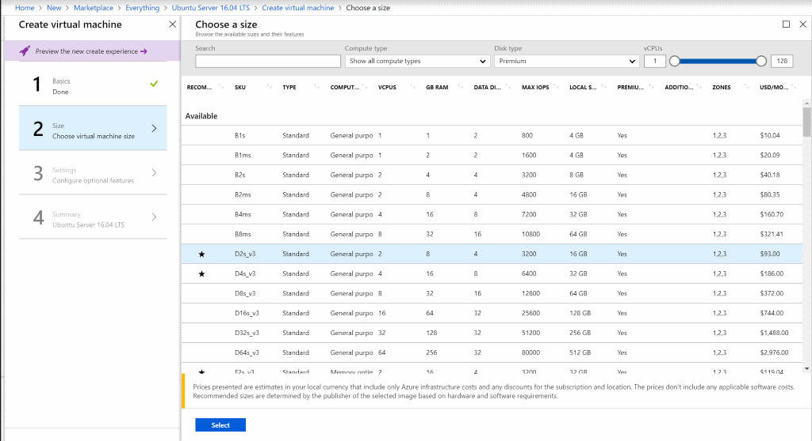
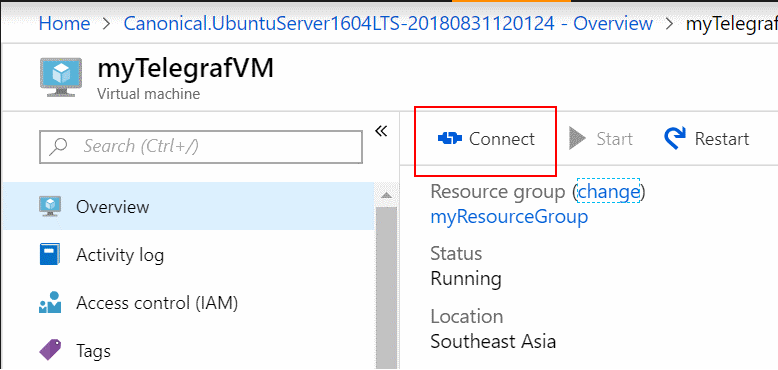

# Collect custom metrics for a Linux VM with the InfluxData Telegraf Agent

Azure Monitor enables you to collect custom metrics via your application telemetry, an agent running on your Azure resources, or even outside-in monitoring systems and submit them directly to Azure Monitor. This article focuses on providing instructions on how to deploy the [InfluxData](https://www.influxdata.com/) Telegraf agent on a Linux VM in Azure and configure the agent to publish metrics to Azure Monitor. 

## InfluxData Telegraf Agent 

[Telegraf](https://docs.influxdata.com/telegraf/v1.7/) is a plugin-driven agent that enables the collection of metrics from over 150 different sources. Depending on what workloads are running on your VM (ex. MySQL, NGINX, Apache, etc.) you can configure the agent to leverage specialized input plugins to collect metrics. Output plugins, then enable the agent to write to destinations of your choosing. The Telegraf agent has integrated directly with the Azure Monitor custom metrics REST API, and supports a “Azure Monitor Output plugin”. This enables the agent to collect workload specific metrics on your Linux VM and submit them as custom metrics to Azure Monitor. 

 

## Send custom metrics 

For the purpose of this tutorial, we deploy a Linux VM running the Ubuntu 16.04 LTS operating system. The Telegraf agent is supported for most Linux operating systems. Both Debian and RPM packages are available along with unpackaged Linux binaries on the InfluxData download portal. See this installation guide for additional Telegraf installation instructions and options. 

Login to the [Azure Portal](https://portal.azure.com)

To create a new Linux VM: 

1. Click the **Create a resource** option from the left-hand navigation pane. 
1. Search for *Virtual Machine*  
1. Select *Ubuntu 16.04 LTS* and click **Create** 
1. Provide a VM name like *MyTelegrafVM*.  
1. Leave the disk type as **SSD**, then provide a **username**, such as *azureuser*. 
1. For *Authentication type*, select **Password**, then type in a password you will use later to SSH into this VM. 
1. Choose to **Create new resource group**, then provide a name, such as *myResourceGroup*.  Choose your desired Location, then select **OK**. 

     

1. Select a size for the VM. You can filter by Compute type or Disk type, for example. 

     

1. On the **Settings page**, in **Network** > **Network Security Group** > **Select public inbound ports**, select *HTTP* and *SSH (22)*. Leave the rest of the defaults and select **OK**. 

1. On the summary page, select Create to start the VM deployment. 

The VM is pinned to the Azure portal dashboard. Once the deployment has completed, the VM summary automatically opens. 

In the VM blade, navigate to the **Identity** tab and ensure your VM has a system assigned identity *On*. 
 

 
Connect to the VM 

## Create an SSH connection with the VM 

Select the Connect button on the overview page for your VM. 



In the Connect to virtual machine page, keep the default options to connect by DNS name over port 22. In Login using VM local account a connection command is shown. Click the button to copy the command. The following example shows what the SSH connection command looks like: 

```cmd
ssh azureuser@XXXX.XX.XXX 
```

Paste the SSH connection command into a shell, such as the Azure Cloud Shell, Bash on Ubuntu on Windows, or use an SSH client of your choosing to create the connection. 

## Install and Configure Telegraf 

To install the Telegraf Debian package onto the VM, run the following commands from your SSH session: 

```cmd
# download the package to the VM 
wget https://dl.influxdata.com/telegraf/releases/telegraf_1.8.0~rc1-1_amd64.deb 
# install the package 
sudo dpkg -i telegraf_1.8.0~rc1-1_amd64.deb
```
Telegraf’s configuration file defines Telegraf’s operations. By default, an example configuration file is installed at the path “/etc/telegraf/telegraf.conf”. The example configuration file lists all possible input and output plugins. However, we are going to create a custom configuration file and have the agent use it by running the following commands 

```cmd
# generate the new Telegraf config file in the current directory 
telegraf --input-filter cpu:mem --output-filter azure_monitor config > azm-telegraf.conf 

# replace the example config with the new generated config 
sudo cp azm-telegraf.conf /etc/telegraf/telegraf.conf 
```

>![NOTE]
>The above only enables two input plugins “cpu” and “mem”, feel free to add more input plugins (Docker, MySQL, NGINX, etc.) depending on the workload running on your machine. A full list of input plugins can be found here. 

Finally, to have the agent start using the new configuration we force the agent to stop and start, by running the following commands 

```cmd
# stop the telegraf agent on the VM 
sudo systemctl stop telegraf 
# start the telegraf agent on the VM to ensure it picks up the latest configuration 
sudo systemctl start telegraf 
```
Now the agent will collect metrics from each of the input plugins specified and emit them to Azure Monitor. 

## Plot your Telegraf metrics in the Azure portal 

1. Open the [Azure portal](https://portal.azure.com) 

1. Navigate to the new Monitor tab, and then select **Metrics**.  
     

1. Select your VM in the resource selector

     

1. Select the *Telegraf/CPU* namespace, and select the *usage_system* metric. You can choose filter by the dimensions on this metric, or split on them.  

     

## Additional configuration 

The above walkthrough provides information on how to configure the Telegraf agent to collect metrics from a few basic input plugins. The Telegraf agent has support for over 150 input plugins, with some supporting additional configuration options. InfluxData has published a [list of supported plugins](https://docs.influxdata.com/telegraf/v1.7/plugins/inputs/) and instructions on [how to configure them](https://docs.influxdata.com/telegraf/v1.7/administration/configuration/).  

Additionally, this walkthrough has allowed you use the Telegraf agent to emit metrics about the VM the agent is deployed on. The Telegraf agent can also be used as a collector and forwarder of metrics for other resources. To learn how to configure the agent to emit metrics for other Azure resources, see [Azure Monitor Custom Metric Output for Telegraf](https://github.com/influxdata/telegraf/blob/fb704500386214655e2adb53b6eb6b15f7a6c694/plugins/outputs/azure_monitor/README.md).  

## Clean up resources 

When no longer needed, you can delete the resource group, virtual machine, and all related resources. To do so, select the resource group for the virtual machine, select Delete, then confirm the name of the resource group to delete. 

## Next steps
- Learn more about [custom metrics](metrics-custom-overview.md).


