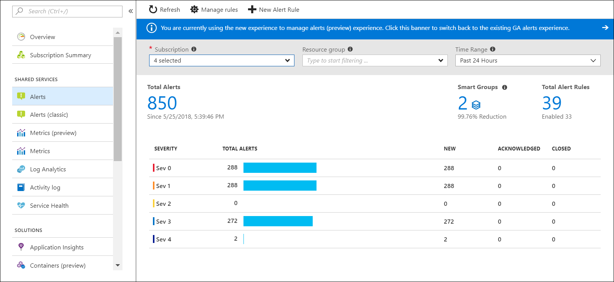
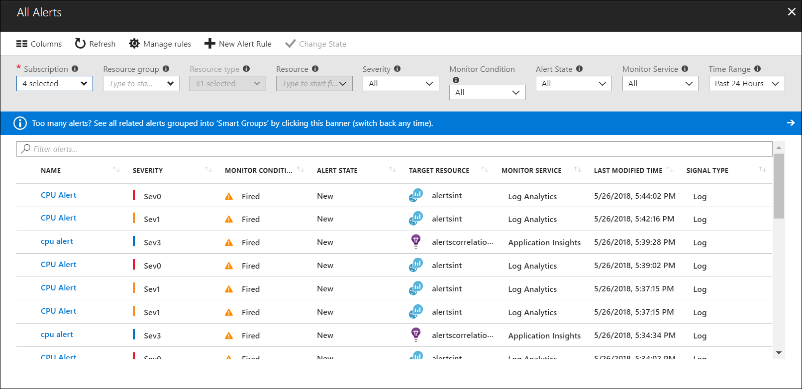
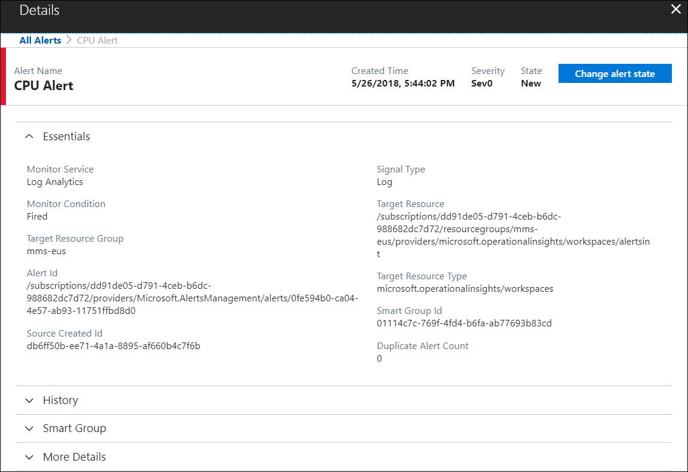
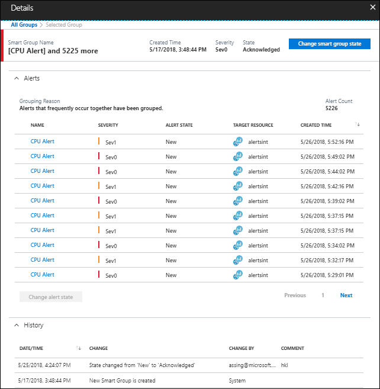

# Azure Alerts user interface (Public Preview))

## Overview 
 
> [!NOTE] 
> This article describes the new alert experience in Azure Monitor. Classic alerts are described in [classic alerts Overview](monitoring-overview-alerts.md). 
 
A new alerts experience was released for Azure Monitor on June 1, 2018. This experience builds on the benefits of the [unified alerts experience](monitoring-overview-unified-alerts.md) released March 2018 and provides the ability to manage and aggregate individual alerts in addition to modifying alert state.

## Features in the new alert experience

The new experience provides the following features that aren't available in the classic experience:

- View and manage individual alerts across multiple subscriptions.
- Aggregate all alerts into single view organized by alert severity. 
- Change the state of alerts to reflect where it current is in the resolution process. 
- Organize alerts by smart groups which are automatically generated with machine learning algorithms.

## Accessing the new alert experience
Access the new alert experience by clicking on the banner at the top of the Alerts page. You can switch back and forth between the new and old experience by clicking on the banner. 

## Alert States 
The state of an alert specifies where it is in the resolution process.  When an alert is created, it has a status of *New*. You can change the status when you've acknowledged an alert and when you've closed it.  The following alert states are supported.

| State | Description |
|:---|:---|
| New | The issue has just been detected and not yet reviewed. |
| Acknowledged | An administrator has reviewed the alert and started working on it. |
| Closed | The issue has been resolved. |

Note that once an alert has been closed, you can reopen it my changing it to another state.

### Changing the state of an alert or smart group
You can change the state of an alert by clicking on **Change alert state** in the detail view for the alert or **Change smart group state** in the detail view for the smart group. You can change the state of multiple items at one time by selecting them in a list view and clicking **Change State** at the top of the page. In both cases, select a new state from the dropdown and optionally provide a comment. If you're changing a single item, then you also have an option to apply the same changes to all the alerts in the smart group.

## Alerts page
The default Alerts page provides a quick summary of alerts within a particular tine window. It displays the total alerts for each severity with columns identifying the total number of alerts in each state for each severity. Click any of the severities to open the **All Alerts** view filtered by that severity.

You can filter the view by selecting values in the dropdowns at the top of the page.

| Column | Description |
|:---|:---|
| Subscription | Select up to 5 Azure subscriptions. Only alerts in the selected subscriptions are included in the view. |
| Resource Group | Select a single resource group. Only alerts with targets in the selected resource group are included in the view. |
| Time Range | Only alerts fired within the selected time window will be included in the view. Supported values are past hour, past 24 hours, past 7 days, and past 30 days. |

The default alerts view displays the following values.

| Value | Description |
|:---|:---|
| Total Alerts | Displays the total number of alerts that match the selected criteria. Click this value to open the All Alerts view with no filter. |
| Smart Groups | Displays the total number of smart groups created from the alerts that match the selected criteria. Click this value to open the Smart Groups list in the All Alerts view.
| Total Alert Rules | Total number of alert rules in the selected subscription and resource group. Click this value to open the Rules view filtered on the selected subscriptions and resource group.

## All Alerts page 
The Total Alerts page allows you to view all alerts that were created within the selected time window. You can either view a list of the individual alerts or a list of the smart groups containing the alerts. Click the banner at the top of the page to toggle between views.

You can filter the view by selecting values in the dropdowns at the top of the page.

| Column | Description |
|:---|:---|
| Subscription | Select up to 5 Azure subscriptions. Only alerts in the selected subscriptions are included in the view. |
| Resource Group | Select a single resource group. Only alerts with targets in the selected resource group are included in the view. |
| Resource Type | Select one or more resource types. Only alerts with targets of the selected type are included in the view. This column is only available once a resource group has been specified. |
| Resource | Select a resource. Only alerts with that resources as a target are included in the view. This column is only available once a resource group has been specified. |
| Severity | Select an alert severity or select *All* to include alerts of all severities. |
| Monitor Condition | Select a monitor condition or select *All* to include alerts of conditions. |
| Alert State | Select an alert state or select *All* to include alerts of states. |
| Monitor Service | Select a service or select *All* to include all services. Only alerts created by rules using that service as a target are included. | 
| Time Range | Only alerts fired within the selected time window will be included in the view. Supported values are past hour, past 24 hours, past 7 days, and past 30 days. |

### Alert detail page
When you click on an alert, the Alert Detail page is displayed that includes the following sections.

| Section | Description |
|:---|:---|
| Essentials | Displays the properties and other significant information about the alert. |
| History | Lists each action taken by the alert and any changes made to the alert. |
| Smart Group | Information about the smart group the alert is included in. The **Alert Count** refers to the number of alerts included in the smart group. This includes the other alerts that are included in the same same smart group that were created in the past 30 days.  This is regardless of the time filter in the alerts list page. Click on an alert to view its detail. |S
| More Details | Displays granular data for the alert. This information is typically specific to the type of source that created the alert. |

### Smart Group detail page
When you click on a smart group, the Smart Group Detail page is  displayed that includes the following sections.

| Section | Description |
|:---|:---|
| Alerts | Lists the individual alerts that are included in the smart group. Click on an alert to open its Alert Detail page. |
| History | Lists each action taken by the smart group and any changes made to it. |

## Next steps
* Understand [log alerts in Azure](monitor-alerts-unified-log-webhook.md).
* Learn about the new [Azure Alerts](monitoring-overview-unified-alerts.md).
* Learn more about [Application Insights](../application-insights/app-insights-analytics.md).
* Learn more about [Log Analytics](../log-analytics/log-analytics-overview.md).    
