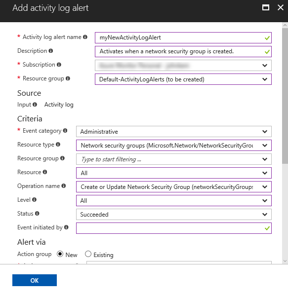
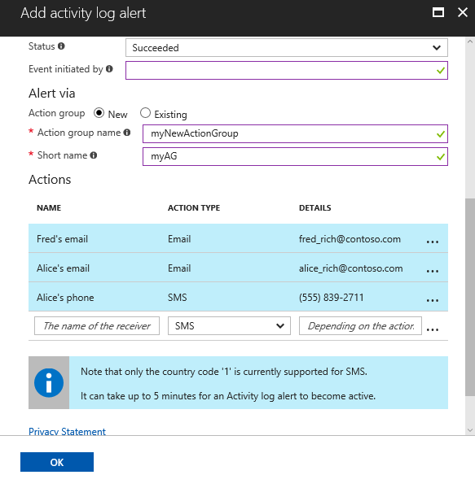

# Create an alert to receive a notification when an important action occurs in your Azure subscription

The **Azure Activity Log** provides a history of subscription-level events in Azure. It offers information about *who* created, updated, or deleted *what* resources and *when* they did it. You can create an **Activity Log alert** to receive email, SMS, or webhook notifications when an activity occurs that match your alert conditions. This Quickstart steps through authoring an Activity Log alert to become notified when a network security group is created.

If you don't have an Azure subscription, create a [free](https://azure.microsoft.com/free/) account before you begin.

## Log in to the Azure portal

Log in to the [Azure portal](https://portal.azure.com/).

## Create a network security group

1. Click the **New** button found on the upper left-hand corner of the Azure portal.

2. Select **Networking**, select **Network security group**.

3. Enter a name for the network security group and create a new resource group named **myResourceGroup**. Click the **Create** button.

    

## Identify event in the Activity Log

An event has now been added to the Activity Log that describes the creation of the network security group. First we will identify the event in the Activity Log.

1. Click the **Monitor** button found on the left-hand navigation list. This opens to the Activity Log section.

2. Click on the **Write NetworkSecurityGroups** event in the table of events shown.

## Create an Activity Log alert

1. In the summary section that appears, click **Add activity log alert**.

    

2. In the section that appears, give the Activity Log alert a name and description.

3. Under **Criteria** ensure that **Event category** is set to **Administrative**, **Resource type** is set to **Network security groups**, **Operation name** is set to **Create or Update Network Security Group**, **Status** is set to **Succeeded** and all other criteria fields are either blank or set to **All**. The criteria define the rules used to determine whether the alert should be activated when a new event appears in the Activity Log.

    

4. Under **Alert via** select **New** action group and provide a **name** and **short name** for the action group. This defines the set of actions taken when the alert is activated (when the criteria match a new event).

5. Under **Actions** add one or more actions by providing a **Name** for the action, the **Action type** (for example, email or SMS), and **Details** for that particular action type (for example, a webhook URL or email address).

    

6. Click **Ok** to save the Activity Log alert.

## Test the Activity Log alert

> [!NOTE]
> It takes approximately ten minutes for an Activity Log alert to become fully enabled. New events that occur before the Activity Log alert is fully enabled do not generate notifications.
>
>

To test the alert, repeat the steps above to **Create a network security group**, but give this network security group a different name and reuse the existing resource group. Within a few minutes you will receive a notification that the network security group was created.

## Clean up resources

When no longer needed, delete the resource group and network security group. To do so, select the **myResourceGroup** resource group and click **Delete**.

## Next steps

In this quick start, you performed an operation to generate an Activity Log event and then created an Activity Log alert to become notified when this operation occurs again in the future. You then tested the alert by performing that operation again. To learn more about the Azure Activity Log, continue to the overview of the Activity Log.

> [!div class="nextstepaction"]
> [Azure Monitor tutorials](./monitoring-overview-activity-logs.md)
