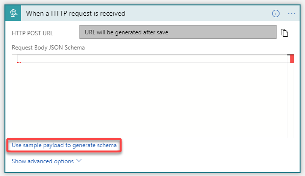
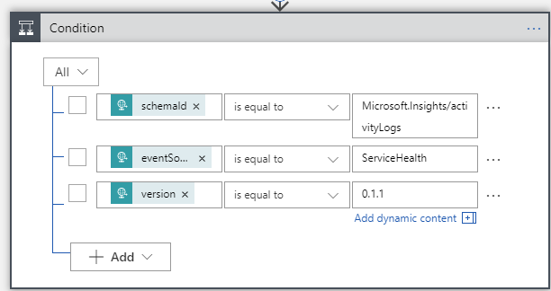

# Create a logic app action

This article shows you how to set up and trigger a logic app to create a conversation in Microsoft Teams when an alert fires.

## Overview
When an Azure Monitor alert triggers, it calls an [action group](monitoring-action-groups.md). Action groups allow you to trigger one or more actions to notify others about an alert and also remediate it.

The general process is:

-   Create the logic app for the respective alert type.

-   Import the schema for the respective alert type into the logic app.

-   Define the logic app behavior.

-   Copy the HTTP endpoint of the logic app into an Azure action group.

The process is similar if you want the logic app to perform a different action.

## Create an activity log alert: Administrative

1.  In the Azure portal, select **Create a resource** in the upper-left corner.

2.  Search for and select **Logic App**, then select **Create**.

3.  Give your logic app a name, choose a resource group, and so on.

    

4.  Select **Create** to create the logic app. A pop-up message indicates that the logic app is created. Select **Launch Resource** to open the **Logic Apps Designer**.

5.  Select the **When a HTTP request is received** trigger.

    

6.  Select **Edit** to change the HTTP request trigger.

    

7.  Select **Use sample payload to generate schema**.

    

8.  Copy and paste the following sample schema into the dialog box:

    ```json
        {
            "schemaId": "Microsoft.Insights/activityLogs",
            "data": {
                "status": "Activated",
                "context": {
                "activityLog": {
                    "authorization": {
                    "action": "microsoft.insights/activityLogAlerts/write",
                    "scope": "/subscriptions/…"
                    },
                    "channels": "Operation",
                    "claims": "…",
                    "caller": "logicappdemo@contoso.com",
                    "correlationId": "91ad2bac-1afa-4932-a2ce-2f8efd6765a3",
                    "description": "",
                    "eventSource": "Administrative",
                    "eventTimestamp": "2018-04-03T22:33:11.762469+00:00",
                    "eventDataId": "ec74c4a2-d7ae-48c3-a4d0-2684a1611ca0",
                    "level": "Informational",
                    "operationName": "microsoft.insights/activityLogAlerts/write",
                    "operationId": "61f59fc8-1442-4c74-9f5f-937392a9723c",
                    "resourceId": "/subscriptions/…",
                    "resourceGroupName": "LOGICAPP-DEMO",
                    "resourceProviderName": "microsoft.insights",
                    "status": "Succeeded",
                    "subStatus": "",
                    "subscriptionId": "…",
                    "submissionTimestamp": "2018-04-03T22:33:36.1068742+00:00",
                    "resourceType": "microsoft.insights/activityLogAlerts"
                }
                },
                "properties": {}
            }
        }
    ```

9. The **Logic App Designer** displays a pop-up window to remind you that the request sent to the logic app must set the **Content-Type** header to **application/json**. Close the pop-up window. The Azure Monitor alert sets the header.

    

10. Select **New Step** and then choose **Add an action**.

    

11. Search for and select the Microsoft Teams connector. Choose the **Microsoft Teams – Post message** action.

    

12. Configure the Microsoft Teams action. The **Logic Apps Designer** asks you to authenticate to your Office 365 account. Choose the **Team Id** and **Channel Id** to send the message to.

13. Configure the message by using a combination of static text and references to the \<fields\> in the dynamic content. Copy and paste the following text into the **Message** field:

    ```text
      Activity Log Alert: <eventSource>
      operationName: <operationName>
      status: <status>
      resourceId: <resourceId>
    ```

    Then search for and replace the \<fields\> with dynamic content tags of the same name.

    > [!NOTE]
    > There are two dynamic fields that are named **status**. Add both of these fields to the message. Use the field that's in the **activityLog** property bag and delete the other field. Hover your cursor over the **status** field to see the fully qualified field reference, as shown in the following screenshot:

    

14. At the top of the **Logic Apps Designer**, select **Save** to save your logic app.

15. Click the **HTTP Request** text box to cause it to expand. Copy the HTTP POST URL.

    

16. Open your existing action group and add an action to reference the logic app. If you don’t have an existing action group, see [Monitoring action groups](https://docs.microsoft.com/en-us/azure/monitoring-and-diagnostics/monitoring-action-groups) to create one. Don’t forget to save your changes.

    

The next time an alert invokes your action group, your logic app is called.

## Create a service health alert

Azure Service Health entries are part of the activity log. The process to create the alert is similar to [creating an activity log alert](#create-an-activity-log-alert-administrative), but with the following changes:

- Steps 1 through 7 are the same.
- For step 8, use the following sample schema for the HTTP request trigger:

    ```json
    {
        "schemaId": "Microsoft.Insights/activityLogs",
        "data": {
            "status": "Activated",
            "context": {
                "activityLog": {
                    "channels": "Admin",
                    "correlationId": "e416ed3c-8874-4ec8-bc6b-54e3c92a24d4",
                    "description": "…",
                    "eventSource": "ServiceHealth",
                    "eventTimestamp": "2018-04-03T22:44:43.7467716+00:00",
                    "eventDataId": "9ce152f5-d435-ee31-2dce-104228486a6d",
                    "level": "Informational",
                    "operationName": "Microsoft.ServiceHealth/incident/action",
                    "operationId": "e416ed3c-8874-4ec8-bc6b-54e3c92a24d4",
                    "properties": {
                        "title": "…",
                        "service": "…",
                        "region": "Global",
                        "communication": "…",
                        "incidentType": "Incident",
                        "trackingId": "…",
                        "impactStartTime": "2018-03-22T21:40:00.0000000Z",
                        "impactMitigationTime": "2018-03-22T21:41:00.0000000Z",
                        "impactedServices": "[{"ImpactedRegions"}]",
                        "defaultLanguageTitle": "…",
                        "defaultLanguageContent": "…",
                        "stage": "Active",
                        "communicationId": "11000001466525",
                        "version": "0.1.1"
                    },
                    "status": "Active",
                    "subscriptionId": "…",
                    "submissionTimestamp": "2018-04-03T22:44:50.8013523+00:00"
                }
            },
            "properties": {}
        }
    }
    ```

-  Steps 9 and 10 are the same.
-  For steps 11 through 14, use the following process instead:

   1. Select **New Step** and then choose **Add a condition**. Set the following conditions to ensure that the logic app executes only when the input data matches these values:
       - `schemaId == Microsoft.Insights/activityLogs`
       - `eventSource == ServiceHealth`
       - `version == 0.1.1`

      

   1. In the **if true** condition, follow the instructions in steps 11 through 13 in [Create an activity log alert](#create-an-activity-log-alert-administrative) to add the Microsoft Teams action.

   1. Define the message by using a combination of HTML and [dynamic content]. Copy and paste the following content into the **Message** field. Replace the `[incidentType]`, `[trackingID]`, `[title]`, and `[communication]` fields with dynamic content tags of the same name:

       ```html
       <p>
       <b>Alert Type:</b>&nbsp;<strong>[incidentType]</strong>&nbsp;
       <strong>Tracking ID:</strong>&nbsp;[trackingId]&nbsp;
       <strong>Title:</strong>&nbsp;[title]</p>
       <p>
       <a href="https://ms.portal.azure.com/#blade/Microsoft_Azure_Health/AzureHealthBrowseBlade/serviceIssues">For details, log in to the Azure Service Health dashboard.</a>
       </p>
       <p>[communication]</p>
       ```

       

   1. For the **If false** condition, provide a useful message:

       ```html
       <p><strong>Service Health Alert</strong></p>
       <p><b>Unrecognized alert schema</b></p>
       <p><a href="https://ms.portal.azure.com/#blade/Microsoft_Azure_Health/AzureHealthBrowseBlade/serviceIssues">For details, log in to the Azure Service Health dashboard.\</a></p>
       ```

       

- Steps 15 and 16 are the same. Follow the instructions to save your logic app and update your action group.

## Create a metric alert

The process to create a metric alert is similar to [creating an activity log alert](#create-an-activity-log-alert-administrative), but with the following changes:

- Steps 1 through 7 are the same.
- For step 8, use the following sample schema for the HTTP reqeust trigger:

    ```json
    {
    "schemaId": "AzureMonitorMetricAlert",
    "data": {
        "version": "2.0",
        "status": "Activated",
        "context": {
        "timestamp": "2018-04-09T19:00:07.7461615Z",
        "id": "…",
        "name": "TEST-VM CPU Utilization",
        "description": "",
        "conditionType": "SingleResourceMultipleMetricCriteria",
        "condition": {
            "windowSize": "PT15M",
            "allOf": [
                {
                    "metricName": "Percentage CPU",
                    "dimensions": [
                    {
                        "name": "ResourceId",
                        "value": "d92fc5cb-06cf-4309-8c9a-538eea6a17a6"
                    }
                ],
                "operator": "GreaterThan",
                "threshold": "5",
                "timeAggregation": "PT15M",
                "metricValue": 1.0
            }
            ]
        },
        "subscriptionId": "…",
        "resourceGroupName": "TEST",
        "resourceName": "test-vm",
        "resourceType": "Microsoft.Compute/virtualMachines",
        "resourceId": "…",
        "portalLink": "…"
        },
        "properties": {}
    }
    }
    ```

- Steps 9 and 10 are the same.
- For steps 11 through 14, use the following process instead:

   1. Select **New Step** and then choose **Add a condition**. Set the following conditions to ensure that the logic app executes only when the input data matches these values:
       - `schemaId == AzureMonitorMetricAlert`
       - `version == 2.0`

       

   1. In the **if true** condition, add a **For each** loop and the Microsoft Teams action. Define the message by using a combination of HTML and `[dynamic content]`.

       

   1. In the **If false** condition, define a Microsoft Teams action to communicate that the metric alert doesn’t match the expectations of the logic app. Include the JSON payload. Notice how to reference the `triggerBody` dynamic content in the `json()` expression.

       

- Steps 15 and 16 are the same. Follow the instructions to save your logic app and update your action group.

## Next steps
* Get an [overview of Azure activity log alerts](monitoring-overview-alerts.md) and learn how to receive alerts.  
* Learn how to [configure alerts when an Azure Service Health notification is posted](monitoring-activity-log-alerts-on-service-notifications.md).
* Learn more about [action groups](monitoring-action-groups.md).