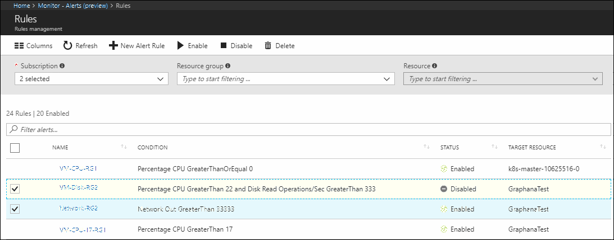
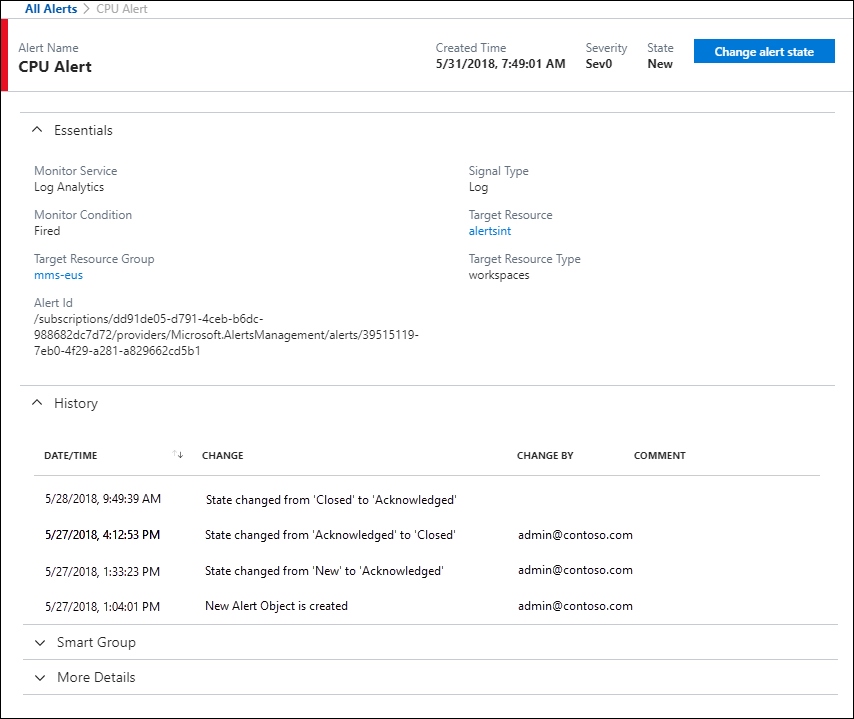

# Overview of alerts in Microsoft Azure 

This article describes what alerts are, their benefits, and how to get started using them.  

## What are alerts in Microsoft Azure?
Alerts proactively notify you when important conditions are found in your monitoring data. They allow you to identify and address issues before the users of your system notice them. 

This article discusses the unified alert experience in Azure Monitor, which now includes Log Analytics and Application Insights. The [previous alert experience](monitoring-overview-alerts.md)and alert types are called **classic alerts**. You can view this older experience and older alert type by clicking on **View classic alerts** at the top of the alert page. 

## Overview

The diagram below represents the general terms and flow of alerts. 

Alert rules are separated from alerts and the action that are taken when an alert fires. 

- **Alert rule** - The alert rule captures the target and criteria for alerting. The alert rule can be in an enabled or a disabled state. Alerts only fire when enabled. The key attributes of an alert rules are:
    - **Target Resource** - A target can be any Azure resource. Target Resource defines the scope and signals available for alerting. Example targets: a virtual machine, a storage account, a virtual machine scale set, a Log Analytics workspace, or an Application Insights resource. For certain resources (e.g. Virtual Machines), you can specify multiple resources as the target of an alert rule.
    - **Signal** - Signals are emitted by the target resource and can be of several types. Metric, Activity log, Application Insights, and Log.
    - **Criteria** - Criteria is combination of Signal and Logic applied on a Target resource. Examples: 
         - Percentage CPU > 70%
         - Server Response Time > 4 ms 
         - Result count of a log query > 100
- **Alert Name** – A specific name for the alert rule configured by the user
- **Alert Description** – A description for the alert rule configured by the user
- **Severity** – The severity of the alert once the criteria specified in the alert rule is met. Severity can range from 0 to 4.
- **Action** - A specific action taken when the alert is fired. For more information, see Action Groups.

## What you can alert on

You can alert on metrics and logs as described in [monitoring data sources](./monitoring-and-diagnotics/monitoring-data-sources.md). These include but are not limited to:
- Metric values
- Log search queries
- Activity Log events
- Health of the underlying Azure platform
- Tests for web site availability

## Manage Alerts
You can set the state of an alert to specify where it is in the resolution process. When the criteria specified in the alert rule is met, an alert is created or fired, it has a status of *New*. You can change the status when you acknowledge an alert and when you close it. All state changes are stored in the history of the alert.

The following alert states are supported.

| State | Description |
|:---|:---|
| New | The issue has just been detected and has not yet been reviewed. |
| Acknowledged | An administrator has reviewed the alert and started working on it. |
| Closed | The issue has been resolved. After an alert has been closed, you can reopen it by changing it to another state. |

The state of an alert is different than the monitor condition. Alert state is set by the user and is independent of the monitor condition. When the underlying condition for the fired alert clears, the monitor condition for the alert is set to resolved. Although the system can set the monitor condition to resolved, the alert state isn't changed until the user changes it. Learn [how to change the state of your alerts and smart groups](https://aka.ms/managing-alert-smart-group-states).

## Smart groups 
Smart Groups are in preview. 

Smart groups are aggregations of alerts based on machine learning algorithms which can help reduce alert noise and aid in trouble-shooting. [Learn more about Smart Groups](https://aka.ms/smart-groups) and [how to manage your smart groups](https://aka.ms/managing-smart-groups).

## Alerts experience 
The default Alerts page provides a summary of alerts that are created within a particular time window. It displays the total alerts for each severity with columns that identify the total number of alerts in each state for each severity. Select any of the severities to open the [All Alerts](#all-alerts-page) page filtered by that severity.

It does not show or track older [classic alerts](#classic-alerts). You can change the subscriptions or filter parameters to update the page. 

You can filter this view by selecting values in the dropdown menus at the top of the page.

| Column | Description |
|:---|:---|
| Subscription | Select up to five Azure subscriptions. Only alerts in the selected subscriptions are included in the view. |
| Resource group | Select a single resource group. Only alerts with targets in the selected resource group are included in the view. |
| Time range | Only alerts fired within the selected time window are included in the view. Supported values are the past hour, the past 24 hours, the past 7 days, and the past 30 days. |

Select the following values at the top of the Alerts page to open another page.

| Value | Description |
|:---|:---|
| Total alerts | The total number of alerts that match the selected criteria. Select this value to open the All Alerts view with no filter. |
| Smart groups | The total number of smart groups that were created from the alerts that match the selected criteria. Select this value to open the smart groups list in the All Alerts view.
| Total alert rules | The total number of alert rules in the selected subscription and resource group. Select this value to open the Rules view filtered on the selected subscription and resource group.

## Manage alert rules
Click on **Manage alert rules** to show the **Rules** page. **Rules** is a single place for managing all alert rules across your Azure subscriptions. It lists all alert rules and can be sorted based on target resources, resource groups, rule name, or status. Alert rules can also be edited, enabled, or disabled from this page.  

 

## Create an alert rule
Alerts can be authored in a consistent manner regardless of the monitoring service or signal type. All fired alerts and related details are available in single page.
 
You create a new alert rule with the following three steps:
1. Pick the _target_ for the alert.
1. Select the _signal_ from the available signals for the target.
1. Specify the _logic_ to be applied to data from the signal.
 
This simplified authoring process no longer requires you to know the monitoring source or signals that are supported before selecting an Azure resource. The list of available signals is automatically filtered based on the target resource that you select, and it guides you through defining the logic of the alert rule.

You can learn more about how to create alert rules in [Create, view, and manage alerts using Azure Monitor](monitor-alerts-unified-usage.md).

Alerts are available across several Azure monitoring services. For information about how and when to use each of these services, see [Monitoring Azure applications and resources](./monitoring-overview.md). The following table provides a listing of the types of alert rules that are available across Azure. It also lists what's currently supported in which alert experience.

Previously, Azure Monitor, Application Insights, Log Analytics and Service Health had separate alerting capabilities. Overtime, Azure improved and combined both the user interface and different methods of alerting. This consolidation is still in process. As a result, there are still some alerting capabilities not yet in the new alerts system.  

| **Monitor source** | **Signal type**  | **Description** | 
|-------------|----------------|-------------|
| Service health | Activity log  | Not supported. See [Create activity log alerts on service notifications](monitoring-activity-log-alerts-on-service-notifications.md).  |
| Application Insights | Web availability tests | Not supported. See [Web test alerts](../application-insights/app-insights-monitor-web-app-availability.md). Available to any website that's instrumented to send data to Application Insights. Receive a notification when availability or responsiveness of a website is below expectations. |

## All alerts page 
Click on Total Alerts to see the all alerts page. Here you can view a list of alerts that were created within the selected time window. You can view either a list of the individual alerts or a list of the smart groups that contain the alerts. Select the banner at the top of the page to toggle between views.

You can filter the view by selecting the following values in the dropdown menus at the top of the page.

| Column | Description |
|:---|:---|
| Subscription | Select up to five Azure subscriptions. Only alerts in the selected subscriptions are included in the view. |
| Resource group | Select a single resource group. Only alerts with targets in the selected resource group are included in the view. |
| Resource type | Select one or more resource types. Only alerts with targets of the selected type are included in the view. This column is only available after a resource group has been specified. |
| Resource | Select a resource. Only alerts with that resource as a target are included in the view. This column is only available after a resource type has been specified. |
| Severity | Select an alert severity, or select *All* to include alerts of all severities. |
| Monitor condition | Select a monitor condition, or select *All* to include alerts of conditions. |
| Alert state | Select an alert state, or select *All* to include alerts of states. |
| Monitor service | Select a service, or select *All* to include all services. Only alerts created by rules that use service as a target are included. |
| Time range | Only alerts fired within the selected time window are included in the view. Supported values are the past hour, the past 24 hours, the past 7 days, and the past 30 days. |

Select **Columns** at the top of the page to select which columns to display. 

## Alert detail page
The Alert detail page is displayed when you select an alert. It provides details of the alert and enables you to change its state.

The Alert detail page includes the following sections.

| Section | Description |
|:---|:---|
| Essentials | Displays the properties and other significant information about the alert. |
| History | Lists each action taken by the alert and any changes made to the alert. This is currently limited to state changes. |
| Smart group | Information about the smart group the alert is included in. The *alert count* refers to the number of alerts that are included in the smart group. This includes the other alerts in the same smart group that were created in the past 30 days.  This is regardless of the time filter in the alerts list page. Select an alert to view its detail. |
| More details | Displays further contextual information for the alert, which is typically specific to the type of source that created the alert. |

## Classic alerts 

The Azure Monitor metrics and activity log alerting capability before June 2018 is called "Alerts (classic)". 

For more information see [Alerts classic](./monitoring-overview-alerts-classic.md)

## Next steps

- [Learn more about Smart Groups](https://aka.ms/smart-groups)
- [Managing your alert instances in Azure](https://aka.ms/managing-alert-instances)
- [Managing Smart Groups](https://aka.ms/managing-smart-groups)

