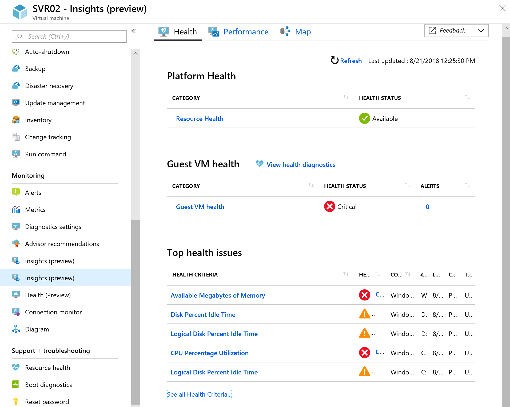
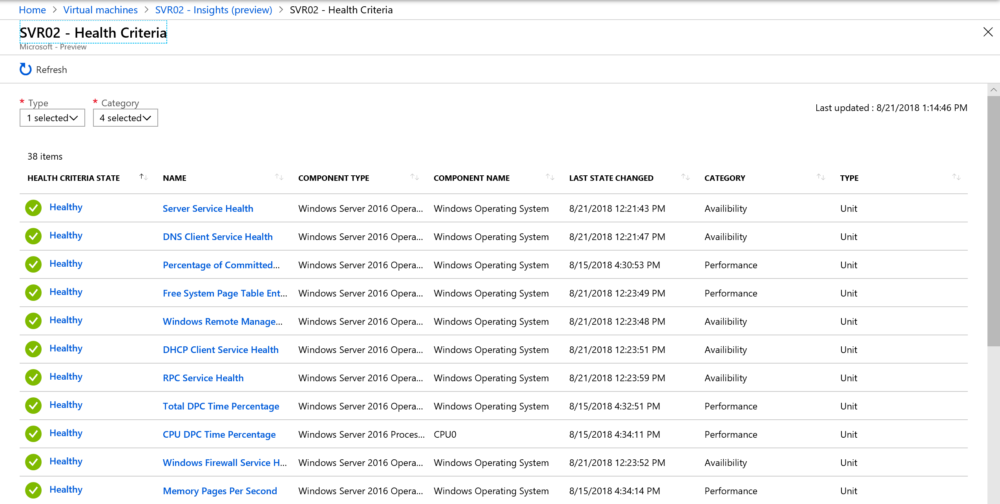
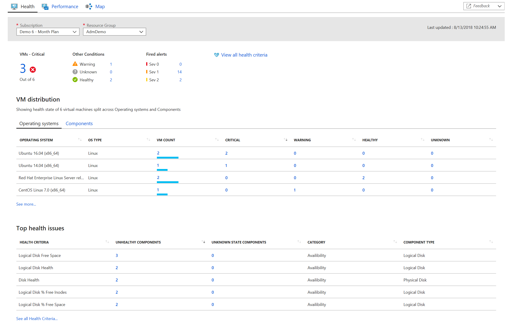
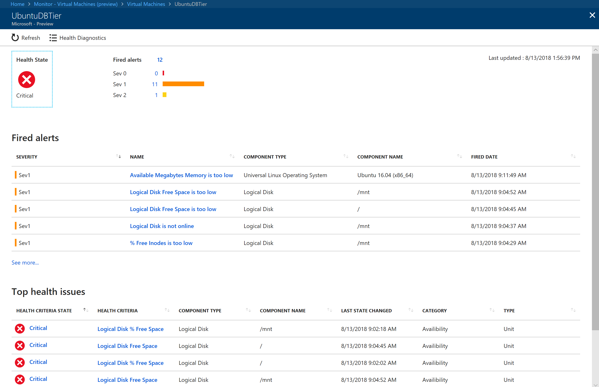

# Understand the health of your virtual machines with Azure Monitor VM insights

Viewing the health state of the operating system running on your Azure virtual machines can be observed in two ways with VM insights, from a virtual machine directly or across all VMs in a subscription. This article will help you understand the experience between the two perspectives and how to quickly assess, investigate and resolve issues detected.

## Sign in to the Azure portal
Sign in to the [Azure portal](https://portal.azure.com). 

## Single virtual machine perspective

To view the health of an Azure VM, select **Insights (preview)** from the left-hand pane of the virtual machine.  On the VM insights page, the **Health** tab to switch to the health view of the VM.  

On the **Health** tab, which is selected by default, under the section **Guest VM health**, the table shows the current health state of your virtual machine and the total number of alerts raised by an unhealthy component. Refer to [Alerting and an alert management](<link to section below>) for more details.  Selecting **View health diagnostics** opens a page showing all the components of the VM, associated health criteria, state changes and other significant issues encountered by monitoring objects related to the VM. Refer to the [Health diagnostics](<link to section>) for more details. 

If the health status is not healthy, the **Top health issues** table provides an overview of the top five health issues identified on the VM.  To see a complete list of health issues or just health state of all components, click on **See all health criteria**. 

The information presented under **Top health issues** and on the **Health Criteria** page is described in the following table:

|Column | Description |
|-------|-------------|
|Health Criteria State |The health state health criteria monitoring this VM. |
|Health Criteria |The name of the health criteria. |
|Component type |Indicates the component type the health criteria is monitoring.  Example, Logical disk, Disk, Network adapter, etc. |
|Component name |The name of the component instance on the VM monitored by the health criteria. |
|Last State Change |The time difference of the last state change, which is a change from a unhealthy to health state. | 
|Category |Represented as *Availability* or *Performance*. |
|Type | The category of health criteria, which is represented as *Unit*, *Dependency*, *Aggregate*. |

The list view would look like below. Results can be filtered further from the drop-down lists **Category** and **Type**.  By default the *Unit* type and categories are selected.

## Aggregate virtual machine perspective

To view health collection for all of your virtual machines, from the navigation list in the portal, select **Azure Monitor** and then select **Virtual Machines (preview)**.  

On the **Health** tab, you are able to learn the following:

1. How many VMs are in a critical or unhealthy state, versus how many are healthy or not submitting data (referred to as an unknown state)?
2. Which VMs by operating system (OS) or OS components are reporting an unhealthy state and how many?
3. What monitored components of the VM are unhealthy and which health criteria is reporting the condition?  Is it the processor, disk, memory or network adapter?

Here you can quickly identify the top critical issues detected by the health criteria  proactively monitoring the VM, and review alert details and associated knowledge article intended to assist in the diagnosis and remediation of the issue.  

### VM Distribution
This section provides the distribution of VMs based on operating system or basic components of a VM. 

On the Operating Systems tab, the table shows VMs listed by Windows edition or Linux distribution, along with their version. In each operating system category, the VMs are broken down further based on the health of the VM. The health states defined for a VM are: 

1. **Healthy** – no issues detected for the VM and it is functioning as required. 
2. **Critical** – one or more critical issues are detected, which need to be addressed in order to restore normal functionality as expected.
3. **Warning** -  one or more issues are detected, which need to be addressed or the health condition could become critical.
4. **Unknown** – if the service were not able to make a connection with the VM, the status changes to an unknown state.

You can click on any column item - **VM count**, **Critical**, **Warning**, **Healthy** or **Unknown** to drill down into that specific VM view to get more details. Based on the column cell selected, the results are filtered on the list view page. For example, if we want to check all VMs running **Ubuntu 16.04 (x86_64)**, click on the VM count value for that OS and it will open the following page, listing the two virtual machines that are in a critical health state.  

 
On the **Virtual Machines** page, if you select the name of a VM under the column **VM Name**, you are directed to the VM instance page with more details of the alerts and health criteria issues identified that are affecting the selected VM.  From here you can filter the health state details by clicking on **Health State** icon in the upper left-hand corner of the page to see which components are unhealthy or you can view alerts raised by an unhealthy component categorized by alert severity.    

From the VM list view, clicking on the name of a VM opens the **VM instance** page.

On this page it shows a rollup **Health Status** for the virtual machine and **Fired alerts**, categorized by severity.  Selecting **Health State** will show the **Health Diagnostics** view of the VM, and here you can find out which health criteria is reflecting a health state issue. When the **Health Diagnostics** page opens, it shows all the components of the VM and their associated health criteria with current health state.  Refer to the [Health Diagnostic](#health-diagnostics) section for more details.  

Select any of the severities to open the [All Alerts](../monitoring-and-diagnostics/monitoring-overview-unified-alerts.md#all-alerts-page) page filtered by that severity.

The **Fired alerts** table shows the top alerts raised and the **Top health issues** table reflects the top health issues identified for the VM and which health criteria threshold was breached. The information that's presented is described in the following table:

|Column | Description |
|-------|-------------| 
|Health Criteria |The name of the health criteria measuring the health state on the monitored VM. |
|Unhealthy components |The number of components in the environment that are in an unhealthy state with respect to the health criterion. |
|Unknown state components |The number of components whose health state is unknown with respect to this health condition. |
|Category |The health criteria are organized into two major health categories based on the aspect that they align with - *Availability* and *Performance*.  |
|Component type | Indicates the type of component of the VM on which this health criterion is acting - *Logical disk*, *Disk*, *Network adapter*, *Memory*, and *Processor*.

Selecting **See All Health Criteria** opens a page show a list view of all the health criteria available with this solution.  The information can be further filtered based on the following options:

1. **Type** – There are three kinds of health criteria types to assess conditions and roll up overall health state of the monitored VM .
   a. **Unit** – Measures some aspect of the virtual machine. This might be checking a performance counter to determine the performance of the component, running a script to perform a synthetic transaction, or watch for an event that indicates an error.  By default the filter is set to unit.  
   b. **Dependency** - Provides health rollup between different entities. This allows the health of an entity to depend on the health of another kind of entity that it relies on for successful operation.
   c. **Aggregate** -  Provides a combined health state of similar health criteria. Unit and dependency health criterion will typically be configured under an aggregate health criterion. In addition to providing better general organization of the many different health criteria targeted at an entity, aggregate health criterion provides a unique health state for distinct categories of the entities.

2. **Category** - Type of health criteria used to group criteria of similar type for reporting purposes.  They are either **Availability** or **Performance**.

You can drill further down to see which instances are unhealthy by clicking on a value under the **Unhealthy Component** column.  On the page a table lists the components which are in a critical health state.    

Navigating back to the **VM Distribution** page, selecting the **Components** tab shows the health state of the four major components of a VM in the table - CPU, disk, memory, and network. The data is presented from the perspective of out of all the VMs monitored, one or more have exceeded a threshold for that component.  You can drill-down to the list view of the VM and analyze the results.  

## Health diagnostics
Health diagnostics view gives the user the ability to view all the components of the VM, associated health criteria, state changes and other significant issues encountered by monitoring objects related to the VM. 

You can launch Health diagnostics in the following ways.

1. By rollup health state for all VMs from the aggregate VM perspective in Azure Monitor.  On the VM insights health page, clicking on the icon for **Critical**, **Warning**, **Healthy**, or **Unknown** health state under the section **Guest VM health** and drill-down to the page that lists all the VMs matching that filtered category.  Clicking on the value in the **Health State** column will open Health Diagnostics scoped to that particular VM.     

    <Show image> 

2. By operating system from the aggregate VM perspective in Azure Monitor. Under **VM distribution**, selecting any one of the column values will open the **Virtual Machines** page and return a list in the table matching the filtered category.  Clicking on the value under **Health State** column opens Health diagnostics for the selected VM.    

    <Show image>
 
4. From the guest VM on the VM insights health tab, by selecting **View health diagnostics** 

    <Show image>

Health diagnostics organizes health information into the following categories: 

* Availability
* Performance
* Configuration
* Security 
 
All health criteria defined for a selected target displays in the appropriate category. 

<Show image>

Health state for health criteria is defined by one of the three states – *Critical*, *Warning* and *Healthy*. There is another state *Unknown*, which is not associated with health state, but represents its known monitoring status by the solution.  

The following table provides details on the health states represented in Health diagnostics.

|Icon |Health State |Meaning |
|-----|-------------|------------|
| |Healthy |The health state is healthy if it is within the defined health conditions. In the case of a parent rollup monitor, health rolls-up and it reflects the best-case or worst-case state of the child.|
| |Critical |The health state is critical if it is not within the defined health condition. In the case of a parent rollup monitor, health rolls-up and it reflects the best-case or worst-case state of the child.|
| |Warning |The health state is warning if it is between two thresholds for the defined health condition, where one indicates a *Warning* state and the other indicates a *Critical* state. In case of a parent rollup monitor, if one or more of the children is in a warning state, then the parent will reflect *warning* state. If there is a child that is in a *Critical* and another child in a *Warning* state, the parent rollup will show a health state of *Critical*.|
| |Unknown |The health state is in an *Unknown* state when the health state cannot be computed for several reasons, such as not able to collect data, service uninitialized etc.| 

Health diagnostics page has three main sections:

1. Component Model 
2. Health Criteria
3. State Changes 

### Component model

The left most column in a health diagnostics screen is the Component Model. All the components and its discovered instances, which are associated with the VM would be displayed in this column. 
In the example below, the discovered components are disk, logical disk, processor, memory and Operating System. Multiple instances of these components are discovered and displayed in this column (there are two instances of logical disk (/ and /mnt), one instance of network adapter (eth0), two instances of disk (sda and sdb), two instances of processor (0 and 1) and an Ubuntu Operating System). 

### Health criteria
The center column in the Health Diagnostics page is the “Health Criteria” column. The health model defined for the VM structure in would be displayed in a tree this section. A health model for a VM would consist of unit, dependency and aggregate health criteria.  
A health criterion measures the health of the monitored instance with some criteria which could be a threshold value or a state of an entity etc. A health criterion has either two or three health states as described in the above section. At any given point, the health criterion can be in only one of its potential states. 
The overall health of a target is determined from the health of each of its health criteria defined in the health model. This will be a combination of health criteria targeted directly at the target, health criteria targeted at components rolling up to the target through a dependency health criterion. This hierarchy is illustrated in the Health Criteria section of the Health Diagnostics screen. The policy for how health is rolled up is part of the configuration of the aggregate and dependency health criteria. 
You can find the list of default set of Health criteria running as part of this solution in Health Criteria Details document.  
In the example below, the aggregate health criterion Core Windows Services Rollup assesses the health of the most critical Windows Services based on individual service health criteria. The status of each service such as DNS, DHCP etc., are evaluated and the health is rolled up to corresponding rollup health criterion (as shown below).  

The health of the Core Windows Services Rollup rolls into the health of Operating System availability which eventually rolls up to the Availability of the VM. 

### State changes
The right most column in health diagnostics screen is “State Changes”. This column lists all the state changes associated with the health criteria that is selected in the Health Criteria section or the state change of the VM if a VM is selected in the Component Model column or Health Criteria column. 

This section consists of the health criteria state and the associated time (with the latest state on the top). 

### Association of Component Model, Health Criteria and State change columns 
The three columns are interlinked with each other. 
When a user selects a discovered instance in the “Component Model”, the “Health Criteria” section will be filtered to that component view and correspondingly the “state changes” will be updated to the health criteria that is being selected. 

In the above example, when one selects /mnt (Logical Disk), the Health Criteria tree is filtered to /mnt(Logical Disk). The Availability/Performance/Configuration/Security tabs are filtered accordingly too. The State Change column shows the state change for the “availability” of /mnt(Logical Disk). 

### Health diagnostics screen tasks option
Health Diagnostics screen has two task options – 
1) Refresh – This refreshes the entire health diagnostics page. If there is an update to the health criterion’s health state based on the predefined polling interval, this task would update the health criteria to the latest. 2) Health Criteria State – This is a filter. User can filter the whole health diagnostics screen based on the health criteria state – Healthy, Warning, Critical, Unknown and All. 
 
The Last Updated time to the top right corner, represents the latest time when the health diagnostic page was refreshed. 