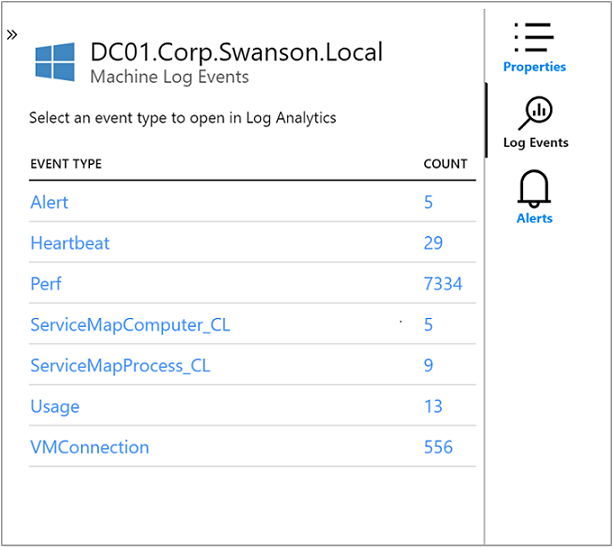
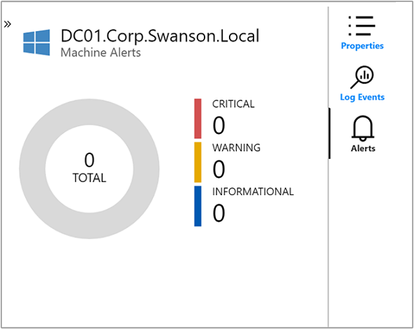

# Using VM Insights Maps to understand application components
Viewing the discovered application components on Windows and Linux virtual machines running in Azure your your environment can be observed in two ways with VM Insights, from a virtual machine directly or across all VMs in a subscription from Azure Monitor. 

This article will help you understand the experience between the two perspectives and how to use VM Insights Maps. For information about configuring VM Insights, see [Configuring solution in Azure](monitoring-vminsights-onboard.md).

## Sign in to Azure
Sign in to the Azure portal at [https://portal.azure.com](https://portal.azure.com).

## View Map directly from a virtual machine 
To access VM Insights directly from a virtual machine, perform the following.

1. In the Azure portal, select **Virtual Machines**. 
2. From the list, choose a VM and in the **Monitoring** section choose **Insights (preview)**.  
3. Select the **Map** tab.

Maps visualizes the VMs dependencies, that is running process groups and processes with active network connections, over a specified time range.  By default, the map shows the last 30 minutes.  Using the **TimeRange** selector in the upper left-hand corner, you can query for historical time ranges of up to one hour to show how dependencies looked in the past (for example, during an incident or before a change occurred).  

When a virtual machine onboarded to the solution is expanded to show process details, only those processes that communicate with the focus VM are shown. The count of agentless front-end machines that connect into the focus machine is indicated with the Port Group, along with other connections to the same port number.  Expand the Port Group to see the detailed list of servers connected over that port.   

Certain processes serve particular roles on machines: web servers, application servers, database, and so on. Service Map annotates process and machine boxes with role icons to help identify at a glance the role a process or server plays.

When you click on the virtual machine, the **Properties** pane is expanded on the right to show the properties of the item selected, such as system information reported by the operating system, properties of the Azure VM, and a doughnut summarizing the discovered connections. 

On the right-side of the pane, click on the **Log Events** icon to switch focus of the pane to show a list of tables that collected data from the VM has sent to Log Analytics and is available for querying.  Clicking on any one of the record types listed will open the **Log search** page to view the results for that type with a pre-configured query filtered against the specific virtual machine.  

Close *Log search** and return to the **Properties** pane and select **Alerts** to view alerts that alerts raised for the VM from health criteria.  

The **Legend** option in the upper right-hand corner describes the symbols and roles on a map.  To zoom in for a closer look at your map and move the it around, the Zoom controls at the bottom right-hand side of the page sets the zoom level and fit the page to the size of the current page.  

## View Maps from Azure Monitor
From Azure Monitor, the Maps feature provides a global view of your virtual machines and their dependencies.  To access VM Insights from Azure Monitor, perform the following. 

1. In the Azure portal, select **Monitor**. 
2. Choose **Virtual Machines (preview)** in the **Solutions** section.
3. Select the **Map** tab.

From the **Workspace** selector at the top of the page, if you have more than one Log Analytics workspace, choose the one that is integrated with the solution and has virtual machines reporting to it.  You then select from the **Group** selector, a subscription or resource group to view a set of VMs and their dependencies matching the group, over a specified period of time.  By default, the map shows the last 30 minutes.  Using the **TimeRange** selector, you can query for historical time ranges of up to one hour to show how dependencies looked in the past (for example, during an incident or before a change occurred).   

