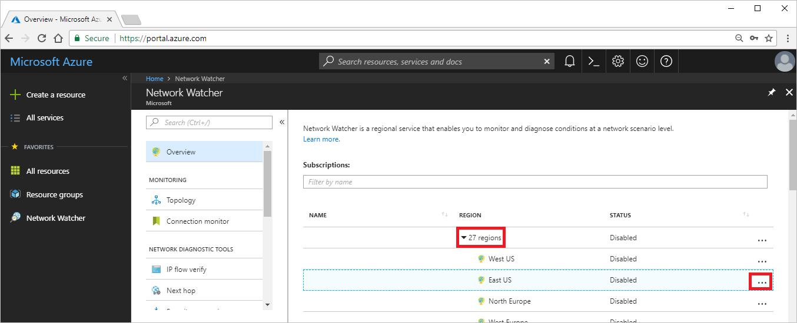
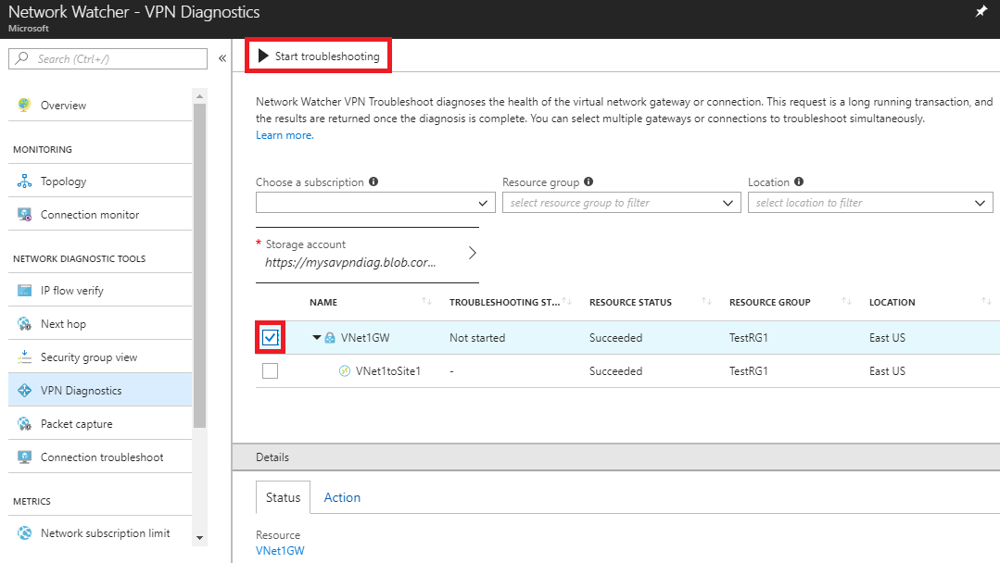
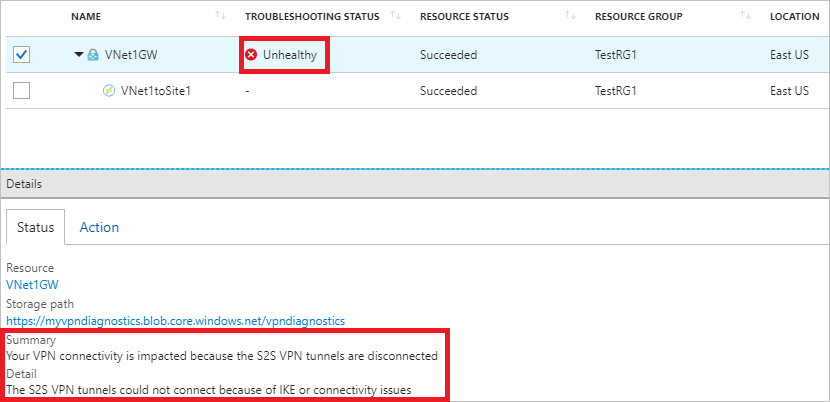
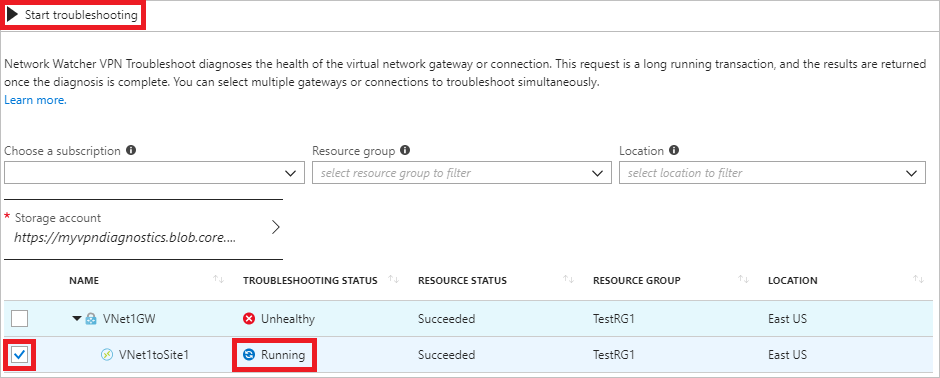
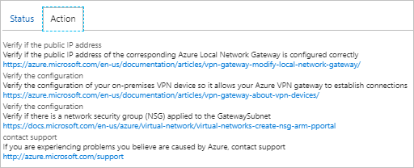

# Tutorial: Diagnose a communication problem between networks using the Azure portal

A virtual network gateway connects an Azure virtual network to an on-premises, or other virtual network. In this tutorial, you learn how to:

> [!div class="checklist"]
> * Use Network Watcher's VPN diagnostics capability to diagnose a problem with a virtual network gateway
> * Diagnose a problem with a gateway connection
> * Learn how to resolve a problem with a gateway

If you don't have an Azure subscription, create a [free account](https://azure.microsoft.com/free/?WT.mc_id=A261C142F) before you begin.

## Prerequisites

To use VPN diagnostics, you must have an existing, running VPN gateway. If you don't have an existing VPN gateway to diagnose, you can deploy one using a [PowerShell script](../vpn-gateway/scripts/vpn-gateway-sample-site-to-site-powershell.md?toc=%2fazure%2fnetwork-watcher%2ftoc.json). You can run the PowerShell script from:
    - **A local PowerShell installation**: The script requires the AzureRM PowerShell module version 5.7.0 or later. Run `Get-Module -ListAvailable AzureRM` to find the installed version. If you need to upgrade, see [Install Azure PowerShell](/powershell/azure/install-azurerm-ps). If you are running PowerShell locally, you also need to run `Login-AzureRmAccount` to create a connection with Azure.
    - **The Azure Cloud Shell**: The [Azure Cloud Shell](https://shell.azure.com/powershell) has the latest version of PowerShell installed and configured, and logs you into Azure.

The script takes approximately an hour to create a VPN gateway. The remaining steps assume that the gateway you're diagnosing is the one deployed by this script. If you diagnose your own existing gateway instead, your results will vary.

## Sign in to Azure

Sign in to the [Azure portal](https://portal.azure.com).

## Enable Network Watcher

If you already have a network watcher enabled in at least one region, skip to [Diagnose a gateway](#diagnose-a-gateway).

1. In the portal, select **All services**. In the **Filter box**, enter *Network Watcher*. When **Network Watcher** appears in the results, select it.
2. Select **Regions**, to expand it, and then select **...** to the right of **East US**, as shown in the following picture:

    

3. Select **Enable Network Watcher**.

## Diagnose a gateway

1. On the left side of the portal, select **All services**.
2. Start typing *network watcher* in the **Filter** box. When **Network Watcher** appears in the search results, select it.
3. Under **NETWORK DIAGNOSTIC TOOLS**, select **VPN Diagnostics**.
4. Select **Storage account**, and then select the storage account you want to write diagnostic information to.
5. From the list of **Storage accounts**, select the storage account you want to use. If you don't have an existing storage account, select **+ Storage account**, enter, or select the required information, and then select **Create**, to create one. If you created a VPN gateway using the script in [prerequisites](#prerequisites), you may want to create the storage account in the same resource group, *TestRG1*, as the gateway.
6. From the list of **Containers**, select the container you want to use, and then select **Select**. If you don't have any containers, select **+ Container**, enter a name for the container, then select **OK**.
7. Select a gateway, and then select **Start troubleshooting**. As shown in the following picture, the test is run against a gateway named **Vnet1GW**:

    

8. While the test is running, **Running** appears in the **TROUBLESHOOTING STATUS** column where **Not started** is shown, in the previous picture. The test may take several minutes to run.
9. View the status of a completed test. The following picture shows the status results of a completed diagnostic test:

    

    You can see that the **TROUBLESHOOTING STATUS** is **Unhealthy**, as well as a **Summary** and **Detail** of the problem on the **Status** tab.
10. When you select the **Action** tab, VPN diagnostics provides additional information. In the example, shown in the following picture, VPN diagnostics lets you know that you should check the health of each connection:

  

## Diagnose a gateway connection

A gateway is connected to other networks via a gateway connection. Both the gateway and gateway connections must be healthy for successful communication between a virtual network and a connected network.

1. Complete step 7 of [Diagnose a gateway](#diagnose-a-gateway) again, this time, selecting a connection. In the following example, a connection named **VNet1toSite1** is tested:

    

    The test runs for several minutes.
2. After the test of the connection is complete, you receive results similar to the results shown in the following pictures on the **Status** and **Action** tabs:

    

    

    VPN diagnostics informs you what is wrong on the **Status** tab, and gives you several suggestions for what may be causing the problem on the **Action** tab.

    If the gateway you tested was the one deployed by the [script](../vpn-gateway/scripts/vpn-gateway-sample-site-to-site-powershell.md?toc=%2fazure%2fnetwork-watcher%2ftoc.json) in [Prerequisites](#prerequisites), then the problem on the **Status** tab, and the first two items on the **Actions** tab are exactly what the problem is. The script configures a placeholder IP address, 23.99.221.164, for the on-premises VPN gateway device.

    To resolve the issue, you need to ensure that your on-premises VPN gateway is [configured properly](../vpn-gateway/vpn-gateway-about-vpn-devices.md?toc=%2fazure%2fnetwork-watcher%2ftoc.json), and change the IP address configured by the script for the local network gateway, to the actual public address of your on-premises VPN gateway.

## Clean up resources

If you created a VPN gateway using the script in the [prerequisites](#prerequisites) solely to complete this tutorial, and no longer need it, delete the resource group and all of the resources it contains:

1. Enter *TestRG1* in the **Search** box at the top of the portal. When you see **TestRG1** in the search results, select it.
2. Select **Delete resource group**.
3. Enter *TestRG1* for **TYPE THE RESOURCE GROUP NAME:** and select **Delete**.

## Next steps

In this tutorial, you learned how to diagnose a problem with a virtual network gateway. It's useful, and sometimes required by organizational policy, to review the network traffic that flows to and from VMs. To review network traffic, you first associate a network security group (NSG) to a VM network interface, a virtual network subnet, or both, and enable NSG flow logging. To learn how, advance to the next tutorial.

> [!div class="nextstepaction"]
> [Log network traffic that flows through a network security group](network-watcher-nsg-flow-logging-portal.md)