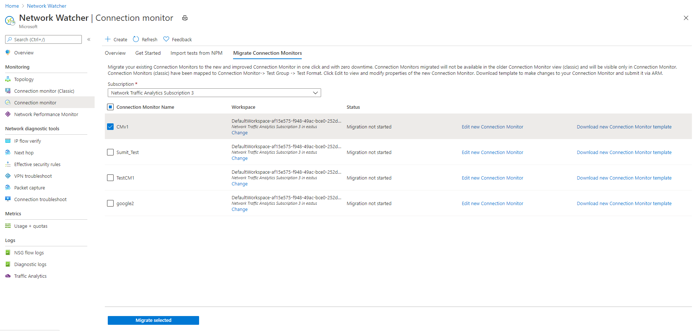

# Migrate to Connection Monitor (Preview) from Connection Monitor

You can migrate existing connection monitors to the new and improved Connection Monitor(Preview) in one click and with zero downtime. To know more about the benefits, you may read [Connection Monitor (Preview)](https://docs.microsoft.com/azure/network-watcher/connection-monitor-preview)

## Key points to note

* Agents and firewall settings will work as is (no touch required) 
* Existing connection monitors will be mapped to Connection Monitor (Preview)-> Test Group -> Test format. Users can click *Edit* to view and modify properties of the new Connection Monitor and download template to make changes to Connection Monitor and submit it via Azure Resource Manager. 
* Azure virtual machines with Network Watcher extension send data to both workspace and metrics. Connection Monitors will make the data available through the new metrics (ChecksFailedPercent (Preview) and RoundTripTimeMs (Preview)) instead of the stop old metrics (ProbesFailedPercent and AverageRoundtripMs) 
* Monitoring data
	* Alerts – Will be migrated to new metrics as a part of migration
	* Dashboards and Integrations – You will have to manually edit the metrics set. 
	
## Prerequisites

If using custom workspace, ensure Network Watcher is enabled in subscription and region of the Log Analytics workspace 

## Steps to migrate from Connection Monitor to Connection Monitor (Preview)

1. Click on “Connection Monitor”, navigate to “Migrate Connection Monitors” to migrate connection monitors from older to newer solution.

	
	
1. Select subscription and connection monitors and click “Migrate selected”. In one click migrate existing connection monitors  to Connection Monitor(Preview) 
1. You can customize connection monitor properties, change default workspace, download template and check status of migration. 
1. Once migration begins, following changes happen: 
	1. Azure Resource Manager (ARM) resource changes to the newer connection monitor
		1. Name, region, and subscription of the connection monitor remains unchanged. Hence, there is no impact on the resource ID.
		1. Unless customized, a default Log Analytics workspace is created in the region and subscription of the connection monitor. This workspace is where monitoring data will be stored. Test result data will also be stored in metrics.
		1. Each test is migrated to a test group called * defaultTestGroup*
		1.	Source and destination endpoints are created and used in the created test group. Default names are *defaultSourceEndpoint* and *defaultDestinationEndpoint*
		1. Destination port and probing interval are moved to the test configuration called *defaultTestConfiguration*. Based on the port values, the protocol is set. Success thresholds and other optional properties are left blank.
	1. Metric alerts get migrated to Connection Monitor (Preview) metric alerts. The metrics are different <link to metric section in the doc>, hence the change
	1. The migrated connection monitors will not show up in the older connection monitor solution, they will now only be available for use in Connection Monitor (Preview)
	1. Any external integrations like dashboards in PowerBI, Grafana, integrations with SIEM systems, will need to be migrated by the user directly. This is the only manual step the user needs to perform to migrate his setup.

## Next steps

* Learn [how to migrate from Network Performance Monitor to Connection Monitor (Preview)](migrate-to-connection-monitor-preview-from-network-performance-monitor.md)
* Learn [how to create Connection Monitor (Preview) using Azure portal](https://docs.microsoft.com/azure/network-watcher/connection-monitor-preview-create-using-portal)
