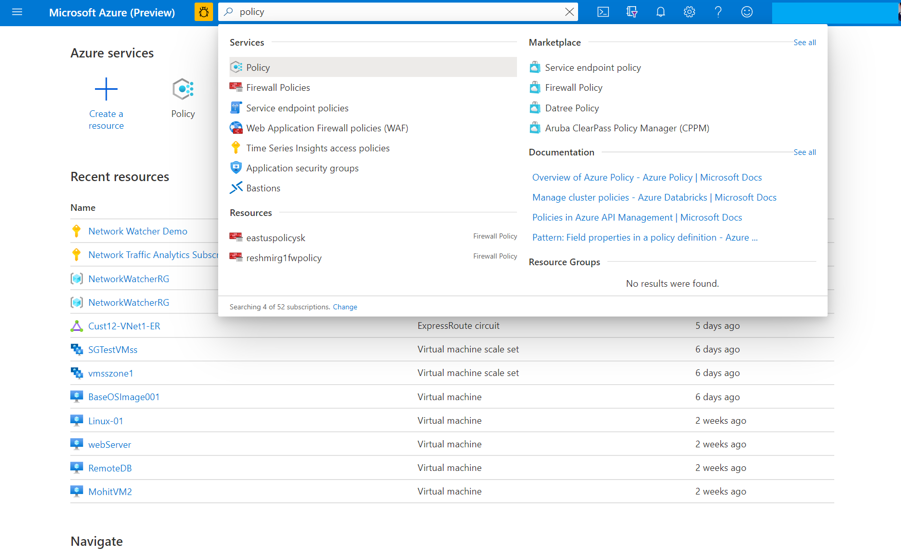
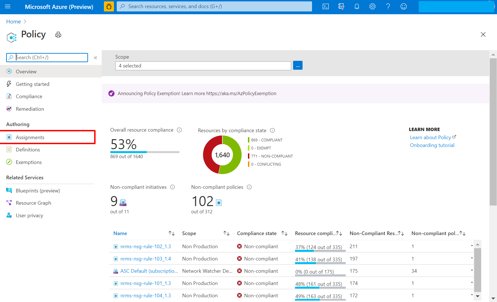
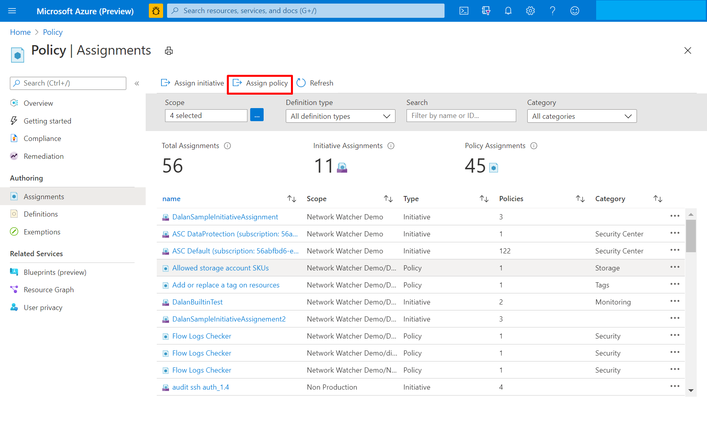
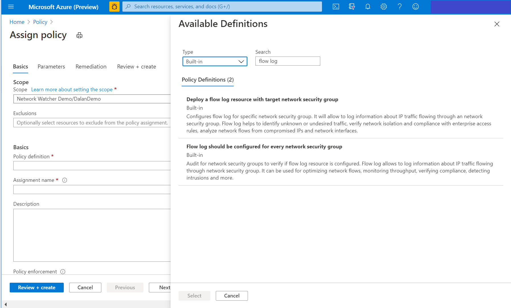

# QuickStart: Deploy and manage NSG Flow Logs using Azure Policy 

## Overview
Azure Policy helps to enforce organizational standards and to assess compliance at-scale. Common use cases for Azure Policy include implementing governance for resource consistency, regulatory compliance, security, cost, and management.

## Goal
In this article, we will use two built-in policies available for NSG Flow Logs to manage your flow logs setup. The first policy automatically deploys Flow logs for NSGs without Flow logs enabled. The second policy flags any NSGs without flow logs enabled. 

## NSG Object property  
Flow Logs are currently enabled NSGs. This linkage is programmatically accessible, using the /flowlogs property of the NSG ARM objects. Thus, you can check if Flowlogs are enabled and retrieve the name of the Flowlog object using the property. This property is used in both the policies below. 

## Introduction to Policies 

### DINE policy 
TK: <Insert huge DINE policy JSON>
For a given region, the policy checks all NSGs for the existence of a flow log. If the flow logs don’t exist, they are deployed. 
TK: Sync with Julio to get up to date on all the parameters. Especially the messy ones.

### Audit policy 
TK: <Insert audit policy JSON>
The policy checks all existing ARM objects of type “Microsoft.Network/networkSecurityGroups” i.e. it looks at all NSGs in a given scope, and checks for the existence of linked flowlogs via the flowlogs property. If the property doesn’t not exist, the NSG is flagged.   

## Tutorial for assign
Azure policies are applied to resources through *assignments*. Applying policies individually can become cumbersome. Instead we can use *policy initiatives* which are policy sets that allow you to assign multiple policies at once. We will create a policy initiative that uses both of the above policies. 

### Choose your scope 
Choose your scope: The screen below my target RG with a VM, a NIC and an NSG. 
You can observe that the NSG doesn't have Flow logs enabled. 

## Creating an assignment 
- Go to the Azure portal – portal.azure.com 

Navigate to Azure Policy page by searching for Policy in the top search bar 

- Head over to the **Assignments** tab from the left pane

- Click on **Assign Policy** button 

- Choose your scope 

- Hit the three dots menu under "Policy Definitions" to bring up the available policies

- Use the Type filter and choose "Built-in". Then search for 'Flow log'
This should bring up the two built-in policies for Flow logs

- Choose the policy you want to assign. There are separate instructions for each policy below.  

### See the results of the policy
Click on the Compliance tab to see the state of the policy 
•	Search for the assignment name.
•	If you see “Not Started”, please wait for some time 
•	Else you should see the results 

Show 
•	Show state of RG after policy 

### Clean up. 
•	Delete assignment 

## Next steps 
•	Go deeper with ARM templates 
•	Learn more about Azure governance policies 
