# Traffic Analytics

Traffic Analytics is a cloud-based solution that provides visibility into user and application activity in cloud networks. Traffic Analytics analyzes Network Watcher network security group (NSG) flow logs to provide insights into traffic flow in your Azure cloud. With Traffic Analytics, you can:

- Visualize network activity across your Azure subscriptions and identify hotspots.
- Identify security threats to, and secure your network, with information such as open-ports, applications attempting internet access, and virtual machines (VM) connecting to rogue networks.
- Understand traffic flow patterns across Azure regions and the internet to optimize your network deployment for performance and capacity.
- Pinpoint network misconfigurations leading to failed connections in your network.

## Why Traffic Analytics?

It is vital to monitor, manage, and know your own network for uncompromised security, compliance, and performance. Knowing your own environment is of paramount importance to protect and optimize it. You often need to know the current state of the network, who is connecting where, which ports are open to the internet, expected network behavior, irregular network behavior, and sudden rises in traffic.

Cloud networks are different than on-premises enterprise networks, where you have Netflow or equivalent protocol capable routers and switches, which provide the capability to collect IP network traffic as it enters or exits a network interface. By analyzing traffic flow data, you can build an analysis of network traffic flow and volume.

Azure virtual networks have NSG flow logs, which provide you information about ingress and egress IP traffic through a Network Security Group associated to individual network interfaces, VMs, or subnets. By analyzing raw NSG flow logs, and inserting intelligence of security, topology, and geography, Traffic Analytics can provide you with insights into traffic flow in your environment. Traffic Analytics provides information such as most communicating hosts, most communicating application protocols, most conversing host pairs, allowed/blocked traffic, inbound/outbound traffic, open internet ports, most blocking rules, traffic distribution per Azure datacenter, virtual network, subnets, or, rogue networks.

## Key components 

- **Network security group (NSG)**: Contains a list of security rules that allow or deny network traffic to resources connected to an Azure Virtual Network. NSGs can be associated to subnets, individual VMs (classic), or individual network interfaces (NIC) attached to VMs (Resource Manager). For more information, see [Network security group overview](../virtual-network/security-overview.md?toc=%2fazure%2fnetwork-watcher%2ftoc.json).
- **Network Security Group (NSG) flow logs**: Allow you to view information about ingress and egress IP traffic through a network security group. NSG flow logs are written in json format and show outbound and inbound flows on a per rule basis, the NIC the flow applies to, 5-tuple information about the flow (source/destination IP address, source/destination port, and protocol), and if the traffic was allowed or denied. For more information about NSG flow logs, see [NSG flow logs](network-watcher-nsg-flow-logging-overview.md).
- **Log Analytics**: An Azure service that collects monitoring data and stores the data in a central repository. This data can include events, performance data, or custom data provided through the Azure API. Once collected, the data is available for alerting, analysis, and export. Monitoring applications such as Network Performance Monitor and Traffic Analytics are built using Log Analytics as a foundation. For more information, see [Log analytics](../log-analytics/log-analytics-overview.md?toc=%2fazure%2fnetwork-watcher%2ftoc.json).
- **Log Analytics Workspace**: An instance of Log Analytics, where the data pertaining to an Azure account, is stored. For more information about
Log Analytics Workspaces, see [Create a Log Analytics workspace](../log-analytics/log-analytics-quick-create-workspace.md?toc=%2fazure%2fnetwork-watcher%2ftoc.json).
- **Network Watcher**: A regional service that enables you to monitor and diagnose conditions at a network scenario level in Azure. You can turn NSG flow logs on and off with Network Watcher. For more information, see [Network Watcher](network-watcher-monitoring-overview.md#network-watcher).

## How Traffic Analytics works 

Traffic Analytics examines the raw NSG flow logs and captures reduced logs by aggregating common flows among the same source IP address, destination IP address, destination port, and protocol. For example, Host 1 (IP address: 10.10.10.10) communicating to Host 2 (IP address: 10.10.20.10), 100 times over a period of 1 hour using port (for example, 80) and protocol (for example, http). The reduced log has one entry, that Host 1 & Host 2 communicated 100 times over a period of 1 hour using port *80* and protocol *HTTP*, instead of having 100 entries. Reduced logs are enhanced with geography, security, and topology information, and then stored in a Log Analytics workspace. The following picture shows the data flow:


## Supported regions

Traffic Analytics is available in preview. Features in preview release do not have the same level of availability and reliability as features in general release.  While in preview release, you can use Traffic Analytics for NSGs in any of the following regions: West Central US, East US, East US 2, North Central US, South Central US, Central US, West US, West US-2, West Europe, North Europe, West UK, South UK, Australia East, and Australia Southeast. The Log Analytics workspace must exist in the West Central US, East US, West Europe, Australia Southeast, or South UK region.

## Prerequisites

### Enable Network Watcher 

To analyze traffic, you need to have an existing Network Watcher, or [enable an Azure Network watcher](network-watcher-create.md) in each region that you have NSGs that you want to analyze traffic for. Traffic Analytics can be enabled for NSGs hosted in any of the [supported regions](#supported-regions).

### Re-register the network resource provider 

Before you can use Traffic Analytics during the preview, you must re-register your network resource provider. Click **Try It** in the following code box to open the Azure Cloud Shell. The Cloud Shell automatically logs you into to your Azure subscription. Once the Cloud Shell is open, enter the following command to re-register the network resource provider:

```azurepowershell-interactive
Register-AzureRmResourceProvider -ProviderNamespace "Microsoft.Network"
```

### Select a network security group 

Before enabling NSG flow logging, you must have a network security group to log flows for. If you don't have a network security group, see [Create a network security group](../virtual-network/virtual-networks-create-nsg-arm-pportal.md) to create one.

On the left side of the Azure portal, select **Monitor**, then **Network watcher**, and then select **NSG flow logs**. Select the network security group that you want to enable an NSG flow log for, as shown in the following picture:


If you try to enable Traffic Analytics for an NSG that is hosted in any region other than the [supported regions](#supported-regions), you receive a "Not found" error. 

## Enable flow log settings

Before enabling flow log settings, you must complete the following tasks:

Register the Azure Insights provider, if it's not already registered for your subscription:

```azurepowershell-interactive
Register-AzureRmResourceProvider -ProviderNamespace Microsoft.Insights
```

If you don't already have an Azure Storage account to store NSG flow logs in, you must create a storage account. You can create a storage account with the command that follows. Before running the command, replace `<replace-with-your-unique-storage-account-name>` with a name that is unique across all Azure locations, between 3-24 characters in length, using only numbers and lower-case letters. You can also change the resource group name, if necessary.

```azurepowershell-interactive
New-AzureRmStorageAccount `
  -Location westcentralus `
  -Name <replace-with-your-unique-storage-account-name> `
  -ResourceGroupName myResourceGroup `
  -SkuName Standard_LRS `
  -Kind StorageV2
```

Select the following options, as shown in the picture:

1. Select *On* for **Status**
2. Select an existing storage account to store the flow logs in. If you want to store the data forever, set the value to *0*. You incur Azure Storage fees for the storage account.
3. Set **Retention** to the number of days you want to store data for.
4. Select *On* for **Traffic Analytics Status**.
5. Select an existing Log Analytics (OMS) Workspace, or select **Create New Workspace** to create a new one. A Log Analytics workspace is used by Traffic Analytics  to store the aggregated and indexed data that is then used to generate the analytics. If you select an existing workspace, it must exist in one of the [supported regions](#traffic-analytics-supported-regions) and have been upgraded to the new query language. If you do not wish to upgrade an existing workspace, or do not have a workspace in a supported region, create a new one. For more information about query languages, see [Azure Log Analytics upgrade to new log search](../log-analytics/log-analytics-log-search-upgrade.md?toc=%2fazure%2fnetwork-watcher%2ftoc.json).

    The Log Analytics (OMS) Workspace hosting the Traffic Analytics solution and the NSGs do not have to be in the same region. For example, you may have Traffic Analytics in a workspace in the West Europe region, while you may have NSGs in East US and West US. Multiple NSGs can be configured in the same workspace.
6. Select **Save**.

    

Repeat the previous steps for any other NSGs for which you wish to enable Traffic Analytics for. Data from flow logs is sent to the workspace, so ensure that the local laws and regulations in your country permit data storage in the region where the workspace exists.

## View Traffic Analytics

On the left-side of the portal, select **All services**, then enter *Monitor* in the **Filter** box. When **Monitor** appears in the search results, select it. To start exploring Traffic Analytics and its capabilities, select **Network watcher**, then **Traffic Analytics (Preview)**.

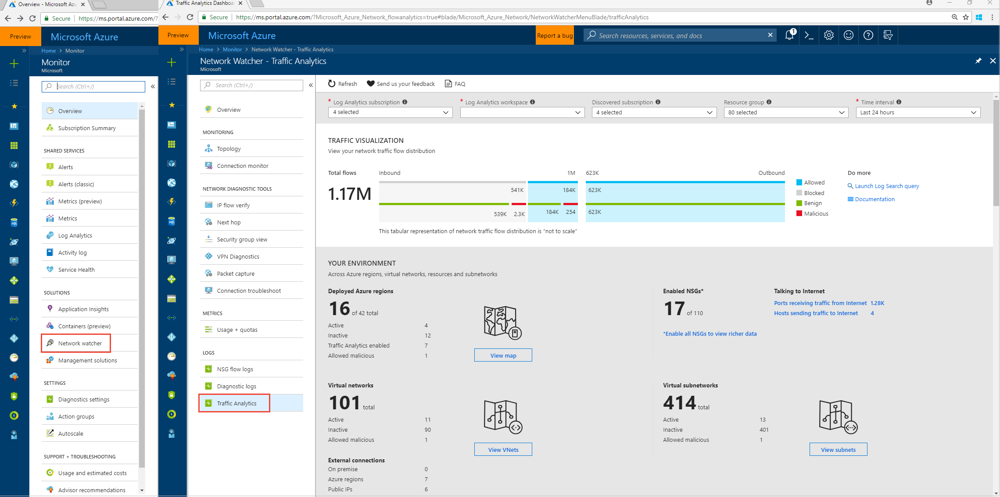

The dashboard may take up to 30 minutes to appear the first time because Traffic Analytics must first aggregate enough data for it to derive meaningful insights, before it can generate any reports.

## Usage scenarios

Some of the insights you might want to gain after Traffic Analytics is fully configured, are as follows:

### Find traffic hotspots

**Look for**

- Which hosts are sending or receiving the most traffic?
    - Understanding which hosts are sending or receiving the most traffic can help you identify the hosts that are processing the most traffic.
    - You can evaluate if the volume of traffic is appropriate for a host. Is the volume of traffic normal behavior, or does it merit further investigation?
- How much inbound/outbound traffic is there?
    -   Is the host expected to receive more inbound traffic than outbound, or vice-versa?
- Statistics of allowed/blocked traffic.
    - Why is a host allowing or blocking a significant volume of traffic?

    Select **More details**, under **Hosts with most traffic**, as shown in the following picture:

    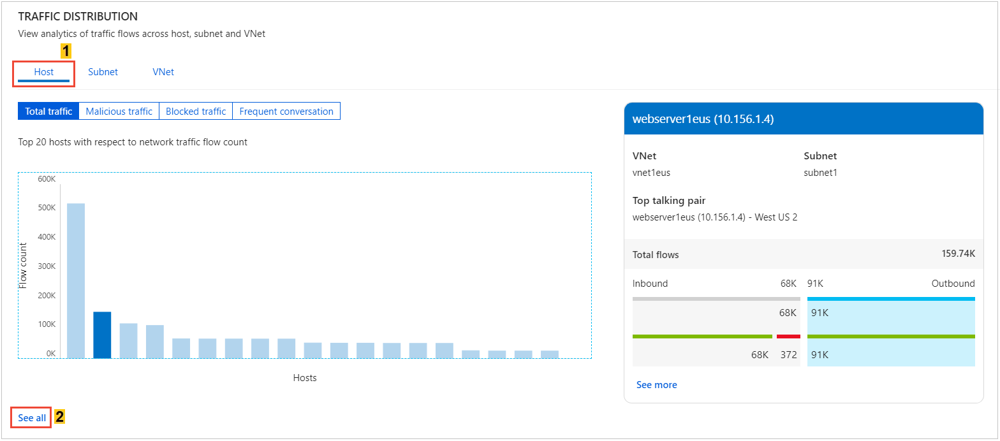

- The following picture shows time trending for the top five talking hosts and the flow-related details (allowed – inbound/outbound and denied - inbound/outbound flows) for a VM:

    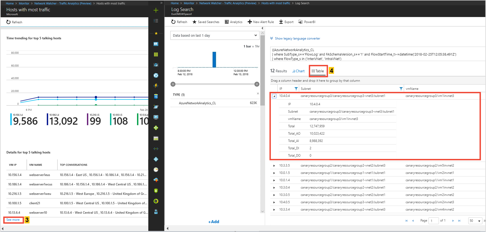

**Look for**

- Which are the most conversing host pairs?
    - Expected behavior like front end-backend communication or irregular behavior, like backend-internet traffic.
- Statistics of allowed/blocked traffic
    - Why a host is allowing or blocking significant traffic volume
- Most frequently used application protocol among most conversing host pairs:
    - Are these applications allowed on this network?
    - Are the applications configured properly? Are they using the appropriate protocol for communication? Select **More details** under **Most frequent conversations**, as show in the following picture:

        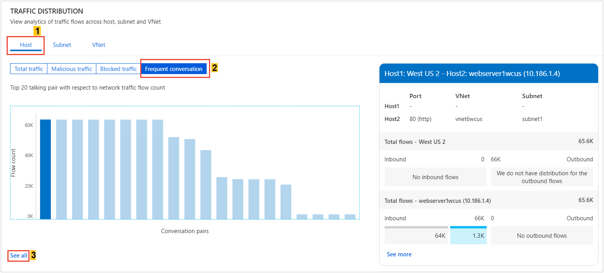

- The following picture shows time trending for the top five conversations and the flow-related details such as allowed and denied inbound and outbound flows for a conversation pair:

    

**Look for**

- Which application protocol is most used in your environment, and which conversing host pairs are using the application protocol the most?
    - Are these applications allowed on this network?
    - Are the applications configured properly? Are they using the appropriate protocol for communication? Expected behavior is common ports such as 80 and 443. For standard communication, if any unusual ports are displayed, they might require a configuration change. Select **More details** under **Top application protocols**, in the following picture:

        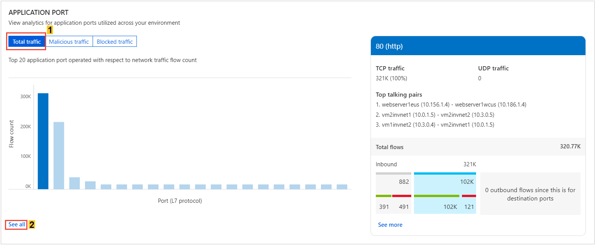

- The following pictures show time trending for the top five L7 protocols and the flow-related details (for example, allowed and denied flows) for an L7 protocol:

    

    

**Look for**

- Capacity utilization trends of a VPN gateway in your environment.
    - Each VPN SKU allows a certain amount of bandwidth. Are the VPN gateways underutilized?
    - Are your gateways reaching capacity? Should you upgrade to the next higher SKU?
- Which are the most conversing hosts, via which VPN gateway, over which port?
    - Is this pattern normal? Select **More details** under **Top active VPN connections**, as shown in the following picture:

        

- The following picture shows time trending for capacity utilization of an Azure VPN Gateway and the flow-related details (such as allowed flows and ports):

    

### Visualize traffic distribution by geography

**Look for**

- Traffic distribution per data center such as top sources of traffic to a datacenter, top rogue networks conversing with the data center, and top conversing application protocols.
    - If you observe more load on a data center, you can plan for efficient traffic distribution.
    - If rogue networks are conversing in the data center, then correct NSG rules to block them.

    Select **Click here to see live geomap** under **Traffic distribution across Azure data centers**, as shown in the following picture:

  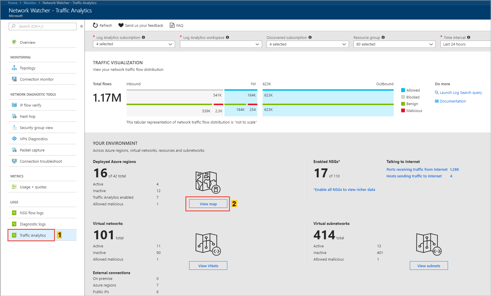

- The geo-map shows the top ribbon for selection of parameters such as data centers (Deployed/No-deployment/Active/Inactive/Traffic Analytics Enabled/Traffic Analytics Not Enabled) and countries contributing Benign/Malicious traffic to the active deployment:

    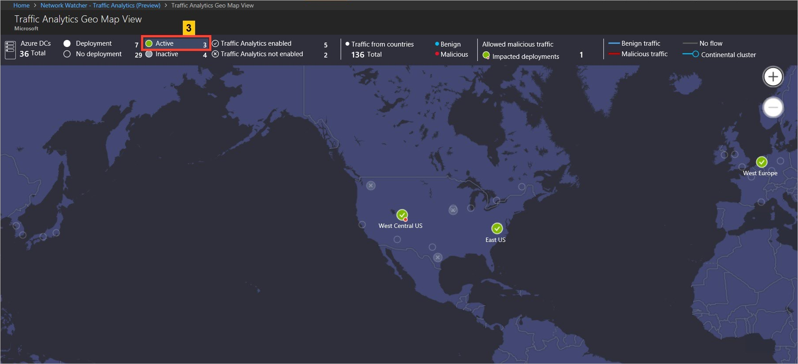

- The geo-map shows the traffic distribution to a data center from countries and continents communicating to it in blue (Benign traffic) and red (malicious traffic) colored lines:

    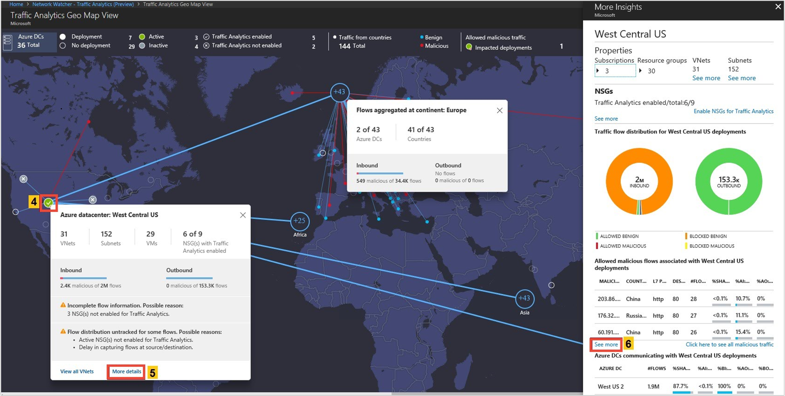

    

### Visualize traffic distribution by virtual networks

**Look for**

- Traffic distribution per virtual network, topology, top sources of traffic to the virtual network, top rogue networks conversing to the virtual network, and top conversing application protocols.
    - Knowing which virtual network is conversing to which virtual network. If the conversation is not expected, it can be corrected.
    - If rogue networks are conversing with a virtual network, you can correct NSG rules to block the rogue networks.
 
    Select **Click here to see VNet traffic topology** under **Virtual network distribution**, as shown in the following picture: 

    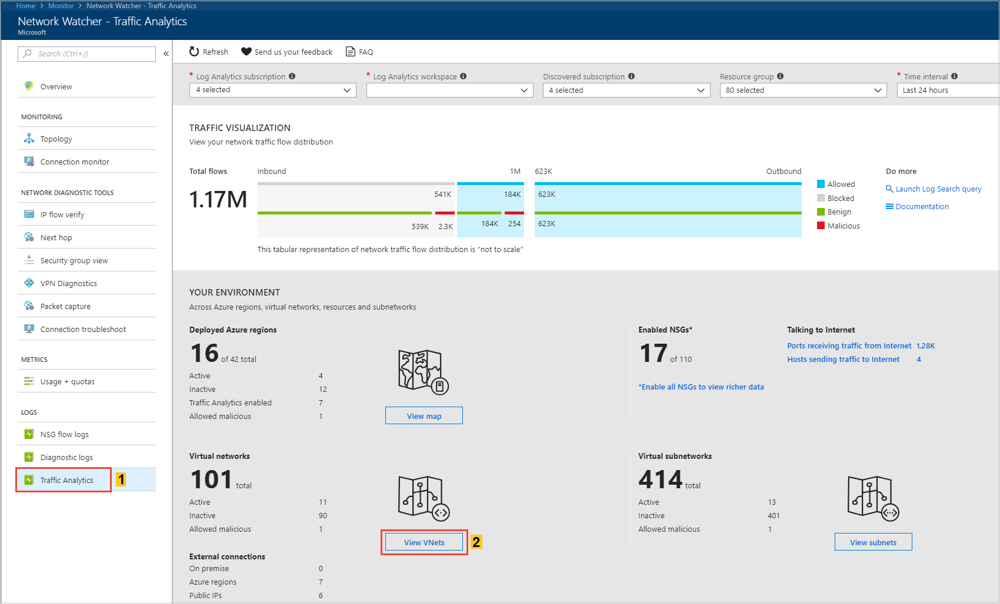

- The Virtual Network Topology shows the top ribbon for selection of parameters like a virtual network’s (Inter virtual network Connections/Active/Inactive), External Connections, Active Flows, and Malicious flows of the virtual network.
- The Virtual Network Topology shows the traffic distribution to a virtual network with regards to flows (Allowed/Blocked/Inbound/Outbound/Benign/Malicious), application protocol, and network security groups, for example:

    

    

**Look for**

- Traffic distribution per subnet, topology, top sources of traffic to the subnet, top rouge networks conversing to the subnet, and top conversing application protocols.
    - Knowing which subnet is conversing to which subnet. If you see unexpected conversations, you can correct your configuration.
    - If rouge networks are conversing with a subnet, you are able to correct it by configuring NSG rules to block the rogue networks, for example.
- The Subnets Topology shows the top ribbon for selection of parameters such as Active/Inactive subnet, External Connections, Active Flows, and Malicious flows of the subnet.
- The Subnet Topology shows the traffic distribution to a virtual network with regards to flows (Allowed/Blocked/Inbound/Outbound/Benign/Malicious), application protocol, and NSGs, for example:

    

### View ports and virtual machines receiving traffic from the internet

**Look for**

- Which open ports are conversing over the internet?
    - If unexpected ports are found open, you can correct your configuration:

        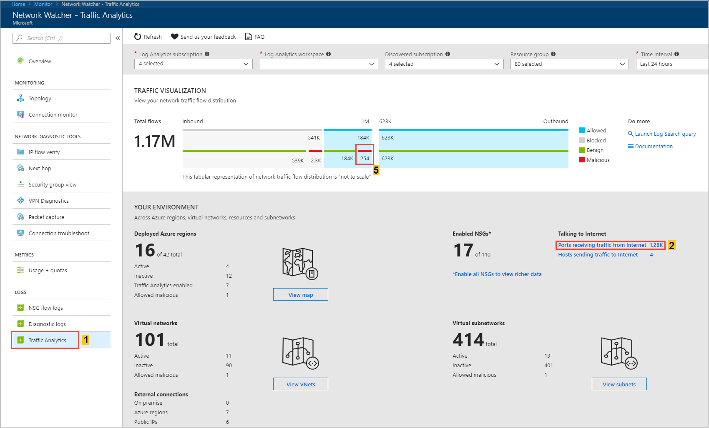

        

**Look for**

Do you have malicious traffic in your environment? Where is it originating from? Where is it destined to?


### Visualize the trends in NSG rule hits

**Look for**

- Which NSG/rule has the most hits?
- What are the top source and destination conversation pairs per NSG?

    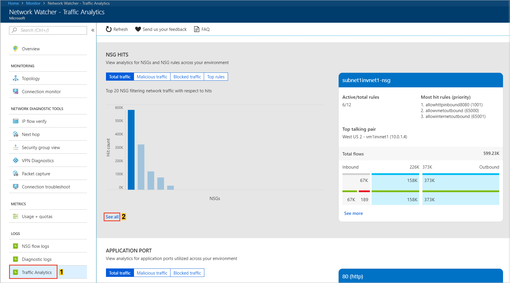

- The following pictures show time trending for hits of NSG rules and source-destination flow details for a network security group:

    

    