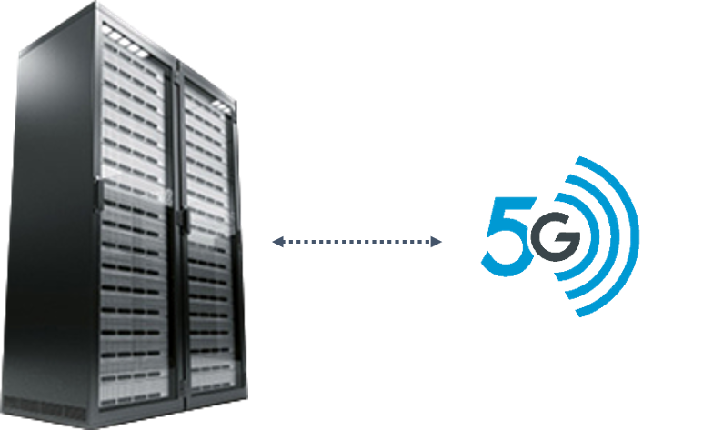
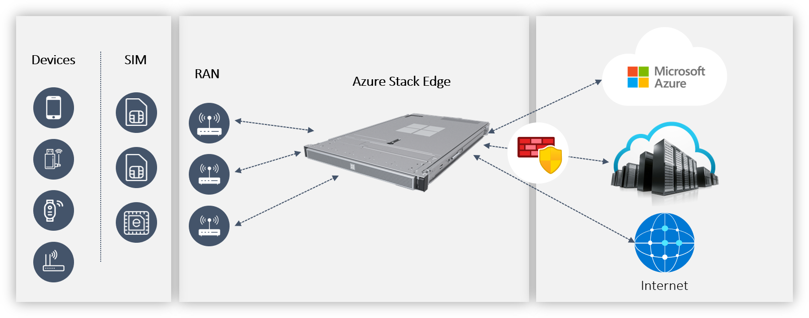

# About Azure Edge Zones - Preview

Azure Edge Zones is a family of offerings from Microsoft Azure that enables data processing close to the user. You can deploy VMs, containers, and other Azure services into edge zones to address the low latency and high throughput requirements of applications.

Typical use case scenarios for Edge Zones include:

- Real-time command and control in robotics.
- Real-time analytics and inferencing via artificial intelligence and machine learning.
- Machine vision.
- Remote rendering for mixed reality and VDI scenarios.
- Immersive multiplayer gaming.
- Media streaming and content delivery.
- Surveillance and security.

There are three types of Azure edge zones:

- Azure Edge Zones
- Azure Edge Zones with Carrier
- Azure Private Edge Zones

## Azure Edge Zones

Azure edge zones are small-footprint extensions of Azure placed in population centers that are far away from Azure regions. Azure edge zones support VMs, containers, and a set of Azure services that let you run latency-sensitive and throughput-intensive applications close to end users.

Azure Edge Zones is part of the Microsoft global network. It provides secure, reliable, high-bandwidth connectivity between applications that run at the edge zone close to the user. And it offers the full set of Azure services running within Azure regions. Azure edge zones are owned and operated by Microsoft. You can use the same set of Azure tools and the same portal to manage and deploy services into edge zones.

Typical use cases include:

- Gaming and game streaming.
- Media streaming and content delivery.
- Real-time analytics and inferencing via artificial intelligence and machine learning.
- Rendering for mixed reality.

Azure Edge Zones will be available in the following metro areas:

- New York, NY
- Los Angeles, CA
- Miami, FL

[Contact the Edge Zones team](https://aka.ms/EdgeZones) for more information.

## Azure Edge Zones with Carrier

Azure edge zones with carrier are small-footprint extensions of Azure that are placed in mobile operators' datacenters in population centers. Azure Edge Zones with Carrier infrastructure is placed one hop away from the mobile operator's 5G network. This placement offers latency of less than 10 milliseconds to applications from mobile devices.

Azure Edge Zones with Carrier is deployed in mobile operators' datacenters and connected to the Microsoft global network. It provides secure, reliable, high-bandwidth connectivity between applications that run close to the user. And it offers the full set of Azure services running within Azure regions. Developers can use the same set of familiar tools to build and deploy services into the edge zones.

Typical use cases include:

- Gaming and game streaming.
- Media streaming and content delivery.
- Real-time analytics and inferencing via artificial intelligence and machine learning.
- Rendering for mixed reality.
- Connected automobiles.
- Tele-medicine.

Edge Zones will be offered in partnership with the following operators:

- AT&T (Atlanta, Dallas, and Los Angeles)

## Azure Private Edge Zones

Azure private edge zones are small-footprint extensions of Azure that are placed on-premises. Azure Private Edge Zones is based on the [Azure Stack Edge](https://azure.microsoft.com/products/azure-stack/edge/) platform. It enables low latency access to computing and storage services deployed on-premises. Private Edge Zones also lets you deploy applications from ISVs and virtualized network functions (VNFs) as [Azure managed applications](https://azure.microsoft.com/services/managed-applications/) along with virtual machines and containers on-premises. These VNFs can include mobile packet cores, routers, firewalls, and SD-WAN appliances. Azure Private Edge Zones comes with a cloud-native orchestration solution that lets you manage the lifecycles of VNFs and applications from the Azure portal.

Azure Private Edge Zones lets you develop and deploy applications on-premises by using the same familiar tools that you use to build and deploy applications in Azure. 

It also lets you: 

- Run private mobile networks (private LTE, private 5G).
- Implement security functions like firewalls.
- Extend your on-premises networks across multiple branches and Azure by using SD-WAN appliances on the same Private Edge Zone appliances and manage them from Azure.

Typical use cases include:

- Real-time command and control in robotics.
- Real-time analytics and inferencing with artificial intelligence and machine learning.
- Machine vision.
- Remote rendering for mixed reality and VDI scenarios.
- Surveillance and security.

We have a rich ecosystem of VNF vendors, ISVs, and MSP partners to enable end-to-end solutions that use Private Edge Zones. [Contact the Private Edge Zones team](https://aka.ms/EdgeZonesPartner) for more information.

### Private Edge Zones partners

#### Virtualized network functions (VNFs)

##### Virtualized Evolved Packet Core (vEPC) for mobile networks

- [Affirmed Networks](https://www.affirmednetworks.com/)
- [Druid Software](https://www.druidsoftware.com/)
- [Expeto](https://www.expeto.io/)
- [Mavenir](https://mavenir.com/)
- [Metaswitch](https://www.metaswitch.com/)
- [Nokia Digital Automation Cloud](https://www.dac.nokia.com/)

##### Mobile radio partners

- [Commscope Ruckus](https://support.ruckuswireless.com/)

##### SD-WAN vendors

- [NetFoundry](https://netfoundry.io/)
- [Nuage Networks from Nokia](https://www.nuagenetworks.net/)
- [VMware SD-WAN by Velocloud](https://www.velocloud.com/)

##### Router vendors

- [Arista](https://www.arista.com/)

##### Firewall vendors

- [Palo Alto Networks](https://www.paloaltonetworks.com/)

##### Managed Solutions Providers: Mobile operators and Global System Integrators (GSIs)

| GSIs and operators | Mobile operators |
| --- | --- |
| Amdocs                       | Etisalat             |
| American Tower               | NTT Communications   |
| CenturyLink                  | Proximus             |
| Expeto                       | Rogers               |
| Federated Wireless           | SK Telecom           |
| Infosys                      | Telefonica           |
| Tech Mahindra                | Telstra              |
|                              | Vodafone             |

[Contact the Private Edge Zones team](https://aka.ms/EdgeZonesPartner) for information on how to become a partner.

### Private Edge Zones solutions

#### Private mobile network on Private Edge Zones

You can now deploy a private mobile network on Private Edge Zones. Private mobile networks enable ultra-low latency, high capacity, and the reliable and secure wireless network that's required for business-critical applications. 

Private mobile networks can enable scenarios like: 
- Command and control of automated guided vehicles (AGVs) in warehouses. 
- Real-time communication between robots in smart factories.
- Augmented reality and virtual reality edge applications.

The virtualized evolved packet core (vEPC) network function is the brains of a private mobile network. You can now deploy a vEPC on Private Edge Zones. For a list of vEPC partners that are available on Private Edge Zones, see [vEPC ISVs](#vEPC).

Deploying a private mobile network solution on Private Edge Zones requires other components, like mobile access points, SIM cards, and other VNFs like routers. Access to licensed or unlicensed spectrum is critical to setting up a private mobile network. And you might need help with RF planning, physical layout, installation, and support. For a list of partners, see [Mobile radio partners](#mobile-radio).

Microsoft provides a partner ecosystem that can help with all aspects of this process. Partners can help with planning the network, purchasing the required devices, setting up hardware, and managing the configuration from Azure. A set of validated partners that are tightly integrated with Microsoft ensure your solution will be reliable and easy to use. You can focus on your core scenarios and rely on Microsoft and its partners to help with the rest.

#### SD-WAN on Private Edge Zones

 
SD-WAN lets you create enterprise-grade wide area networks (WANs) that have these benefits:

- Increased bandwidth
- High-performance access to the cloud
- Service insertion
- Reliability
- Policy management
- Extensive network visibility
    
SD-WAN provides seamless branch office connectivity that's orchestrated from redundant central controllers at lower cost of ownership.
SD-WAN on Private Edge Zones lets you move from a capex-centric model to a software-as-a-service (SaaS) model to reduce IT budgets. You can use your choice of SD-WAN partners, orchestrator or controller, to enable new services and propagate them throughout your entire network immediately.

## Next steps

For more information, contact the following teams:

* [Edge Zones team](https://aka.ms/EdgeZones)
* [Private Edge Zones team, to become a partner](https://aka.ms/EdgeZonesPartner)
