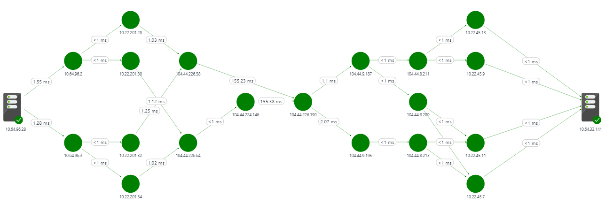

# Network monitoring solutions 

Azure offers a host of solutions to monitor your networking assets. Azure has solutions and utilities to monitor network connectivity, the health of ExpressRoute circuits, and analyze network traffic in the cloud.

## Network Performance Monitor (NPM)

Network Performance Monitor (NPM) is a suite of capabilities, each of which is geared towards monitoring the health of your network, network connectivity to your applications, and provides insights into the performance of your network. NPM is cloud-based and provides a hybrid network monitoring solution that monitors connectivity between:
 
* Cloud deployments and on-premises locations
* Multiple data centers and branch offices
* Mission critical multi-tier applications/micro-services
* User locations and web-based applications (HTTP/HTTPs) 

## Performance Monitor

Performance Monitor is part of NPM and is network monitoring for cloud, hybrid, and on-premises environments. You can monitor network connectivity across remote branch and field offices, store locations, data centers, and clouds. You can detect network issues before your users complain. The key advantages are:

* Monitor loss and latency across various subnets and set alerts
* Monitor all paths (including redundant paths) on the network
* Troubleshoot transient and point-in-time network issues, that are difficult to replicate
* Determine the specific segment on the network, that is responsible for degraded performance
* Monitor the health of the network, without the need for SNMP

 

For more information, view the following articles:

* [Configure a Network Performance Monitor Solution in Log Analytics](../log-analytics/log-analytics-network-performance-monitor.md) 
* [Use cases](https://blogs.technet.microsoft.com/msoms/2016/08/30/monitor-on-premises-cloud-iaas-and-hybrid-networks-using-oms-network-performance-monitor/)
*  Product Updates: [February 2017](https://blogs.technet.microsoft.com/msoms/2017/02/27/oms-network-performance-monitor-is-now-generally-available/), [August 2017](https://blogs.technet.microsoft.com/msoms/2017/08/14/improvements-to-oms-network-performance-monitor/)

## ExpressRoute Monitor

NPM for ExpressRoute offers comprehensive ExpressRoute monitoring for private peering connections. You can monitor E2E connectivity and performance between your branch offices and Azure over ExpressRoute. The key capabilities are:

* Auto-detection of ER circuits associated with your subscription
* Detection of network topology  from on-premises to your cloud applications
* Capacity planning, utilization analysis
* Monitoring and alerting on both primary and secondary paths
* Detect degradation of connectivity to VNets

For more information, see the following articles:

* [Configure Network Performance Monitor for ExpressRoute](../expressroute/how-to-npm.md)
* [Blog post](https://aka.ms/NPMExRmonitorGA)

## Service Endpoint Monitor

With Service Endpoint monitoring, you can now test reachability of applications and detect performance bottlenecks across on-premises, carrier networks and cloud/private data centers.

* Monitor end-to-end network connectivity to applications
* Correlate application delivery with network performance, detect precise location of degradation along the path between the user and the application
* Test application reachability from multiple user locations across the globe
* Determine network latency and packet loss for your line of business and SaaS applications
* Determine hot spots on the network, that may be causing poor application performance
* Monitor reachability to  Office 365 applications, using built-in tests for Microsoft Office 365, Dynamics 365, Skype for Business and other Microsoft services

For more information, see the following articles:

* [Configure Network Performance Monitor for monitoring Service Endpoints](https://aka.ms/applicationconnectivitymonitorguide)
* [Blog post](https://aka.ms/svcendptmonitor)

## Traffic Analytics
Traffic Analytics is a cloud based solution that provides  visibility into user and application activity on your cloud networks. NSG Flow logs are analyzed to provide insights into:

* Traffic flows across your networks between Azure and Internet,  public cloud regions, VNETs and subnets
* Applications and protocols on your network, without the need for sniffers or dedicated flow collector appliances
* Top talkers, chatty applications, VM conversations in the cloud, traffic hotspots
* Sources and destinations of traffic across VNETs, inter-relationships between critical business services and applications
* Security – malicious traffic, ports open to the Internet,  applications or VMs attempting Internet access…

Traffic Analytics equips you with actionable information that helps you audit your organization’s network activity, secure applications and data,  optimize workload performance and stay compliant.

 

Related links:
* [Blog post](https://aka.ms/trafficanalytics), [Documentation](https://aka.ms/trafficanalyticsdocs), [FAQ](../network-watcher/traffic-analytics-faq)

## Next steps

* [Configure Network Performance Monitor](https://docs.microsoft.com/azure/log-analytics/log-analytics-network-performance-monitor)
* [Configure Network Performance Monitor for ExpressRoute](../expressroute/how-to-npm.md)
