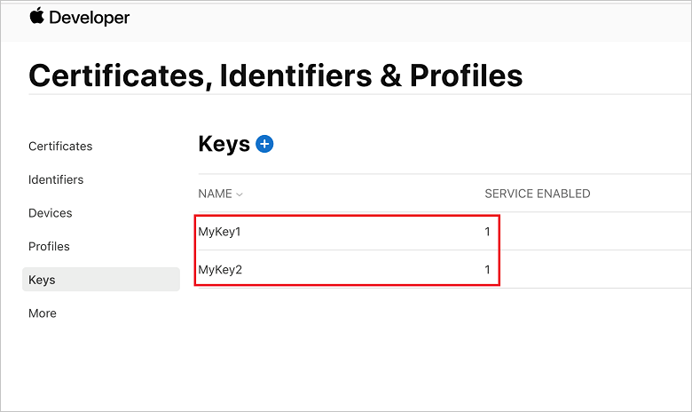
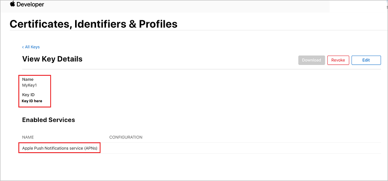

# Token-based (HTTP/2) Authentication for APNS

## Overview

This article explains how to use the new APNS HTTP/2 protocol with token-based authentication.

The key benefits of using the new protocol include:

* Token generation is relatively simple (compared to certificates)
* No more expiry dates – you are in control of your authentication tokens and their revocation
* Payloads can now be up to 4 KB
* Synchronous feedback
* You are on Apple's latest protocol – certificates still use the binary protocol, which is marked for deprecation

Using this new mechanism can be performed in two steps:

* Obtain the necessary information from the Apple Developer account portal.
* Configure your notification hub with the new information.

Notification Hubs is now set to use the new authentication system with APNS.

Note that if you migrated from using certificate credentials for APNS, the token properties overwrite your certificate in our system, but your application continues to receive notifications seamlessly.

## Obtaining authentication information from Apple

To enable token-based authentication, you need the following properties from your Apple Developer account:

### Key identifier

The key identifier can be obtained from the "Keys" page in your Apple developer account





### Application identifier and application name

The application name and identifier are available in the **Certificates, Identifiers & Profiles** page in the developer account.


### Authentication token

The authentication token can be downloaded after you generate a token for your application. For details on how to generate this token, refer to the [Apple developer documentation](https://help.apple.com/xcode/mac/current/#/devdfd3d04a1).

### Configure via the .NET SDK

You can configure your hub to use token based authentication using our [latest client SDK](https://www.nuget.org/packages/Microsoft.Azure.NotificationHubs), or [using the Azure portal](create-notification-hub-portal.md).

Token-based credentials are composed of the following fields:

* **Key ID**: Identifier of the private key generated in the Apple Developer portal; for example, `2USFGKSKLT`.
* **Team ID**: Also called the "Prefix" or "App Prefix." This is the identifier for the organization in the Apple Developer portal; for example, `S4V3D7CHJR`.
* **Bundle ID**: Also called the "App ID." This is the bundle identifier for the application; for example, `com.microsoft.nhubsample2019`. Note that you can use one key for many apps. This value maps to the `apns-topic` HTTP header when sending a notification, and is used to target the specific application.
* **Token**: Also called the "Key" or "Private Key." This is obtained from the .p8 file generated on the Apple Developer portal. The key must have APNS enabled (which is selected on the Apple Developer portal when generating the key). The value must have the PEM header/footer stripped from it when you supply it to the NH Portal/API.
* **Endpoint**: This is a toggle in the Notification Hubs portal blade, and a string field in the API. Valid values are `https://api.push.apple.com` or `https://api.sandbox.push.apple.com`. Notification Hubs uses this value for either the production or sandbox environment, for sending notifications. This must match the `aps-environment` entitlement in the app, otherwise the APNS device tokens generated don't match the environment, and the notifications fail to send.

Here's a code sample illustrating the correct usage:

```csharp
NamespaceManager nm = NamespaceManager.CreateFromConnectionString(_endpoint);
string token = "YOUR PRIVATE KEY HERE";
string keyId = "YOUR KEY ID HERE";
string appName = "YOUR APP NAME HERE";
string appId = "YOUR APP ID HERE";
NotificationHubDescription desc = new NotificationHubDescription("PATH TO YOUR HUB");
desc.ApnsCredential = new ApnsCredential(token, keyId, appId, appName);
desc.ApnsCredential.Endpoint = @"https://api.development.push.apple.com:443/3/device";
nm.UpdateNotificationHubAsync(desc);
```

## Next steps

* [Create an Azure notification hub in the Azure portal](create-notification-hub-portal.md)
* [Configure a notification hub in the Azure portal](create-notification-hub-portal.md)
