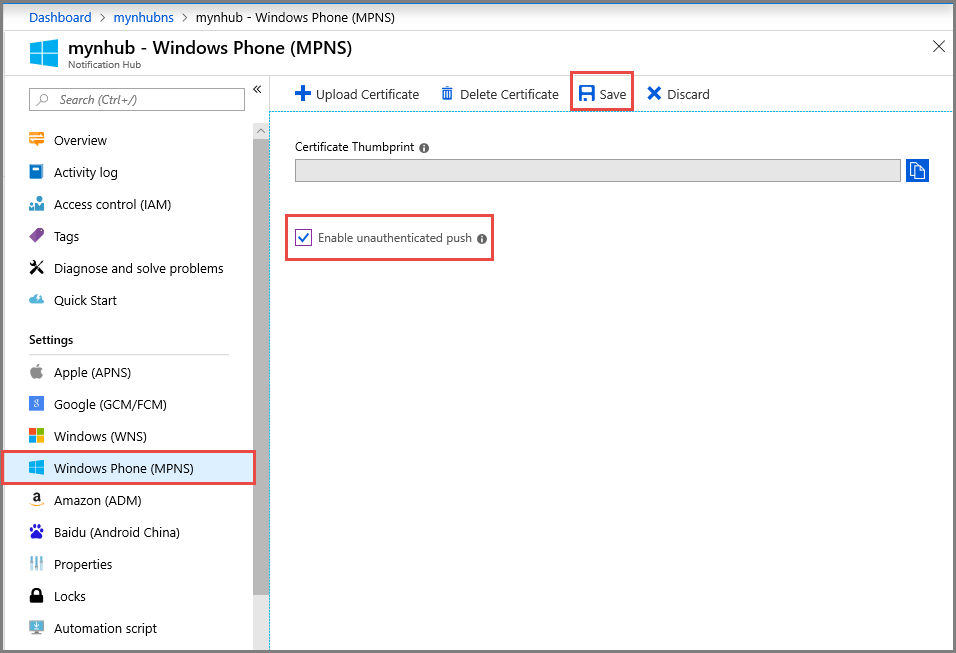
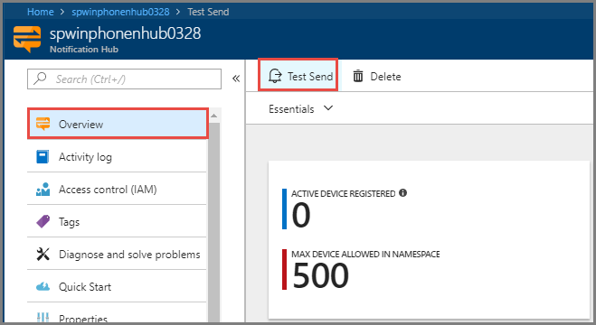
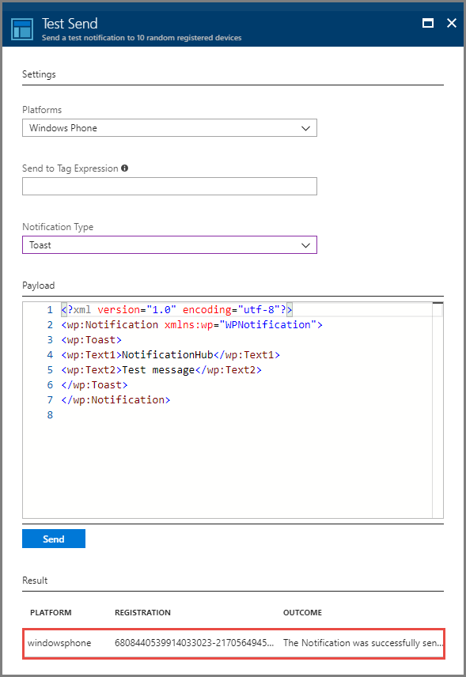
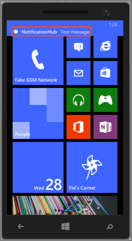

# Tutorial: Push notifications to Windows Phone apps by using Azure Notification Hubs
[!INCLUDE [notification-hubs-selector-get-started](../../includes/notification-hubs-selector-get-started.md)]

## Overview
This tutorial shows you how to use Azure Notification Hubs to send push notifications to a Windows Phone 8 or Windows Phone 8.1 Silverlight applications. If you are targeting Windows Phone 8.1 (non-Silverlight), see the [Windows Universal](notification-hubs-windows-store-dotnet-get-started-wns-push-notification.md) version of this tutorial.

In this tutorial, you create a blank Windows Phone 8 app that receives push notifications by using the Microsoft Push Notification Service (MPNS). When you're finished, you'll be able to use your notification hub to broadcast push notifications to all the devices running your app.

> [!NOTE]
> The Notification Hubs Windows Phone SDK does not support using the Windows Push Notification Service (WNS) with Windows Phone 8.1 Silverlight apps. To use WNS (instead of MPNS) with Windows Phone 8.1 Silverlight apps, follow the [Notification Hubs - Windows Phone Silverlight tutorial], which uses REST APIs.

In this tutorial, you perform the following steps:

> [!div class="checklist"]
> * Create a notification hub
> * Create a Windows Phone application
> * Test send a notification 

## Prerequisites
This tutorial requires the following:

- **Azure subscription**. If you don't have an Azure subscription, create a [free](https://azure.microsoft.com/free/) account before you begin.
- [Visual Studio 2015 Express for Windows Phone], or a later version.

Completing this tutorial is a prerequisite for all other Notification Hubs tutorials for Windows Phone 8 apps.

## Create your notification hub
[!INCLUDE [notification-hubs-portal-create-new-hub](../../includes/notification-hubs-portal-create-new-hub.md)]

<ol start="6">
<li>
Under <b>Notification Services</b>, select <b>Windows Phone (MPNS)</b> and then click the <b>Enable unauthenticated push</b> check box.

</li>
</ol>

&emsp;&emsp;

Your hub is now created and configured to send unauthenticated notification for Windows Phone.

> [!NOTE]
> This tutorial uses MPNS in unauthenticated mode. MPNS unauthenticated mode comes with restrictions on notifications that you can send to each channel. Notification Hubs supports [MPNS authenticated mode](http://msdn.microsoft.com/library/windowsphone/develop/ff941099.aspx) by allowing you to upload your certificate.
> 
> 

## Create a Windows Phone application
In this section, you create a Windows Phone application that registers itself with your notification hub. 

1. In Visual Studio, create a new Windows Phone 8 application. For the target version, select **.NET Framework 4.5**. 
   
    ![Visual Studio - New Project - Windows Phone App][13]
   
    In Visual Studio 2013 Update 2 or later, you instead create a Windows Phone Silverlight application.
   
    ![Visual Studio - New Project - Blank App - Windows Phone Silverlight][11]
2. In Visual Studio, right-click the solution, and then click **Manage NuGet Packages**.
   
    This displays the **Manage NuGet Packages** dialog box.
3. Search for `WindowsAzure.Messaging.Managed` and click **Install**, and then accept the terms of use.
   
    ![Visual Studio - NuGet Package Manager][20]
   
    This downloads, installs, and adds a reference to the Azure Messaging library for Windows by using the <a href="http://nuget.org/packages/WindowsAzure.Messaging.Managed/">WindowsAzure.Messaging.Managed NuGet package</a>.
4. Open the file App.xaml.cs and add the following `using` statements:
   
        using Microsoft.Phone.Notification;
        using Microsoft.WindowsAzure.Messaging;
5. Add the following code at the top of **Application_Launching** method in App.xaml.cs:
   
        private void Application_Launching(object sender, LaunchingEventArgs e)
        {

            var channel = HttpNotificationChannel.Find("MyPushChannel");
            if (channel == null)
            {
                channel = new HttpNotificationChannel("MyPushChannel");
                channel.Open();
                channel.BindToShellToast();
            }
       
            channel.ChannelUriUpdated += new EventHandler<NotificationChannelUriEventArgs>(async (o, args) =>
            {
                var hub = new NotificationHub("<hub name>", "<connection string>");
                var result = await hub.RegisterNativeAsync(args.ChannelUri.ToString());
       
                System.Windows.Deployment.Current.Dispatcher.BeginInvoke(() =>
                {
                    MessageBox.Show("Registration :" + result.RegistrationId, "Registered", MessageBoxButton.OK);
                });
            });
        }
   
   > [!NOTE]
   > The value **MyPushChannel** is an index that is used to lookup an existing channel in the [HttpNotificationChannel](https://msdn.microsoft.com/library/windows/apps/microsoft.phone.notification.httpnotificationchannel.aspx) collection. If there isn't one there, create a new entry with that name.
   > 
   > 
   
    Make sure to insert the name of your hub and the connection string called **DefaultListenSharedAccessSignature** that you obtained in the previous section.
    This code retrieves the channel URI for the app from MPNS, and then registers that channel URI with your notification hub. It also guarantees that the channel URI is registered in your notification hub each time the application is launched.
   
   > [!NOTE]
   > This tutorial sends a toast notification to the device. When you send a tile notification, you must instead call the **BindToShellTile** method on the channel. To support both toast and tile notifications, call both **BindToShellTile** and  **BindToShellToast**.
   > 
   > 
6. In Solution Explorer, expand **Properties**, open the `WMAppManifest.xml` file, click the **Capabilities** tab, and make sure that the **ID_CAP_PUSH_NOTIFICATION** capability is checked.
   
    ![Visual Studio - Windows Phone App Capabilities][14]
   
    This ensures that your app can receive push notifications. Without it, any attempt to send a push notification to the app will fail.
7. Press the `F5` key to run the app.
   
    A registration message is displayed in the app.
8. Close the app or switch to the home page. 
   
   > [!NOTE]
   > To receive a toast push notification, the application must not be running in the foreground.

## Test send a notification 

1. In the Azure portal, switch to the Overview tab.
2. Select **Test Send**.

    
3. In the **Test Send** window, take the following steps:

    1. For **Platforms**, select **Windows Phone**. 
    2. For **Notification Type**, select **Toast**. 
    3. Select **Send**
    4. See the **result** in the list at the bottom of the window. 

            
4. In the Windows Phone emulator or on the Windows phone, confirm that you see the notification message. 

    

## Next steps
In this simple example, you broadcasted push notifications to all your Windows Phone 8 devices. 

In order to target specific users, refer to the [Use Notification Hubs to push notifications to users] tutorial. 

If you want to segment your users by interest groups, you can read [Use Notification Hubs to send breaking news]. 

Learn more about how to use Notification Hubs in [Notification Hubs Guidance].

<!-- Images. -->
[6]: ./media/notification-hubs-windows-phone-get-started/notification-hub-create-console-app.png
[7]: ./media/notification-hubs-windows-phone-get-started/notification-hub-create-from-portal.png
[8]: ./media/notification-hubs-windows-phone-get-started/notification-hub-create-from-portal2.png
[9]: ./media/notification-hubs-windows-phone-get-started/notification-hub-select-from-portal.png
[10]: ./media/notification-hubs-windows-phone-get-started/notification-hub-select-from-portal2.png
[11]: ./media/notification-hubs-windows-phone-get-started/notification-hub-create-wp-silverlight-app.png
[12]: ./media/notification-hubs-windows-phone-get-started/notification-hub-connection-strings.png

[13]: ./media/notification-hubs-windows-phone-get-started/notification-hub-create-wp-app.png
[14]: ./media/notification-hubs-windows-phone-get-started/mobile-app-enable-push-wp8.png
[15]: ./media/notification-hubs-windows-phone-get-started/notification-hub-pushauth.png
[20]: ./media/notification-hubs-windows-phone-get-started/notification-hub-windows-universal-app-install-package.png
[213]: ./media/notification-hubs-windows-phone-get-started/notification-hub-create-console-app.png

<!-- URLs. -->
[Visual Studio 2012 Express for Windows Phone]: https://www.visualstudio.com/vs/older-downloads/
[Notification Hubs Guidance]: http://msdn.microsoft.com/library/jj927170.aspx
[MPNS authenticated mode]: http://msdn.microsoft.com/library/windowsphone/develop/ff941099(v=vs.105).aspx
[Use Notification Hubs to push notifications to users]: notification-hubs-aspnet-backend-windows-dotnet-wns-notification.md
[Use Notification Hubs to send breaking news]: notification-hubs-windows-phone-push-xplat-segmented-mpns-notification.md
[toast catalog]: http://msdn.microsoft.com/library/windowsphone/develop/jj662938(v=vs.105).aspx
[tile catalog]: http://msdn.microsoft.com/library/windowsphone/develop/hh202948(v=vs.105).aspx
[Notification Hubs - Windows Phone Silverlight tutorial]: https://github.com/Azure/azure-notificationhubs-samples/tree/master/PushToSLPhoneApp

