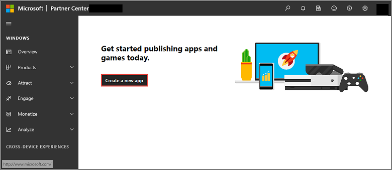
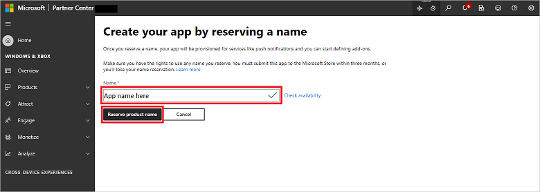
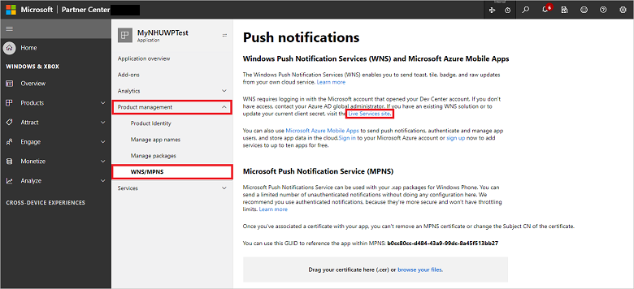

# Tutorial: Send notifications to Universal Windows Platform apps by using Azure Notification Hubs

[!INCLUDE [notification-hubs-selector-get-started](../../includes/notification-hubs-selector-get-started.md)]

In this tutorial, you create a notification hub to send push notifications to a Universal Windows Platform (UWP) app. You create a blank Windows Store app that receives push notifications by using the Windows Push Notification Service (WNS). Then, you can use your notification hub to broadcast push notifications to all devices that are running your app.

> [!NOTE]
> You can find the completed code for this tutorial on [GitHub](https://github.com/Azure/azure-notificationhubs-samples/tree/master/dotnet/GetStartedWindowsUniversal).

In this tutorial, you take the following steps:

> [!div class="checklist"]
> * Create an app in Windows Store
> * Create a notificaiton hub
> * Create a sample Windows app
> * Send test notifications

## Prerequisites
- **Azure subscription**. If you don't have an Azure subscription, create a [free account](https://azure.microsoft.com/free/?WT.mc_id=A261C142F) before you begin.
- [Microsoft Visual Studio Community 2015 or later](https://www.visualstudio.com/products/visual-studio-community-vs) or later.
- [UWP app-development tools installed](https://msdn.microsoft.com/windows/uwp/get-started/get-set-up)
- An active Windows Store account

Completing this tutorial is a prerequisite for all other Notification Hubs tutorials for UWP apps.

## Create an app in Windows Store
To send push notifications to UWP apps, associate your app to the Windows Store. Then, configure your notification hub to integrate with WNS.

1. Navigate to the [Windows Dev Center](https://dev.windows.com/overview), sign in with your Microsoft account, and then select **Create a new app**.

    
1. Type a name for your app, and then select **Reserve product name**. Doing so creates a new Windows Store registration for your app.

    
1. Expand **App Management**, select **WNS/MPNS**, select **WNS/MPNS**, and then select **Live Services site**. Sign-in to your Microsoft account. The **Application Registration Portal** opens in a new tab. Alternatively, you can navigate directly to the [Application Registration Portal](http://apps.dev.microsoft.com), select your application name to get to this page.

    
1.   Note the **Application Secret** password and the **Package security identifier (SID)**.

        >[!WARNING]
        >The application secret and package SID are important security credentials. Do not share these values with anyone or distribute them with your app.

## Create a notification hub
[!INCLUDE [notification-hubs-portal-create-new-hub](../../includes/notification-hubs-portal-create-new-hub.md)]

### Configure WNS settings for the hub

1. Select **Windows (WNS)** in the **NOTIFICATION SETTINGS** category. 
2. Enter values for **Package SIS** and **Security Key** you noted from the previous section. 
3. Select **Save** on the toolbar.

    

Your notification hub is now configured to work with WNS. You have the connection strings to register your app and send notifications.

## Create a sample Windows app
1. In Visual Studio, create a new Visual C# Store apps project by using the UWP **Blank App** template, and then select **OK**.
2. Accept the defaults for the target and minimum platform versions.
3. In Solution Explorer, right-click the Windows Store app project, select **Store**, and then select **Associate App with the Store**. The **Associate Your App with the Windows Store** wizard appears.
2. In the wizard, sign in with your Microsoft account.
3. Select the app that you registered in step 2, select **Next**, and then select **Associate**. Doing so adds the required Windows Store registration information to the application manifest.
2. In Visual Studio, right-click the solution, and then select **Manage NuGet Packages**. The **Manage NuGet Packages** window opens.
2. In the search box, enter **Microsoft.Azure.NotificationHubs**, select **Install**, and accept the terms of use.
   
    ![The Manage NuGet Packages window][20]
   
    This action downloads, installs, and adds a reference to the Azure Notification Hubs library for Windows by using the [Microsoft.Azure.NotificationHubs NuGet package](https://www.nuget.org/packages/Microsoft.Azure.NotificationHubs).

3. Open the App.xaml.cs project file, and add the following `using` statements: 
   
        using Windows.Networking.PushNotifications;
        using Microsoft.WindowsAzure.Messaging;
        using Windows.UI.Popups;

4. In App.xaml.cs, also add to the **App** class the following **InitNotificationsAsync** method definition:
   
        private async void InitNotificationsAsync()
        {
            var channel = await PushNotificationChannelManager.CreatePushNotificationChannelForApplicationAsync();
   
            var hub = new NotificationHub("<your hub name>", "<Your DefaultListenSharedAccessSignature connection string>");
            var result = await hub.RegisterNativeAsync(channel.Uri);
   
            // Displays the registration ID so you know it was successful
            if (result.RegistrationId != null)
            {
                var dialog = new MessageDialog("Registration successful: " + result.RegistrationId);
                dialog.Commands.Add(new UICommand("OK"));
                await dialog.ShowAsync();
            }
   
        }
   
    This code retrieves the channel URI for the app from WNS, and then registers that channel URI with your notification hub.
   
    >[!NOTE]
    >* Replace the **hub name** placeholder with the name of the notification hub that appears in the Azure portal. 
    >* Also replace the connection string placeholder with the **DefaultListenSharedAccessSignature** connection string that you obtained from the **Access Polices** page of your notification hub in a previous section.
   > 
   > 
5. At the top of the **OnLaunched** event handler in App.xaml.cs, add the following call to the new **InitNotificationsAsync** method:
   
        InitNotificationsAsync();
   
    This action guarantees that the channel URI is registered in your notification hub each time the application is launched.

6. To run the app, select the **F5** key. A dialog box that contains the registration key is displayed.

Your app is now ready to receive toast notifications.

## Send test notifications
You can quickly test receiving notifications in your app by sending notifications in the [Azure portal](https://portal.azure.com/). Use the **Test Send** button on the notification hub, as shown in the following image:

Push notifications are normally sent in a back-end service like Mobile Services or ASP.NET by using a compatible library. If a library is not available for your back end, you can also send notification messages by using the REST API directly. 

This tutorial demonstrates how to test your client app simply by sending notifications that use the .NET SDK for notification hubs in a console application instead of a back-end service. We recommend the [Use Notification Hubs to push notifications to users] tutorial as the next step for sending notifications from an ASP.NET back end. However, you can send notifications by using the following approaches:

* **REST interface**: You can support notifications on any back-end platform by using the [REST interface](http://msdn.microsoft.com/library/windowsazure/dn223264.aspx).

* **Microsoft Azure Notification Hubs .NET SDK**: In the NuGet Package Manager for Visual Studio, run [Install-Package Microsoft.Azure.NotificationHubs](https://www.nuget.org/packages/Microsoft.Azure.NotificationHubs/).

* **Node.js**: See [How to use Notification Hubs from Node.js](notification-hubs-nodejs-push-notification-tutorial.md).
* **Azure Mobile Apps**: For an example of how to send notifications from an Azure mobile app that's integrated with Notification Hubs, see [Add push notifications for Mobile Apps](../app-service-mobile/app-service-mobile-windows-store-dotnet-get-started-push.md).

* **Java or PHP**: For examples of how to send notifications by using the REST APIs, see:
    * [Java](notification-hubs-java-push-notification-tutorial.md)
    * [PHP](notification-hubs-php-push-notification-tutorial.md)

## Next steps
In this simple example, you sent broadcast notifications to all your Windows devices by using the portal or a console app. For your next step, we recommend the [Use Notification Hubs to push notifications to users] tutorial. It demonstrates how to send notifications from an ASP.NET back end by using tags to target specific users.

If you want to segment your users by interest groups, see [Use Notification Hubs to send breaking news]. 

For more general information about Notification Hubs, see [Notification Hubs guidance](notification-hubs-push-notification-overview.md).

<!-- Images. -->
[13]: ./media/notification-hubs-windows-store-dotnet-get-started/notification-hub-create-console-app.png
[14]: ./media/notification-hubs-windows-store-dotnet-get-started/notification-hub-windows-toast.png
[19]: ./media/notification-hubs-windows-store-dotnet-get-started/notification-hub-windows-reg.png
[20]: ./media/notification-hubs-windows-store-dotnet-get-started/notification-hub-windows-universal-app-install-package.png

<!-- URLs. -->

[Use Notification Hubs to push notifications to users]: notification-hubs-aspnet-backend-windows-dotnet-wns-notification.md
[Use Notification Hubs to send breaking news]: notification-hubs-windows-notification-dotnet-push-xplat-segmented-wns.md

[toast catalog]: http://msdn.microsoft.com/library/windows/apps/hh761494.aspx
[tile catalog]: http://msdn.microsoft.com/library/windows/apps/hh761491.aspx
[badge overview]: http://msdn.microsoft.com/library/windows/apps/hh779719.aspx
 
