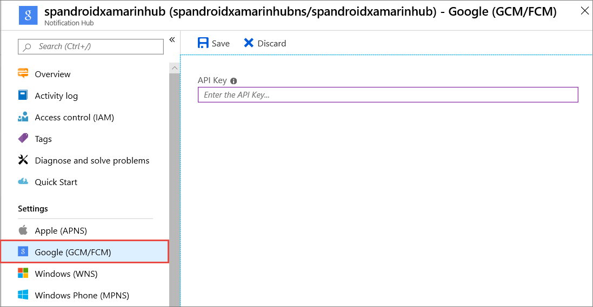
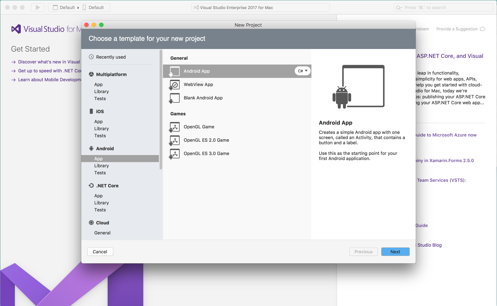
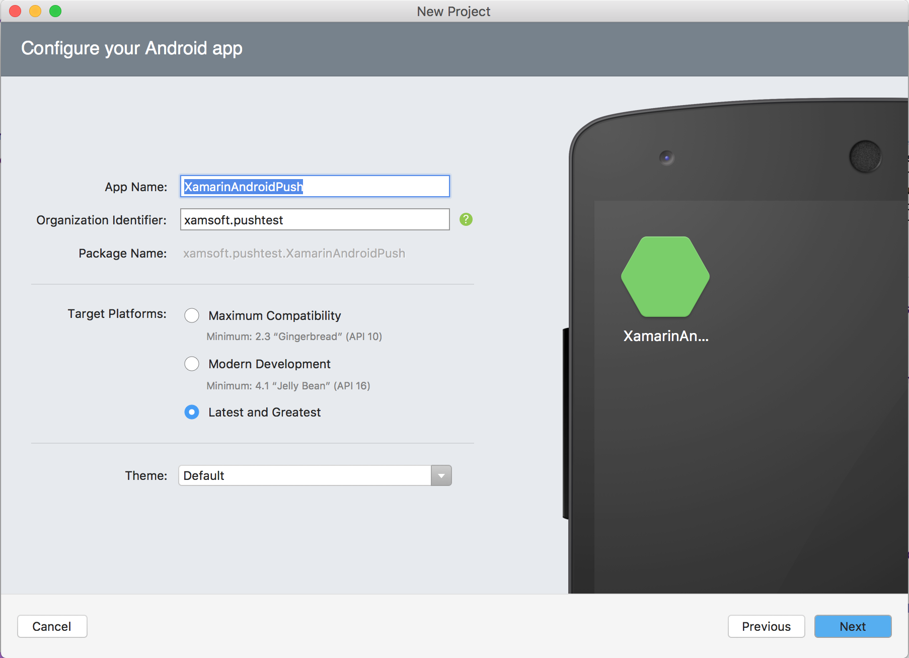

# Get started with Notification Hubs for Xamarin.Android apps
[!INCLUDE [notification-hubs-selector-get-started](../../includes/notification-hubs-selector-get-started.md)]

## Overview
This tutorial shows you how to use Azure Notification Hubs to send push notifications to a Xamarin.Android application. You'll create a blank Xamarin.Android app that receives push notifications by using Firebase Cloud Messaging (FCM). When you're finished, you'll be able to use your notification hub to broadcast push notifications to all the devices running your app. The finished code is available in the [NotificationHubs app][GitHub] sample.

This tutorial demonstrates the simple broadcast scenario in using Notification Hubs.

## Before you begin
[!INCLUDE [notification-hubs-hero-slug](../../includes/notification-hubs-hero-slug.md)]

The completed code for this tutorial can be found on GitHub [here][GitHub].

## Prerequisites
This tutorial requires the following:

* [Visual Studio with Xamarin] on Windows or [Visual Studio for Mac] on OS X.
* Active Google account
* [Azure Messaging Component]
* [Google Cloud Messaging Client Component]

Completing this tutorial is a prerequisite for all other Notification Hubs tutorials for Xamarin.Android apps.

> [!IMPORTANT]
> To complete this tutorial, you must have an active Azure account. If you don't have an account, you can create a free trial account in just a couple of minutes. For details, see [Azure Free Trial](https://azure.microsoft.com/pricing/free-trial/?WT.mc_id=A9C9624B5&amp;returnurl=http%3A%2F%2Fazure.microsoft.com%2Fen-us%2Fdocumentation%2Farticles%2Fpartner-xamarin-notification-hubs-android-get-started%2F).
> 
> 

## Enable Firebase Cloud Messaging
[!INCLUDE [notification-hubs-enable-firebase-cloud-messaging](../../includes/notification-hubs-enable-firebase-cloud-messaging.md)]

## Configure your notification hub
[!INCLUDE [notification-hubs-portal-create-new-hub](../../includes/notification-hubs-portal-create-new-hub.md)]

<ol start="6">

<li><p>Choose the <b>Configure</b> tab at the top, enter the <b>API Key</b> value you obtained in the previous section, and then select <b>Save</b>.</p>
</li>
</ol>
&emsp;&emsp;

Your notification hub is now configured to work with FCM, and you have the connection strings to both register your app to receive notifications and to send push notifications.

## Connect your app to the notification hub
First, you create a new project.
1. In Visual Studio, choose **New Solution** > **Android App** and then select **Next**.
   
      

2. Enter your **App Name** and **Identifier**. Choose the **Target Plaforms** you want to support and then choose **Next** and **Create**.
   
      

    This creates a new Android project.

3. Open the project properties by right-clicking your new project in the Solution view and choosing **Options**. Select the **Android Application** item in the **Build** section.
   
    Ensure that the first letter of your **Package name** is lowercase.
   
   > [!IMPORTANT]
   > The first letter of the package name must be lowercase. Otherwise, you will receive application manifest errors when you register your **BroadcastReceiver** and **IntentFilter** for push notifications below.
   > 
   > 
   
      
4. Optionally, set the **Minimum Android version** to another API Level.
5. Optionally, set the **Target Android version** to the another API version that you want to target (must be API level 8 or higher).
6. Choose **OK** and close the Project Options dialog.

### Add the required components to your project
The Google Cloud Messaging Client available on the Xamarin Component Store simplifies the process of supporting push notifications in Xamarin.Android.

1. Right-click the Components folder in Xamarin.Android app and choose **Get More Components**.
2. Search for the **Azure Messaging** component and add it to the project.
3. Search for the **Google Cloud Messaging Client** component and add it to the project.

### Set up notification hubs in your project
1. Gather the following information for your Android app and notification hub:
   
   * **GoogleProjectNumber**:  Get this Project Number value from the overview of your app on the Google Developer Portal. You made a note of this value earlier when you created the app on the portal.
   * **Listen connection string**: On the dashboard in the [Azure Classic Portal], choose **View connection strings**. Copy the *DefaultListenSharedAccessSignature* connection string for this value.
   * **Hub name**: This is the name of your hub from the [Azure Classic Portal]. For example, *mynotificationhub2*.
     
2. Create a **Constants.cs** class for your Xamarin project and define the following constant values in the class. Replace the placeholders with your values.
     
        public static class Constants
        {
     
           public const string SenderID = "<GoogleProjectNumber>"; // Google API Project Number
           public const string ListenConnectionString = "<Listen connection string>";
           public const string NotificationHubName = "<hub name>";
        }
3. Add the following using statements to **MainActivity.cs**:
   
        using Android.Util;
        using Gcm.Client;
4. Add an instance variable to the `MainActivity` class that will be used to show an alert dialog when the app is running:
   
        public static MainActivity instance;
5. Create the following method in the **MainActivity** class:
   
        private void RegisterWithGCM()
        {
            // Check to ensure everything's set up right
            GcmClient.CheckDevice(this);
            GcmClient.CheckManifest(this);
   
            // Register for push notifications
            Log.Info("MainActivity", "Registering...");
            GcmClient.Register(this, Constants.SenderID);
        }
6. In the `OnCreate` method of **MainActivity.cs**, initialize the `instance` variable and add a call to `RegisterWithGCM`:
   
        protected override void OnCreate (Bundle bundle)
        {
            instance = this;
   
            base.OnCreate (bundle);
   
            // Set your view from the "main" layout resource
            SetContentView (Resource.Layout.Main);
   
            // Get your button from the layout resource,
            // and attach an event to it
            Button button = FindViewById<Button> (Resource.Id.myButton);
   
            RegisterWithGCM();
        }
7. Create a new class, **MyBroadcastReceiver**.
   
   > [!NOTE]
   > We will walk through creating a **BroadcastReceiver** class from scratch below. However, a quick alternative to manually creating **MyBroadcastReceiver.cs** is to refer to the **GcmService.cs** file found in the sample Xamarin.Android project included with the [NotificationHubs samples][GitHub]. Duplicating **GcmService.cs** and changing class names can be a great place to start as well.
   > 
   > 
8. Add the following using statements to **MyBroadcastReceiver.cs** (referring to the component and assembly that you added earlier):
   
    ```csharp
        using System.Collections.Generic;
        using System.Text;
        using Android.App;
        using Android.Content;
        using Android.Util;
        using Gcm.Client;
        using WindowsAzure.Messaging;
    ```

9. In **MyBroadcastReceiver.cs**, add the following permission requests between the **using** statements and the **namespace** declaration:
   
    ```csharp
        [assembly: Permission(Name = "@PACKAGE_NAME@.permission.C2D_MESSAGE")]
        [assembly: UsesPermission(Name = "@PACKAGE_NAME@.permission.C2D_MESSAGE")]
        [assembly: UsesPermission(Name = "com.google.android.c2dm.permission.RECEIVE")]
   
        //GET_ACCOUNTS is needed only for Android versions 4.0.3 and below
        [assembly: UsesPermission(Name = "android.permission.GET_ACCOUNTS")]
        [assembly: UsesPermission(Name = "android.permission.INTERNET")]
        [assembly: UsesPermission(Name = "android.permission.WAKE_LOCK")]
    ```

10. In **MyBroadcastReceiver.cs**, change the **MyBroadcastReceiver** class to match the following:
   
    ```csharp
        [BroadcastReceiver(Permission=Gcm.Client.Constants.PERMISSION_GCM_INTENTS)]
        [IntentFilter(new string[] { Gcm.Client.Constants.INTENT_FROM_GCM_MESSAGE },
            Categories = new string[] { "@PACKAGE_NAME@" })]
        [IntentFilter(new string[] { Gcm.Client.Constants.INTENT_FROM_GCM_REGISTRATION_CALLBACK },
            Categories = new string[] { "@PACKAGE_NAME@" })]
        [IntentFilter(new string[] { Gcm.Client.Constants.INTENT_FROM_GCM_LIBRARY_RETRY },
            Categories = new string[] { "@PACKAGE_NAME@" })]
        public class MyBroadcastReceiver : GcmBroadcastReceiverBase<PushHandlerService>
        {
            public static string[] SENDER_IDS = new string[] { Constants.SenderID };
   
            public const string TAG = "MyBroadcastReceiver-GCM";
        }
    ```

11. Add another class in **MyBroadcastReceiver.cs** named **PushHandlerService**, which derives from **GcmServiceBase**. Make sure to apply the **Service** attribute to the class:
    
    ```csharp
         [Service] // Must use the service tag
         public class PushHandlerService : GcmServiceBase
         {
             public static string RegistrationID { get; private set; }
             private NotificationHub Hub { get; set; }
    
             public PushHandlerService() : base(Constants.SenderID)
                {
                 Log.Info(MyBroadcastReceiver.TAG, "PushHandlerService() constructor");
             }
         }
    ```

12. **GcmServiceBase** implements methods **OnRegistered()**, **OnUnRegistered()**, **OnMessage()**, **OnRecoverableError()**, and **OnError()**. Our **PushHandlerService** implementation class must override these methods, and these methods will fire in response to interacting with the notification hub.
13. Override the **OnRegistered()** method in **PushHandlerService** by using the following code:
    
    ```csharp
         protected override void OnRegistered(Context context, string registrationId)
         {
             Log.Verbose(MyBroadcastReceiver.TAG, "GCM Registered: " + registrationId);
             RegistrationID = registrationId;
    
             createNotification("PushHandlerService-GCM Registered...",
                                 "The device has been Registered!");
    
             Hub = new NotificationHub(Constants.NotificationHubName, Constants.ListenConnectionString,
                                         context);
             try
             {
                 Hub.UnregisterAll(registrationId);
             }
             catch (Exception ex)
             {
                 Log.Error(MyBroadcastReceiver.TAG, ex.Message);
             }
    
             //var tags = new List<string>() { "falcons" }; // create tags if you want
             var tags = new List<string>() {};
    
             try
             {
                 var hubRegistration = Hub.Register(registrationId, tags.ToArray());
             }
             catch (Exception ex)
             {
                 Log.Error(MyBroadcastReceiver.TAG, ex.Message);
             }
         }
    ```
    
    > [!NOTE]
    > In the **OnRegistered()** code above, you should note the ability to specify tags to register for specific messaging channels.
    > 
    > 
14. Override the **OnMessage** method in **PushHandlerService** by using the following code:
    
    ```csharp
        protected override void OnMessage(Context context, Intent intent)
        {
            Log.Info(MyBroadcastReceiver.TAG, "GCM Message Received!");
    
            var msg = new StringBuilder();
    
            if (intent != null && intent.Extras != null)
            {
                foreach (var key in intent.Extras.KeySet())
                    msg.AppendLine(key + "=" + intent.Extras.Get(key).ToString());
            }
    
            string messageText = intent.Extras.GetString("message");
            if (!string.IsNullOrEmpty (messageText))
            {
                createNotification ("New hub message!", messageText);
            }
            else
            {
                createNotification ("Unknown message details", msg.ToString ());
            }
        }
    ```

15. Add the following **createNotification** and **dialogNotify** methods to **PushHandlerService** for notifying users when a notification is received.
    
    > [!NOTE]
    > Notification design in Android version 5.0 and later represents a significant departure from that of previous versions. If you test this on Android 5.0 or later, the app will need to be running to receive the notification. For more information, see [Android Notifications](http://go.microsoft.com/fwlink/?LinkId=615880).
    > 
    > 
    
    ```csharp
        void createNotification(string title, string desc)
        {
            //Create notification
            var notificationManager = GetSystemService(Context.NotificationService) as NotificationManager;
    
            //Create an intent to show UI
            var uiIntent = new Intent(this, typeof(MainActivity));
    
            //Create the notification
            var notification = new Notification(Android.Resource.Drawable.SymActionEmail, title);
    
            //Auto-cancel will remove the notification once the user touches it
            notification.Flags = NotificationFlags.AutoCancel;
    
            //Set the notification info
            //we use the pending intent, passing our ui intent over, which will get called
            //when the notification is tapped.
            notification.SetLatestEventInfo(this, title, desc, PendingIntent.GetActivity(this, 0, uiIntent, 0));
    
            //Show the notification
            notificationManager.Notify(1, notification);
            dialogNotify (title, desc);
        }
    
        protected void dialogNotify(String title, String message)
        {
    
            MainActivity.instance.RunOnUiThread(() => {
                AlertDialog.Builder dlg = new AlertDialog.Builder(MainActivity.instance);
                AlertDialog alert = dlg.Create();
                alert.SetTitle(title);
                alert.SetButton("Ok", delegate {
                    alert.Dismiss();
                });
                alert.SetMessage(message);
                alert.Show();
            });
        }
    ```

16. Override abstract members **OnUnRegistered()**, **OnRecoverableError()**, and **OnError()** so that your code compiles:
    
    ```csharp
        protected override void OnUnRegistered(Context context, string registrationId)
        {
            Log.Verbose(MyBroadcastReceiver.TAG, "GCM Unregistered: " + registrationId);
    
            createNotification("GCM Unregistered...", "The device has been unregistered!");
        }
    
        protected override bool OnRecoverableError(Context context, string errorId)
        {
            Log.Warn(MyBroadcastReceiver.TAG, "Recoverable Error: " + errorId);
    
            return base.OnRecoverableError (context, errorId);
        }
    
        protected override void OnError(Context context, string errorId)
        {
            Log.Error(MyBroadcastReceiver.TAG, "GCM Error: " + errorId);
        }
    ```

## Run your app in the emulator
If you run this app in the emulator, make sure that you use an Android Virtual Device (AVD) that supports Google APIs.

> [!IMPORTANT]
> In order to receive push notifications, you must set up a Google account on your Android Virtual Device. (In the emulator, navigate to **Settings** and choose **Add Account**.) Also, make sure that the emulator is connected to the Internet.
> 
> [!NOTE]
> Notification design in Android version 5.0 and later represents a significant departure from that of previous versions. For more information, see [Android Notifications](http://go.microsoft.com/fwlink/?LinkId=615880).
> 
> 

1. From **Tools**, choose **Open Android Emulator Manager**, select your device, and then choose **Edit**.
   
      ![][18]
2. Select **Google APIs** in **Target**, and then choose **OK**.
   
      ![][19]
3. On the top toolbar, choose **Run**, and then select your app. This starts the emulator and runs the app.
   
   The app retrieves the *registrationId* from GCM and registers with the notification hub.

## Send notifications from the portal
You can test receiving notifications in your app with the *Test Send* option in the [Azure portal]. This will send a test push notification to your device.

![Azure portal - Test Send][30]

Push notifications are normally sent in a backend service like Mobile Services or ASP.NET through a compatible library. You can also use the REST API directly to send notification messages if a library is not available for your backend.

Here is a list of some other tutorials that you may want to review for sending notifications:

* ASP.NET: See [Use Notification Hubs to push notifications to users].
* Azure Notification Hubs Java SDK: See [How to use Notification Hubs from Java](notification-hubs-java-push-notification-tutorial.md) for sending notifications from Java. This has been tested in Eclipse for Android Development.
* PHP: See [How to use Notification Hubs from PHP](notification-hubs-php-push-notification-tutorial.md).

## Next steps
In this simple example, you broadcasted notifications to all your Android devices. In order to target specific users, refer to the tutorial [Use Notification Hubs to push notifications to users]. If you want to segment your users by interest groups, you can read [Use Notification Hubs to send breaking news]. Learn more about how to use Notification Hubs in [Notification Hubs Guidance] and in the [Notification Hubs How-To for Android].

<!-- Anchors. -->
[Enable Google Cloud Messaging]: #register
[Configure your Notification Hub]: #configure-hub
[Connecting your app to the Notification Hub]: #connecting-app
[Run your app with the emulator]: #run-app
[Send notifications from your back-end]: #send
[Next steps]:#next-steps

<!-- Images. -->

[11]: ./media/partner-xamarin-notification-hubs-android-get-started/notification-hub-configure-android.png

[13]: ./media/partner-xamarin-notification-hubs-android-get-started/notification-hub-create-xamarin-android-app1.png
[15]: ./media/partner-xamarin-notification-hubs-android-get-started/notification-hub-create-xamarin-android-app3.png

[18]: ./media/partner-xamarin-notification-hubs-android-get-started/notification-hub-create-android-app7.png
[19]: ./media/partner-xamarin-notification-hubs-android-get-started/notification-hub-create-android-app8.png

[20]: ./media/partner-xamarin-notification-hubs-android-get-started/notification-hub-create-console-app.png
[21]: ./media/partner-xamarin-notification-hubs-android-get-started/notification-hub-android-toast.png
[22]: ./media/partner-xamarin-notification-hubs-android-get-started/notification-hub-scheduler1.png
[23]: ./media/partner-xamarin-notification-hubs-android-get-started/notification-hub-scheduler2.png

[30]: ./media/partner-xamarin-notification-hubs-android-get-started/notification-hubs-test-send.png


<!-- URLs. -->
[Submit an app page]: http://go.microsoft.com/fwlink/p/?LinkID=266582
[My Applications]: http://go.microsoft.com/fwlink/p/?LinkId=262039
[Live SDK for Windows]: http://go.microsoft.com/fwlink/p/?LinkId=262253
[Get started with Mobile Services]: /develop/mobile/tutorials/get-started-xamarin-android/#create-new-service
[JavaScript and HTML]: /develop/mobile/tutorials/get-started-with-push-js
[Visual Studio with Xamarin]: https://docs.microsoft.com/en-us/visualstudio/install/install-visual-studio
[Visual Studio for Mac]: https://www.visualstudio.com/vs/visual-studio-mac/

[Azure portal]: https://portal.azure.com/
[wns object]: http://go.microsoft.com/fwlink/p/?LinkId=260591
[Notification Hubs Guidance]: http://msdn.microsoft.com/library/jj927170.aspx
[Notification Hubs How-To for Android]: http://msdn.microsoft.com/library/dn282661.aspx

[Use Notification Hubs to push notifications to users]: /manage/services/notification-hubs/notify-users-aspnet
[Use Notification Hubs to send breaking news]: /manage/services/notification-hubs/breaking-news-dotnet
[GitHub]: https://github.com/Azure/azure-notificationhubs-samples/tree/master/dotnet/Xamarin/GetStartedXamarinAndroid
[Google Cloud Messaging Client Component]: http://components.xamarin.com/view/GCMClient/
[Azure Messaging Component]: http://components.xamarin.com/view/azure-messaging
