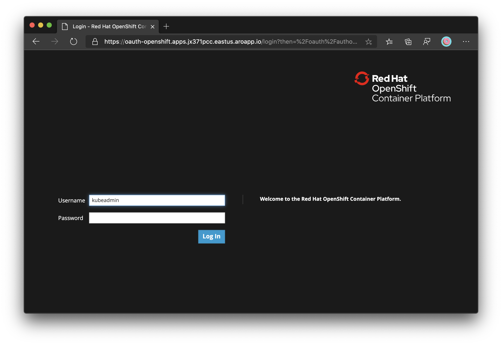
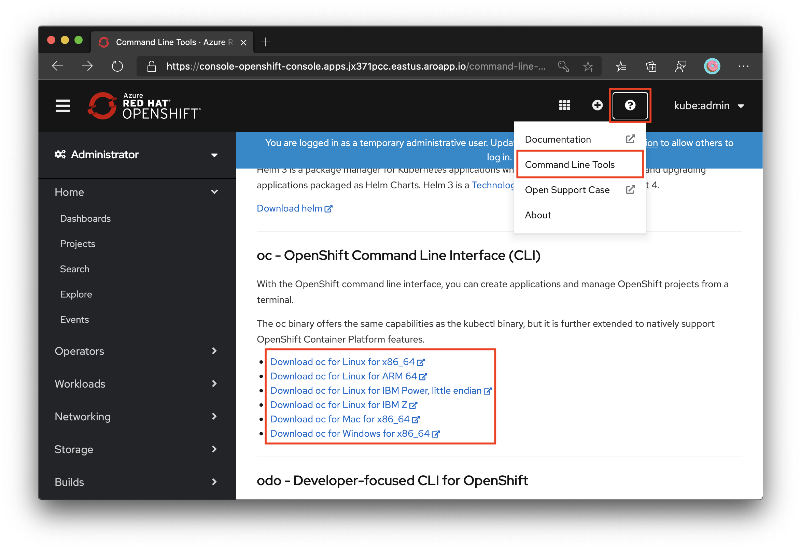

# Tutorial: Connect to an Azure Red Hat OpenShift 4 cluster

In this tutorial, part two of three, you will connect to an Azure Red Hat OpenShift (ARO) cluster running OpenShift 4 as the kube-admin user through the OpenShift web console. You learn how to:
> [!div class="checklist"]
> * Obtain `kube-admin` credentials for your cluster
> * Install the OpenShift CLI
> * Connect to an ARO cluster using the OpenShift CLI

## Before you begin

In previous tutorials, an ARO cluster was created. If you have not done these steps, and would like to follow along, start with [Tutorial 1 - Create an Azure Red Hat Openshift 4 Cluster.](tutorial-create-cluster.md)

If you choose to install and use the CLI locally, this tutorial requires that you are running the Azure CLI version 2.0.75 or later. Run `az --version` to find the version. If you need to install or upgrade, see [Install Azure CLI](https://docs.microsoft.com/cli/azure/install-azure-cli?view=azure-cli-latest).

## Connect to the cluster

You can log into the cluster using the `kubeadmin` user.  Run the following command to find the password for the `kubeadmin` user.

```azurecli-interactive
az aro list-credentials \
  --name aro-cluster \
  --resource-group aro-rg
```

The following example output shows the password will be in `kubeadminPassword`.

```json
{
  "kubeadminPassword": "<generated password>",
  "kubeadminUsername": "kubeadmin"
}
```

You can find the cluster console URL by running the following command, which will look like `https://console-openshift-console.apps.<random>.<region>.aroapp.io/`

```azurecli-interactive
 az aro show \
    --name aro-cluster \
    --resource-group aro-rg \
    --query "consoleProfile.url" -o tsv
```

Launch the console URL in a browser and login using the `kubeadmin` credentials.



## Install the OpenShift CLI

Once you're logged into the OpenShift Web Console, click on the **?** on the top right and then on **Command Line Tools**. Download the release appropriate to your machine.



You can also download the latest release of the CLI appropriate to your machine from <https://mirror.openshift.com/pub/openshift-v4/clients/ocp/latest/>.

If you're running the commands on the Azure Cloud Shell, download the latest OpenShift 4 CLI for Linux.

```azurecli-interactive
cd ~
wget https://mirror.openshift.com/pub/openshift-v4/clients/ocp/latest/openshift-client-linux.tar.gz

mkdir openshift
tar -zxvf openshift-client-linux.tar.gz -C openshift
echo 'export PATH=$PATH:~/openshift' >> ~/.bashrc && source ~/.bashrc
```

## Connect using the OpenShift CLI

Retrieve the API server's address.

```azurecli-interactive
apiServer=$(az aro show -g aro-rg -n aro-cluster --query apiserverProfile.url -o tsv)
```

Login to the OpenShift cluster's API server using the following command. Replace **\<kubeadmin password>** with the password you just retrieved.

```azurecli-interactive
oc login $apiServer -u kubeadmin -p <kubeadmin password>
```

## Next steps

In this part of the tutorial, you learned how to:
> [!div class="checklist"]
> * Obtain `kube-admin` credentials for your cluster
> * Install the OpenShift CLI
> * Connect to an ARO cluster using the OpenShift CLI

Advance to the next tutorial:
> [!div class="nextstepaction"]
> [Delete an Azure Red Hat OpenShift cluster](tutorial-delete-cluster.md)