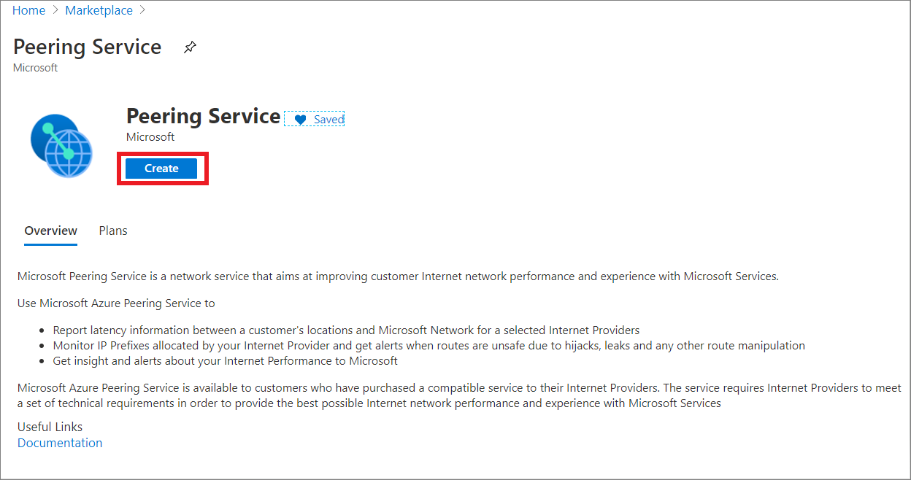
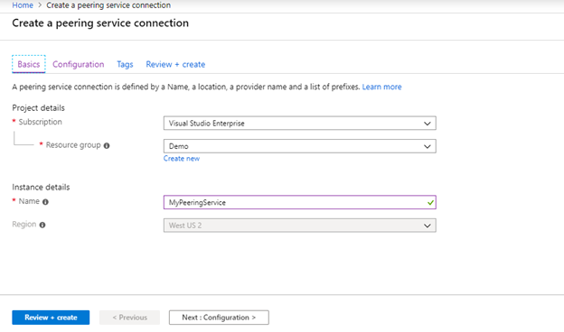

# Register Peering Service using the Azure portal

*Peering Service* is a networking service that aims at enhancing customer connectivity to Microsoft Cloud services such as Office 365, Dynamics 365, SaaS services, Azure or any Microsoft services accessible via public internet

In this article, you will learn how to create a *Peering Service* connection using Azure portal.

If you don't have an Azure subscription, create an [account](https://azure.microsoft.com/free/?WT.mc_id=A261C142F) now.

## Prerequisites  

### Azure account

A valid and active Microsoft Azure account. This account is required to set up the Peering Service connection. Peering Services are resources within Azure subscriptions.  

### Connectivity provider

   - You can work with an Internet Service provider or Internet Exchange Partner to obtain Peering Service to connect your network with Microsoft network.

   - Ensure the connectivity providers are certified.

### Register your subscription with the resource provider and feature flag

Before proceeding to the steps of registering the *Peering Service*, you need to register your subscription with the resource provider and feature flag either via Azure PowerShell or Azure CLI. 

**Azure PowerShell**

```PowerShellCopy
Register-AzProviderFeature-FeatureName AllowPeeringService ProviderNamespace Microsoft.Peering 

Register-AzResourceProvider -ProviderNamespace Microsoft.Peering 

```

**Azure CLI**

```azurecli
az feature register --namespace Microsoft.Peering--name AllowPeeringService
```

## Sign into the Azure portal

From a browser, navigate to the Azure portal and sign in with your Azure account.

## Register the Peering Service connection

1. To register the *Peering Service* connection, click **Create a resource > Peering Service** as depicted below:

> [!div class="mx-imgBorder"]
> 
 
2.	**Basics** - Now, provide the following details in the **Basics** tab of the **Create a peering service connection** page. 
 
3.	Choose the **Subscription** and the **Resource group** associated with the subscription as shown in the screen below:

> [!div class="mx-imgBorder"]
> 

4.	Next, provide a **Name** to which the *Peering Service* instance should be registered.
 
5.	Now, click on the **Next: Configuration** button at the bottom.**Configuration** page appears.

## Configure the Peering Service connection

1.	In the **Configuration**  page, choose the location to which the *Peering Service* must be enabled by choosing the same from the **Peering service location** drop-down list.

2.	Now, choose the service provider from whom the Peering Service must be obtained by choosing provider name from the **Peering service provider**  drop-down list.
 
3.	**Prefixes –** 
Clicking on the **Create new prefix** at the bottom of the **Prefixes** section, text boxes appear. Now, provide **NAME** of the prefix resource and the **PREFIXES** associated with the Service Provider.

> [!div class="mx-imgBorder"]
> 

5.	Now, click on the **Review + create** button at the bottom right of the page. A status message will appear that shows, connection has been registered.

> [!div class="mx-imgBorder"]
> 
 
## Next steps

To learn more about Peering Service concepts, see [Peering Service Connection](connection.md).

To measure the telemetry, see [Measure connection telemetry](measure-connection-telemetry.md).

To register the connection using PowerShell, see [Peering Service connection](powershell.md).

To register the connection using Azure CLI, see [Peering Service connection](cli.md).
