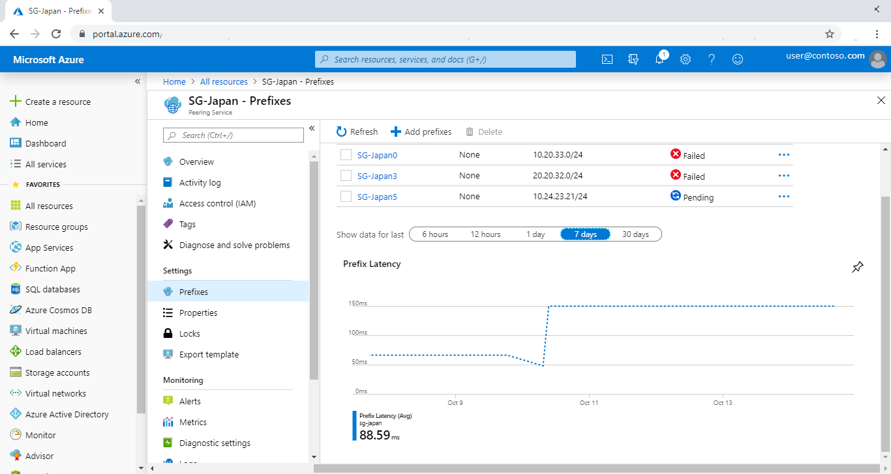

# Measure Peering Service (Preview) connection telemetry

Peering Service connection telemetry is the insights collected for *Peering Service* connection. Customers can opt to obtain monitoring reports by defining the connection telemetry metrics. In this article you will learn how to view the latency report for specific *Peering Service* connection.  

To measure Peering Service connection telemetry, you must register Peering Service connection into the Azure portal. To learn how to register connection, refer [register the Peering Service connection - Azure portal](azure-portal.md).

> [!IMPORTANT]
> "Peering Service” is currently in public preview.
> This preview version is provided without a service level agreement, and it's not recommended for production workloads. Certain features might not be supported or might have constrained capabilities. 
> For more information, see [Supplemental Terms of Use for Microsoft Azure Previews](https://azure.microsoft.com/support/legal/preview-supplemental-terms/).

## View Latency Report

To view latency report for specific Peering Service connection, do the following:

1. Click on **ALL resources** from the left pane and click on the Peering Service connection. Following that, click on the **Open** below the **Prefixes** as depicted below:  

   > [!div class="mx-imgBorder"]
   > 

2. A latency report page for all the prefixes associated with that Peering Service connection appears as shown below:  

   > [!div class="mx-imgBorder"]
   > 

3. By default, the report is updated for every 1 hour that is displayed in this page. However, to view the report for different timelines choose the appropriate option from the **Show data for last**.  

4. **Prefix Events** - To view events for a specific prefix, click on the prefix name and click on the **Prefix Events** on the left pane. The events that are captured will be displayed as depicted below:

   > [!div class="mx-imgBorder"]
   > 

 Some of the possible events that are captured in the **Prefix Events** are as follows: 

| **Prefix Events** | **Event Type**|**Reasoning**|
|-----------|---------|---------|
| PrefixAnnouncementEvent |Information|Prefix announcement was received|
| PrefixWithdrawalEvent|Warning| Prefix withdrawal was received |
| PrefixBackupRouteAnnouncementEvent |Information|Prefix backup route announcement was received |
| PrefixBackupRouteWithdrawalEvent|Warning|Prefix backup route withdrawal was received |
| PrefixActivePath |Information| Current prefix active route   |
| PrefixBackupPath | Information|Current prefix backup route   |
| PrefixOriginAsChangeEvent|Critical| Exact prefix received with different origin Autonomous System Number (for active route)| 
| PrefixBackupRouteOriginAsChangeEvent  | Error|Prefix received with different origin Autonomous System Number (for backup route)  |

## Next steps

To learn about connection, see [Peering Service connection](connection.md).

To learn about connection telemetry, see [Peering Service connection](connection-telemetry.md).