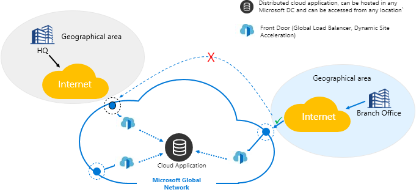
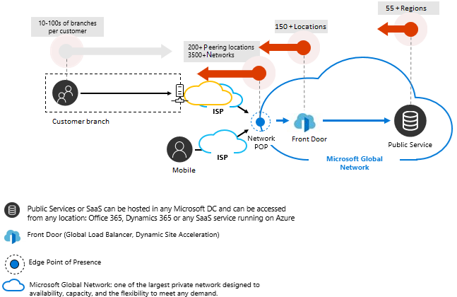

# Microsoft Azure Peering Service (MAPS) Overview
## What is Peering Service? 

Peering Service, also known as Microsoft Azure Peering Service [MAPS] is a networking service that aims at improving customer’s internet access to Microsoft SAAS services such as Office 365, Dynamics 365, and Azure. Microsoft has partnered with Internet Service Providers [ISP] and Internet Exchange Providers [IXP] to provide reliable internet connectivity by meeting the technical requirements such as

- Local redundancy
- Geo redundancy
- Shortest network path

By selecting MAPS, an end user is selecting a Service Provider [SP], which is well connected to Microsoft through high capacity connections. These high capacity connections are optimized for high throughput, better latency at an edge location that is closer to the user. Moreover, these high capacity connections are engineered for High Availability (HA).

Customers can opt for internet telemetry metrics such as BGP route monitoring and alerts against leaks, hijacks by registering Peering Service in the Azure portal.

> [!Note]
> To procure MAPS service,customer is not required to register or perform any other process. They must talk with the MAPS certified Service Providers to render the service. However, to opt for telemetry metrics, customer must register the MAPS service in the Azure portal. To know how to register Peering Service please refer here.
>

## What MAPS isn't about?
**Not a private connectivity product like ExpressRoute or a VPN product.**

- It’s an IP service that follows the rules of the Internet routing. 
- It’s a value-added service intended to offer optimized and reliable routing to public IPs or SaaS traffic such as Office 365, Dynamics 365 or any SaaS traffic running on Azure.

> [!Note]
> For more information about ExpressRoute please refer [here](https://docs.microsoft.com/en-us/azure/expressroute/)
>

## Background

Office 365, Dynamics 365, or any SaaS services can be hosted in any Microsoft DC and can be accessed from any geographic locations. Microsoft Global Network has edge locations around the world where it can connect to an end user via its Service Provider (SP). In the Networking traffic, the link connecting the end user and SP is referred as Last-Mile and the link connecting the data center and edge site Point of Preference [POP] is referred as First-Mile. Microsoft intends to solve the First-Mile problem by routing the networking traffic to the nearest Microsoft Edge (POP) through Service Providers.

> [!Note]
> For more information about the Microsoft Global Network refer [here](https://docs.microsoft.com/en-us/azure/networking/microsoft-global-network)
>

### Prime Focus 

- How to prioritize networking traffic over global network?
- How to optimize last-mile portion in networking when it is bounded to SP?
- How to make cold-potato routing effective?
- How to ensure the networking traffic is routed to the nearest edge point [POP] in the exit path?
- Is there a possibility to monitor network latency?

Microsoft came up with ‘Peering Service/MAPS’ concept to eliminate mid-mile and to solve last-mile, first-mile portions of the networking traffic, aiming for a best-in-class internet experience.

## Key Customer Features
 -	Best Internet routing to Microsoft Cloud Services to achieve optimal performance. 
 -	Traffic insight such as latency, throughput, and so on.
 -	Route analytics and statistics. Events for route leak/hijack detection or non-optimal routing. 

## Why Peering Service?

From a business perspective, it’s recommended for a large-scale enterprise to opt for a redefined technique to get well connected with Microsoft network. Microsoft offers such well-provisioned networks through Peering Services by partnering with respective SPs. Some of the key characteristics of the Peering Service are discussed as below:

**1. Robust, Reliable Peering**
- **Local Redundancy**
   - Microsoft and carriers interconnect with the edge locations. In each location, interconnection must support failover across two routers.
   - Ideally, each peering location is provisioned with two redundant peering links.

- **Geo Redundancy**
    - Replicates the instances of peering connectivity in different geographic locations. This Geo Redundancy supports the failover across multiple locations.
    - Microsoft peers with career at multiple metro locations so that, if one of the Microsoft-Partner nodes shut down, the traffic routes to Microsoft via alternate sites.

- **Shortest Routing Path**
    - Assures to use the shortest routing path by choosing the nearest Microsoft Edge POP.
    - Ensures MAPS partner is one hop away from Microsoft.
    - Microsoft routes traffic in its global network using SDN-based routing policies for optimal performance.
 

- **High Capacity**
   - High availability (port redundant), high throughput, geo-redundant connectivity is maintained with Microsoft Global Network.
   - Capable to transmit maximum amount of data from one point to another over a network. Highly efficient in data transfer rate.
   - Microsoft will provide higher preference to the traffic of MAPS enabled routes on its network.

**2. Optimal Routing**
-  **Cold- potato**
    - Cold-potato routing technique offers control over the networking traffic by ensuring the networking packets are routed within the Microsoft network as much as possible.
    - Ideally, in the return path, probability of networking packets to drop off to the nearest ISP is more, which is referred as Hot- potato routing.
    - By on-boarding MAPS through SPs, networking traffic is guaranteed to use cold-potato routing technique to provide better accessibility to Microsoft network.
 

**3. Monitoring platform**
    - Network monitoring technology is offered to analyze the routing techniques. Monitoring platform provides the following capabilities:
           - Route Anomalies
           - Latency deviation
           - BGP session availability
    - MAPS RADAR service performs the validation by motoring real-time internet routes. On detection of any failovers,customer is notified via e-mails.
 
**4. Secured Peering**

**5. Internet performance insights**
- **Latency optimization**
       - Round-trip time taken from the client to reach the server is optimized by connecting the end users to the nearest possible Microsoft Edge.
       - By using the latency optimization technique, you can access the Microsoft network quickly than expected.