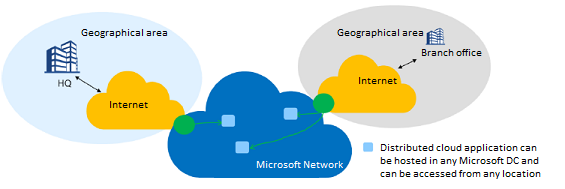
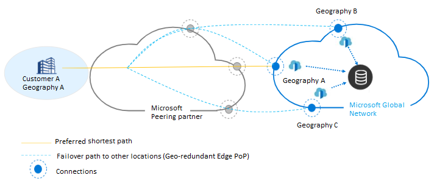
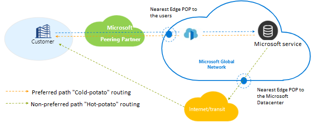

# What is Peering Service? 

Peering Service is a networking service that aims at improving customer’s internet access to Microsoft Public services such as Office 365, Dynamics 365, SaaS services running on Azure or any Microsoft services accessible via public IP Azure. Microsoft has partnered with Internet Service Providers [ISP] and Internet Exchange Providers [IXP] to provide reliable and performant internet connectivity subject to technical requirements in terms of resiliency, geo redundancy and optimal routing (shortest paths and no intermediates in the routing path). 

By selecting Peering Service, an end user is selecting a Service Provider [SP], which is well connected to Microsoft through high capacity connections. These capacity connections are optimized for high throughput, better latency at an edge location that is closer to the user. Moreover, these  capacity connections are engineered for High Availability.

Customers can also opt for Peering Service telemetry such as user latency measures to Microsoft network, BGP route monitoring, and alerts against leaks and hijacks by registering the Peering Service in the Azure Portal.  

To utilize the Peering Service, customer is not required to register with Microsoft.The only requirement is to reach out to a [certified Service Provider](peering-service-location-partners.md) to procure the service. However, to opt for Peering Service telemetry, the customer must register for the same in the Azure Portal.  

To know how to register a Peering Service please refer [here](peering-service-azure-portal.md).  

## What Peering Service isn't about?

**Peering Service is not a private connectivity product like ExpressRoute or a VPN product.**

- It’s an IP service that uses the public internet.  

- It’s a collaboration platform with SPs and a value-added service that is intended to offer optimal and reliable routing to public SPs or SaaS traffic such as Office 365, Dynamics 365 or any SaaS traffic running on Azure.  

> [!Note]
> For more information about ExpressRoute refer [here](https://docs.microsoft.com/en-us/azure/expressroute/)
>

## Background

Office 365, Dynamics 365,  and any other Microsoft SaaS services are hosted in multiple Microsoft data centers and can be accessed from any geographic location. The Microsoft Global Network has edge locations around the world where it can connect to an end user via their Service Provider (SP).  

Microsoft ensures the networking traffic egressing from the prefixes registered with Peering Service connection takes the nearest Edge locations on the Microsoft Global Network. 

> [!Note]
> For more information about the Microsoft Global Network refer [here](https://docs.microsoft.com/en-us/azure/networking/microsoft-global-network).
>

## Why Peering Service? 

Enterprises looking for “Internet first” access to the cloud or considering SD SD-WAN architecture or with high usage of Microsoft SaaS services need robust and performant internet connectivity. Peering Service enables the customers to make that transition happen. Microsoft and Service Providers have partnered to deliver reliable and performance centric public connectivity to the Microsoft cloud. Some of the key customer features are listed below:

 -	Connect to Microsoft cloud through preferable Service Provider.
 -	Best Internet routing to Microsoft Cloud Services to achieve optimal performance.
 - Traffic insight such as latency, throughput, and so on. 
 -	Route analytics and statistics - Events for route anomalies (leak/hijack detection) and suboptimal routing. 
 -	Optimum network hops from the Microsoft cloud. 

### Robust, Reliable Peering

- **Local Redundancy**
   - Microsoft and SP interconnect across multiple edge locations to deliver Peering Service. In each location, interconnection must support failover across two routers. 
   - Each peering location is provisioned with redundant and diverse peering links.

- **Geo Redundancy**
   - Microsoft peers with Service Provider at multiple metro locations so that if one of the edge nodes has a degraded performance, the traffic routes to Microsoft via alternate sites. Microsoft routes traffic in its global network using SDN based routing policies for optimal performance. 

   - Ensures to use the shortest routing path by always choosing the nearest Edge POP to the end user and ensures the customer is one hop away from Microsoft​.  
 

### Optimal Routing

-  **Cold- potato**
    - Software defined cold-potato routing technique offers control over the networking traffic by ensuring the networking packets are routed within the Microsoft network as much as possible.  

    - When traffic egresses, the chances of exiting the Microsoft network close to the service(hot potato) are possible. Cold-potato technique prevents the packets from the immediate exit and ensures the best routing path is chosen to reach the Microsoft network.

    - Microsoft guarantees to use to utilize the cold-potato routing technique to provide better accessibility to the Microsoft networks. 
 

### Monitoring platform

   Service monitoring is offered to analyze the end user traffic and routing, and provides the following capabilities:  

      - **Internet route anomalies detection** 
          
          A service to detect and alert for any route anomaly events including route hijacks to the customer prefixes. 

      - **End user latency**
       
         Monitors the routing path for those prefixes registered with Peering Service and captures as event log for any failover events. 

         Measures the networking performance by validating the round-trip time taken from the client to reach the Edge. Customer can view latency reports for different geographic locations.   

 
### Secured Peering

- Ensures routing happens only via a preferred path that is defined when registering the customer with peering Service. 

- Microsoft guarantees to route the traffic via preferred path regardless of any malicious activity. 

## Next steps

Learn about [Peering Service connection](peering-service-faq.md).

To find a service provider. See [Peering Service partners and locations](peering-service-location-partners.md).

To onboard the Peering Service connection see [Peering Service connection](peering-service-onboarding-connection.md).

To onboard the Peering Service connection telemetry see [Peering Service connection telemetry](peering-service-onboarding-connection-telemetry.md).

To register the connection using Azure portal see [Peering Service connection](peering-service-azure-portal).

To measure the telemetry see [Measure connection telemetry](peering-service-measure-connection-telemetry.md).
