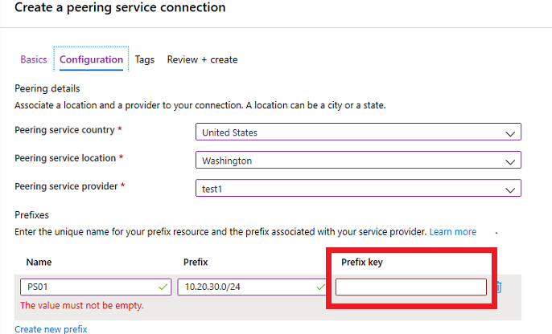

# Onboarding Peering Service connection telemetry

Peering Service is a networking service that improves internet access to Microsoft Public services such as Office 35, Dynamics 365, SaaS services running on Azure or any Microsoft services accessible via public IP Azure. 

To onboard the Peering Service connection telemetry, customer must register the service connection into the Azure portal.

Action plans are described as below:

| **Step** | **Action**| **What you get**| **Costs**|
|-----------|---------|---------|---------|
|2 (Optional)|Customer registers locations into the Azure portal​ A location is defined by: ISP/IXP Name​, Physical location of the customer site (state level), IP Prefix given to the location by the Service Provider or the enterprise​  ​|Telemetry​: Internet Routes monitoring​, traffic prioritization from Microsoft to the user’s closest edge location​. |15 per /24 prefix per month​ ​ |

## Onboarding Peering Service connection telemetry

In addition to the Peering Service enabled service, customers can opt for its telemetry such as route analytics to monitor networking latency and performance when accessing Microsoft network. This can be achieved by registering the connection into the Azure portal.

To register the Peering Service in the Azure portal following pre-requisites should be met.

**Pre-requisites**

**Azure account**

A valid and active Microsoft Azure account. This account is required to set up the Peering Service connection. Peering Services are resources within Azure subscriptions. 

**Connectivity provider**

You can work with Internet Service provider or Internet Exchange Partner to obtain the Peering Service to connect your network with Microsoft network.

Ensure the connectivity providers are certified.

**Register your subscription with the resource provider and feature flag**

Before proceeding to the steps of registering the Peering Service, you need to register your subscription with the resource provider and feature flag. 

Register-AzProviderFeature-FeatureName AllowPeeringService ProviderNamespace Microsoft.Peering 

Register-AzResourceProvider -ProviderNamespace Microsoft.Peering 

## Register the Peering Service connection

1. To register the Peering Service connection, click **Create a resource > Peering Service** as depicted below: 

 
2.	**Basics** - Now, provide the following details in the Basics tab of the Create a peering service connection page. 
 
3.	Choose the **Subscription**  and the **Resource group** associated with the subscription as shown in the screen below:

>[!Note]
>Ensure existing resource group is chosen from the **Resource group** drop-down list, as Peering Service supports only existing ones.
>

4.	Next, provide a **Name** to which the Peering Service instance should be registered.
 
5.	Now, click on the **Next: Configuration**  button at the bottom. Doing so, Configuration page appears.

## Configure the Peering Service connection

1.	In the **Configuration**  page, choose the location to which the **Peering Service** must be enabled by choosing the same from the **Peering service location** drop-down list.

2.	Now, choose the service provider from whom the Peering Service must be obtained by choosing provider name from the **Peering service provider**  drop-down list.
 
3.	**Prefixes –** 
Clicking on the **Create new**  under Prefixes, text boxes appear. Now, provide **Name** of the prefix resource and the **Prefix** that is associated with the Service Provider.

4.	Provide a name to the prefix resource in the **Name** text box and provide the prefix range in the **Prefixes** text box that is associated with the service provider.

> [!div class="mx-imgBorder"]
> 
 
5.	Now, click on the **Review + create** button at the bottom right of the page. Doing so, status message will appear that depicts connection has been registered.

> [!div class="mx-imgBorder"]
> 

## Next steps

To learn about connection, see [Peering Service connection](peering-service-connection.md).

To onboard the Peering Service connection, see [Onboarding Peering Service connection](peering-service-onboarding-connection.md).

