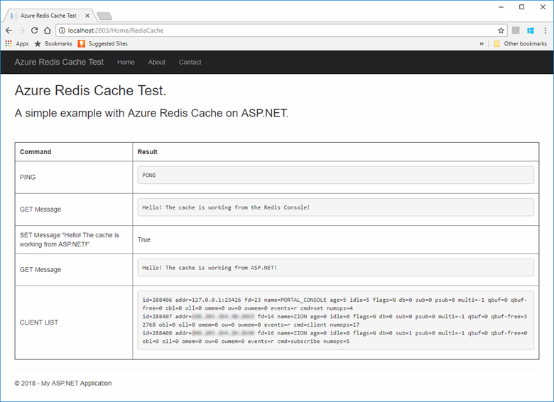
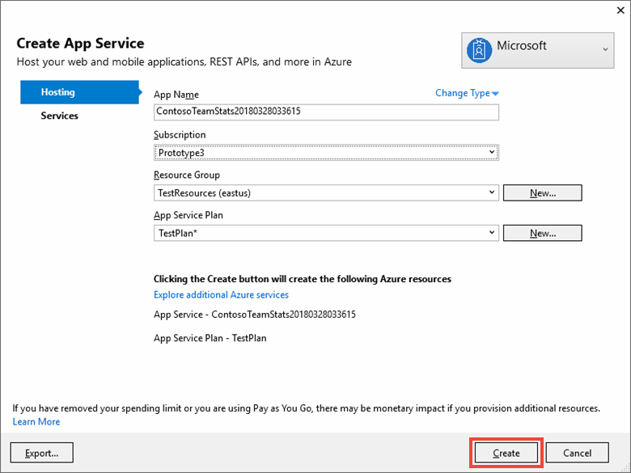
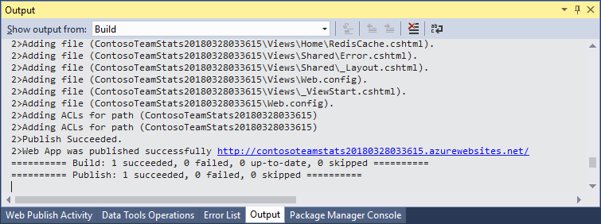

# Quickstart: Create an ASP.NET web app 

## Introduction

This quickstart shows how to create and deploy an ASP.NET web application to Azure App Service by using Visual Studio 2017. The sample application connects to Azure Redis Cache to store and retrieve data from the cache. After you finish the quickstart, you'll have a running web app, hosted in Azure, that reads and writes to Azure Redis Cache.


[!INCLUDE [quickstarts-free-trial-note](../../includes/quickstarts-free-trial-note.md)]

## Prerequisites

To complete the quickstart, you need to install [Visual Studio 2017](https://www.visualstudio.com/downloads/) with the following environments:
* ASP.NET and web development
* Azure development

## Create the Visual Studio project

1. Open Visual Studio, and then and select **File** >**New** > **Project**.

2. In the **New Project** dialog box, take the following steps:

    

    a. In the **Templates** list, expand the **Visual C#** node.

    b. Select **Cloud**.

    c. Select **ASP.NET Web Application**.

    d. Verify that **.NET Framework 4.5.2** or higher is selected.

    e. In the **Name** box, give the project a name. For this example, we used **ContosoTeamStats**.

    f. Select **OK**.
   
    g. Select **MVC** as the project type.

    h. Make sure that **No Authentication** is specified for the **Authentication** settings. Depending on your version of Visual Studio, the default **Authentication** setting might be something else. To change it, select **Change Authentication** and then **No Authentication**.

    i. Select **OK** to create the project.

## Create a cache

Next, you create the cache for the app.

[!INCLUDE [redis-cache-create](../../includes/redis-cache-create.md)]

[!INCLUDE [redis-cache-access-keys](../../includes/redis-cache-access-keys.md)]

#### To edit the *CacheSecrets.config* file

3. Create a file on your computer named *CacheSecrets.config*. Put it in a location where it won't be checked in with the source code of your sample application. For this quickstart, the *CacheSecrets.config* file is located at *C:\AppSecrets\CacheSecrets.config*.

4. Edit the *CacheSecrets.config* file. Then add the following content:

    ```xml
    <appSettings>
        <add key="CacheConnection" value="<cache-name>.redis.cache.windows.net,abortConnect=false,ssl=true,password=<access-key>"/>
    </appSettings>
    ```

5. Replace `<cache-name>` with your cache host name.

6. Replace `<access-key>` with the primary key for your cache.

    > [!TIP]
    > You can use the secondary access key during key rotation as an alternate key while you regenerate the primary access key.
>
7. Save the file.

## Update the MVC application

In this section, you update the application to support a new view that displays a simple test against Azure Redis Cache.

* [Update the web.config file with an app setting for the cache](#Update-the-webconfig-file-with-an-app-setting-for-the-cache)
* [Configure the application to use the StackExchange.Redis client](#configure-the-application-to-use-stackexchangeredis)
* [Update the HomeController and Layout](#update-the-homecontroller-and-layout)
* [Add a new RedisCache view](#add-a-new-rediscache-view)

### Update the web.config file with an app setting for the cache

When you run the application locally, the information in *CacheSecrets.config* is used to connect to your Azure Redis Cache instance. Later you deploy this application to Azure. At that time, you configure an app setting in Azure that the application uses to retrieve the cache connection information instead of this file. 

Because the file *CacheSecrets.config* isn't deployed to Azure with your application, you only use it while testing the application locally. Keep this information as secure as possible to prevent malicious access to your cache data.

#### To update the *web.config* file
1. In **Solution Explorer**, double-click the *web.config* file to open it.

    

2. In the *web.config* file, find the `<appSetting>` element. Then add the following `file` attribute. If you used a different file name or location, substitute those values for the ones that are shown in the example.

* Before: `<appSettings>`
* After: ` <appSettings file="C:\AppSecrets\CacheSecrets.config">`

The ASP.NET runtime merges the contents of the external file with the markup in the `<appSettings>` element. The runtime ignores the file attribute if the specified file can't be found. Your secrets (the connection string to your cache) aren't included as part of the source code for the application. When you deploy your web app to Azure, the *CacheSecrests.config* file isn't deployed.

### To configure the application to use StackExchange.Redis

1. To configure the app to use the [StackExchange.Redis](https://github.com/StackExchange/StackExchange.Redis) NuGet package for Visual Studio, select **Tools > NuGet Package Manager > Package Manager Console**.

2. Run the following command from the `Package Manager Console` window:

    ```powershell
    Install-Package StackExchange.Redis
    ```

3. The NuGet package downloads and adds the required assembly references for your client application to access Azure Redis Cache with the StackExchange.Redis cache client. If you prefer to use a strong-named version of the `StackExchange.Redis` client library, install the `StackExchange.Redis.StrongName` package.

### To update the HomeController and Layout

1. In **Solution Explorer**, expand the **Controllers** folder, and then open the *HomeController.cs* file.

2. Add the following two `using` statements at the top of the file to support the cache client and app settings.

    ```csharp
    using System.Configuration;
    using StackExchange.Redis;
    ```

3. Add the following method to the `HomeController` class to support a new `RedisCache` action that runs some commands against the new cache.

    ```csharp
        public ActionResult RedisCache()
        {
            ViewBag.Message = "A simple example with Azure Redis Cache on ASP.NET.";

            var lazyConnection = new Lazy<ConnectionMultiplexer>(() =>
            {
                string cacheConnection = ConfigurationManager.AppSettings["CacheConnection"].ToString();
                return ConnectionMultiplexer.Connect(cacheConnection);
            });

            // Connection refers to a property that returns a ConnectionMultiplexer
            // as shown in the previous example.
            IDatabase cache = lazyConnection.Value.GetDatabase();

            // Perform cache operations using the cache object...

            // Simple PING command
            ViewBag.command1 = "PING";
            ViewBag.command1Result = cache.Execute(ViewBag.command1).ToString();

            // Simple get and put of integral data types into the cache
            ViewBag.command2 = "GET Message";
            ViewBag.command2Result = cache.StringGet("Message").ToString();

            ViewBag.command3 = "SET Message \"Hello! The cache is working from ASP.NET!\"";
            ViewBag.command3Result = cache.StringSet("Message", "Hello! The cache is working from ASP.NET!").ToString();

            // Demostrate "SET Message" executed as expected...
            ViewBag.command4 = "GET Message";
            ViewBag.command4Result = cache.StringGet("Message").ToString();

            // Get the client list, useful to see if connection list is growing...
            ViewBag.command5 = "CLIENT LIST";
            ViewBag.command5Result = cache.Execute("CLIENT", "LIST").ToString().Replace(" id=", "\rid=");

            lazyConnection.Value.Dispose();

            return View();
        }
    ```

4. In **Solution Explorer**, expand the **Views** > **Shared** folder. Then open the *_Layout.cshtml* file.

    Replace:

        ```csharp
        @Html.ActionLink("Application name", "Index", "Home", new { area = "" }, new { @class = "navbar-brand" })
        ```

    with:

        ```csharp
        @Html.ActionLink("Azure Redis Cache Test", "RedisCache", "Home", new { area = "" }, new { @class = "navbar-brand" })
        ```

### To add a new RedisCache view

1. In **Solution Explorer**, expand the **Views** folder, and then right-click the **Home** folder. Choose **Add** > **View...**.

2. In the **Add View** dialog box, enter **RedisCache** for the View Name. Then select **Add**.

3. Replace the code in the *RedisCache.cshtml* file with the following code:

    ```csharp
    @{
        ViewBag.Title = "Azure Redis Cache Test";
    }

    <h2>@ViewBag.Title.</h2>
    <h3>@ViewBag.Message</h3>
    <br /><br />
    <table border="1" cellpadding="10">
        <tr>
            <th>Command</th>
            <th>Result</th>
        </tr>
        <tr>
            <td>@ViewBag.command1</td>
            <td><pre>@ViewBag.command1Result</pre></td>
        </tr>
        <tr>
            <td>@ViewBag.command2</td>
            <td><pre>@ViewBag.command2Result</pre></td>
        </tr>
        <tr>
            <td>@ViewBag.command3</td>
            <td><pre>@ViewBag.command3Result</pre></td>
        </tr>
        <tr>
            <td>@ViewBag.command4</td>
            <td><pre>@ViewBag.command4Result</pre></td>
        </tr>
        <tr>
            <td>@ViewBag.command5</td>
            <td><pre>@ViewBag.command5Result</pre></td>
        </tr>
    </table>
    ```

## Run the app locally

By default, the project is configured to host the app locally in [IIS Express](https://docs.microsoft.com/iis/extensions/introduction-to-iis-express/iis-express-overview) for testing and debugging.

### To run the app locally
1. In Visual Studio, select **Debug** > **Start Debugging** to build and start the app locally for testing and debugging.

2. In the browser, select **Azure Redis Cache Test** on the navigation bar.

3. In the following example, the `Message` key previously had a cached value, which was set by using the Azure Redis Cache console in the portal. The app updated that cached value. The app also executed the `PING` and `CLIENT LIST` commands.

    

## Publish and run in Azure

After you successfully test the app locally, you can deploy the app to Azure and run it in the cloud.

### To publish the app to Azure

1. In Visual Studio, right-click the project node in Solution Explorer. Then select **Publish**.

    

2. Select **Microsoft Azure App Service**, select **Create New**, and then select **Publish**.

    

3. In the **Create App Service** dialog box, make the following changes:

    | Setting | Recommended value | Description |
    | ------- | :---------------: | ----------- |
    | **App name** | Use default | The app name is the host name for the app when it's deployed to Azure. The name might have a timestamp suffix added to it to make it unique if necessary. |
    | **Subscription** | Choose your Azure subscription | This subscription is charged for any related hosting costs. If you have multiple Azure subscriptions, verify that the subscription that you want is selected.|
    | **Resource group** | Use the same resource group where you created the cache (for example, *TestResourceGroup*). | The resource group helps you manage all resources as a group. Later, when you want to delete the app, you can just delete the group. |
    | **App Service plan** | Select **New**, and then create a new App Service plan named *TestingPlan*. <br />Use the same **Location** you used when creating your cache. <br />Choose **Free** for the size. | An App Service plan defines a set of compute resources for a web app to run with. |

    

4. After you configure the App Service hosting settings, select **Create**.

5. Monitor the **Output** window in Visual Studio to see the publishing status. After the app has been published, the URL for the app is logged as shown below:

    

### Add the app setting for the cache

After the new app has been published, add a new app setting. This setting is used to store the cache connection information. 

#### To add the app setting 

1. Type the app name in the search bar at the top of the Azure portal to find the new app you created.

    

2. Add a new app setting named **CacheConnection** for the app to use to connect to the cache. Use the same value you configured for `CacheConnection` in your *CacheSecrets.config* file. The value contains the cache host name and access key.

    

### Run the app in Azure

In your browser, go to the URL for the app. The URL appears in the results of the publishing operation in the Visual Studio output window. It's also provided in the Azure portal on the overview page of the app you created.

Select **Azure Redis Cache Test** on the navigation bar to test cache access.


## Clean up resources

If you're continuing to the next tutorial, you can keep the resources that you created in this quickstart and reuse them.

Otherwise, if you're finished with the quickstart sample application, you can delete the Azure resources that you created in this quickstart to avoid charges. 

> [!IMPORTANT]
> Deleting a resource group is irreversible. When you delete a resource group, all the resources in it are permanently deleted. Make sure that you do not accidentally delete the wrong resource group or resources. If you created the resources for hosting this sample inside an existing resource group that contains resources you want to keep, you can delete each resource individually from their respective blades instead of deleting the resource group.

### To delete a resource group

1. Sign in to the [Azure portal](https://portal.azure.com), and then select **Resource groups**.

2. In the **Filter by name...** box, type the name of your resource group. The instructions for this article used a resource group named *TestResources*. On your resource group, in the results list, select **...**, and then select **Delete resource group**.

    

You're asked to confirm the deletion of the resource group. Type the name of your resource group to confirm, and then select **Delete**.

After a few moments, the resource group and all of its resources are deleted.

## Next steps

In the next tutorial, you use Azure Redis Cache in a more realistic scenario to improve performance of an app. You update this application to cache leaderboard results using the cache-aside pattern with ASP.NET and a database.

> [!div class="nextstepaction"]
> [Create a cache-aside leaderboard on ASP.NET](cache-web-app-cache-aside-leaderboard.md)
