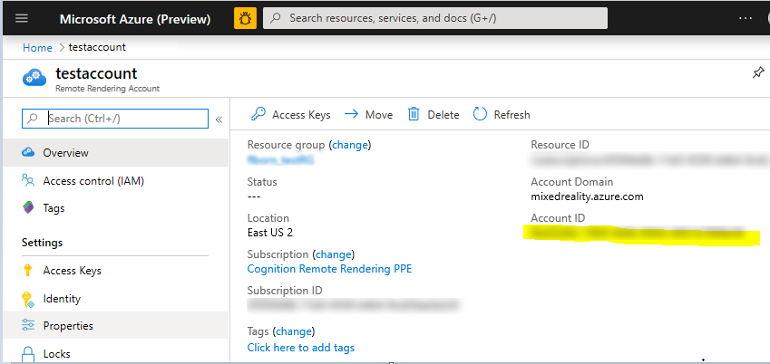
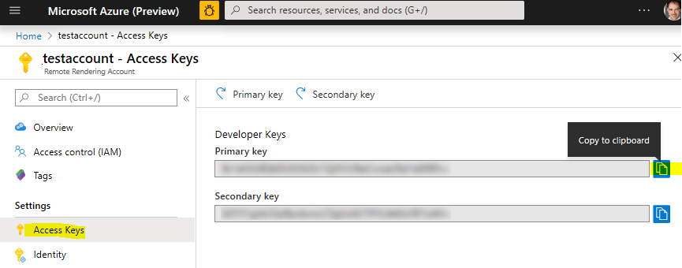

# Creating an account for Azure Remote Rendering

This chapter guides you through the steps to create an account for the **Azure Remote Rendering** service. A valid account is mandatory for completing any of the quickstarts or tutorials.

## Create an account

The following steps are needed to create an account for the Azure Remote Rendering service:

1. Go to the [Mixed Reality Preview page](https://aka.ms/MixedRealityPrivatePreview)
1. Click on 'More services'
1. Click on 'All services'
1. In the search box, type 'Remote Rendering'
1. Select 'Remote Rendering Accounts'
1. Click on '+Add'
    1. Set 'Resource Name' to the name of the account
    1. Update 'Subscription' if needed
    1. Set 'Resource group' to a resource group of your choice
    1. Set 'Location' to 'East US2'
1. Once the account is created, navigate to it and:
    1. In the Overview tab, note the 'Account ID'
    1. In the Keys tab, note the 'Primary key' - this is the account's secret account key

## Retrieve the account information

The samples and tutorials require that you provide the account ID and a key. For instance in the **arrconfig.json** file that is used for the Powershell sample scripts:

```json
{
    "accountSettings": {
        "arrAccountId": "<fill in the account ID from the Azure portal>",
        "arrAccountKey": "<fill in the account key from the Azure portal>",
        "region": "<select from available regions: currently either westus2 or westeurope>"
    },
```

The values for **`arrAccountId`** and **`arrAccountKey`** can be found in the portal as described in the following steps:

* Go to the [Azure portal](https://www.portal.azure.com)
* Find your **"Remote Rendering Account"** - it should be in the **"Recent Resources"** list. You can also search for it in the search bar at the top. In that case, make sure that the subscription you want to use is selected in the Default subscription filter (filter icon next to search bar):


Clicking on your account brings you to this screen, which shows the  **Account ID** right away:



For the key, select **Access Keys** in the panel on the left. The next page shows a primary and a secondary key:



The value for **`arrAccountKey`** can either be primary or secondary key.
