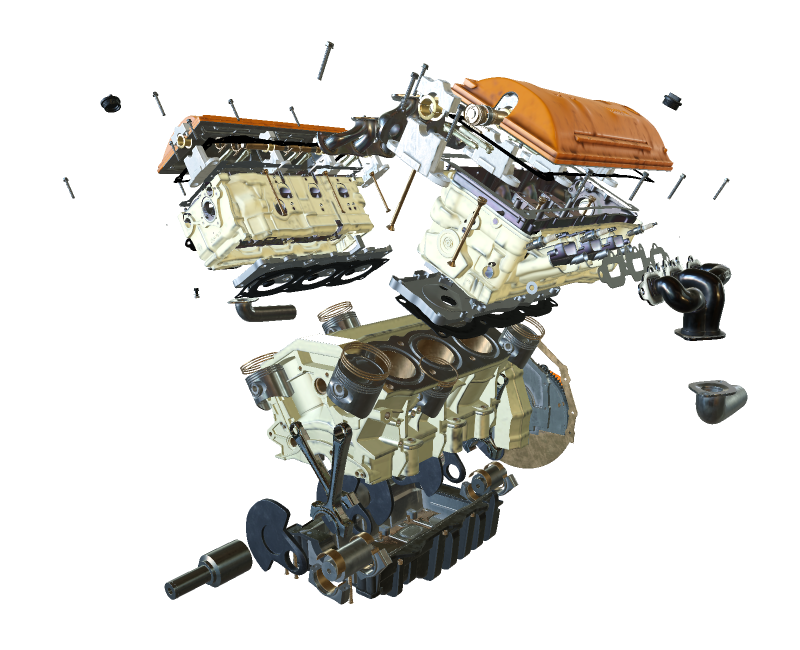

# Azure Remote Rendering documentation

Azure Remote Rendering (ARR) enables you to render highly complex 3D models in real time on devices such as HoloLens 2.

To work with the service, create an [Azure Remote Rendering account](how-tos/create-an-account.md).

## Concepts

Learn key concepts to get started with Azure Remote Rendering:

* [Sessions](concepts/sessions.md)
* [Components](concepts/components.md)
* [Models](concepts/models.md)
* [Model conversion](how-tos/conversion/model-conversion.md)

## Quickstart guides

Use our demo project to see Azure Remote Rendering in action:

* [Quickstart: Render a model with Unity](quickstarts/render-model.md)
* [Quickstart: Deploy Unity sample to HoloLens](quickstarts/deploy-to-hololens.md)
* [Quickstart: Deploy Unity sample to Desktop](quickstarts/deploy-to-desktop.md)
* [Quickstart: Convert a model for rendering](quickstarts/convert-model.md)

## Step-by-Step tutorials

Learn how to build your own app with Azure Remote Rendering:

* [Tutorial: Setting up a Unity project from scratch](tutorials/unity/project-setup.md)
* [Tutorial: Working with remote entities](tutorials/unity/working-with-remote-entities.md)
* [Tutorial: Changing environment and materials](tutorials/unity/changing-environment-and-materials.md)
