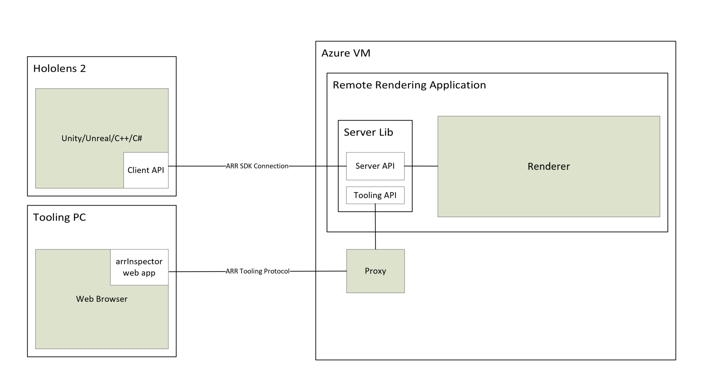

# Azure remote rendering overview

*Azure remote rendering* is a service that enables you to render high-quality interactive 3D content in the cloud and stream it to devices, such as the HoloLens, in real time.

## Introduction

Untethered devices like HoloLens have limited computational power when it comes to rendering complex models, both in terms of number of polygons and realistic shading. Reducing the visual complexity of models on the other hand is not an option in most cases, since any decimation of visual fidelity compromises the application in an unacceptable way.

*Remote Rendering* solves this problem by moving the rendering workload of highly detailed models with complex shading to one or more high-end GPUs in the cloud. A dedicated, cloud-hosted graphics engine renders the image in real time, encodes the image as a video stream, and sends it back over the network to be displayed on the target device.

## Hybrid rendering

The remotely rendered content can still interact with content that is rendered locally on the device, such as markers or UI elements. The process of merging the two images (with correct occlusion) is referred to as *Hybrid Rendering*. One of the key features of Azure Remote Rendering is to hide this complexity so that from a user's perspective it feels like everything is hosted locally.

## Multi-GPU rendering

Depending on the source input data, the complexity of the model might be too high to achieve stable framerates even on a high-end GPU. As a solution, Azure Remote Rendering is able to distribute the workload to multiple GPUs and merge the result into a single image. This process is transparent to the user.

## High-level architecture

The following diagram illustrates how software components work together in a remote rendering setup:

A full end-to-end cycle for image generation involves the following steps:

* Client
  * Client application updates the scene graph
  * Client lib sends scene graph updates and predicted head pose of the device
* Server
  * Rendering engine distributes rendering across available GPUs, based on received head pose
  * Image output from multiple GPUs is composed into single image
  * Image is encoded into video stream, sent over network to client
* Client
  * Merges optional client-generated image with the video stream

Latency is a key problem here. Since the typical end-to-end time span is longer than the desired framerate, there may be more than one frame in flight at a time. 
