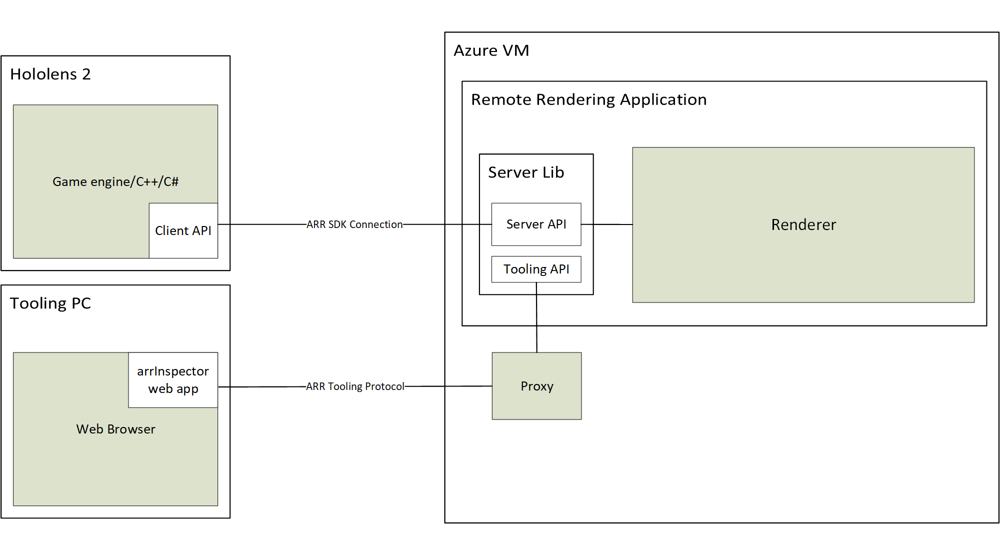

# About Azure Remote Rendering

*Azure Remote Rendering* (ARR) is a service that enables you to render high-quality, interactive 3D content in the cloud and stream it in real time to devices, such as the HoloLens 2.

## Introduction

Untethered devices have limited computational power for rendering complex models. For many applications it would be unacceptable, though, to reduce the visual fidelity in any way.

*Remote Rendering* solves this problem by moving the rendering workload to high-end GPUs in the cloud. A cloud-hosted graphics engine renders the image, encodes it as a video stream, and streams that to the target device.

## Hybrid rendering

The remotely rendered content can be combined with content that is rendered locally on the device, for instance markers or UI elements. The process of merging the two images (with correct occlusion) is referred to as *Hybrid Rendering*. A key feature of ARR is to hide this complexity. From a user's perspective, everything acts like it's rendered locally.

## Multi-GPU rendering

Some models are too complex to render at interactive frame rates, even for a high-end GPU. Especially in industrial visualization this is a common problem. To push the limits further, Azure Remote Rendering can distribute the workload to multiple GPUs. The results are merged into a single image, making the process entirely transparent to the user.

## High-level architecture

This diagram illustrates the remote rendering architecture:

A full cycle for image generation involves the following steps:

1. Client-side: Frame setup
    1. Your code: User input is processed, scene graph gets updated
    1. ARR code: Scene graph updates and predicted head pose get sent to the server
1. Server-side: Remote rendering
    1. Rendering engine distributes rendering across available GPUs
    1. Output from multiple GPUs gets composed into single image
    1. Image is encoded as video stream, sent back to client
1. Client-side: Finalization
    1. Your code: Optional local content (UI, markers, ...) is rendered
    1. ARR code: On 'present', locally rendered content gets automatically merged with video stream

Network latency is the main problem. The turn-around time between sending a request and receiving the result is typically longer than the desired framerate. Therefore more than one frame may be in flight at any time.
