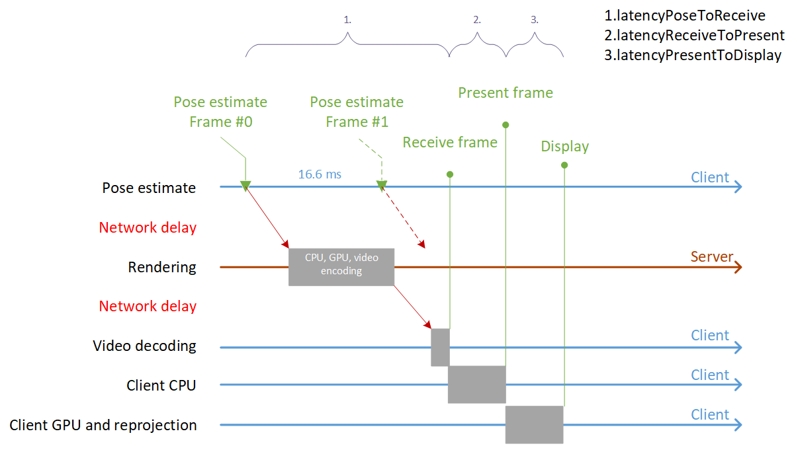
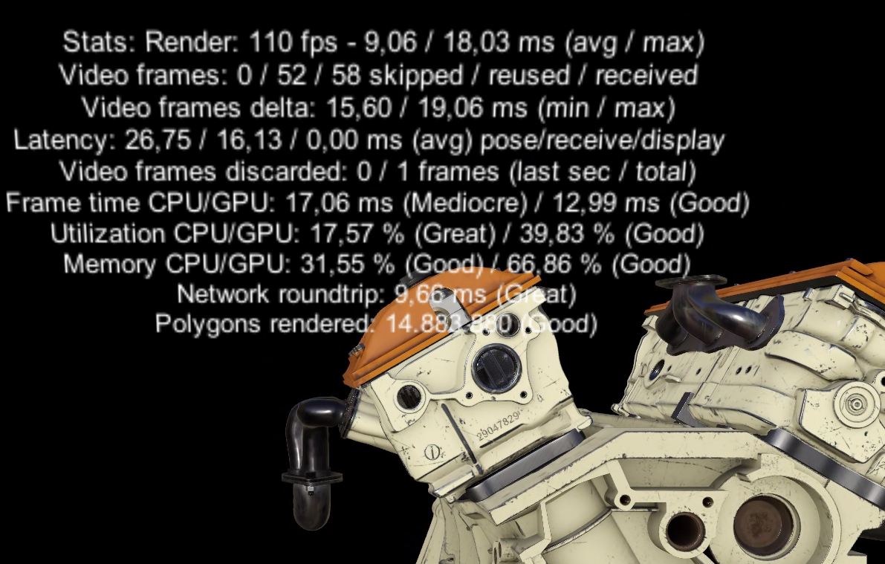

# Server-side performance queries

Good rendering performance on the server is critical for stable frame rates and thus a good user experience. Accordingly, it is important to monitor performance characteristics on the server carefully and optimize where necessary. Performance data can be queried through dedicated API functions as described in the following paragraphs.

Most impactful for the rendering performance is the model input data. You can tweak the input data as described in the [configuring the model conversion](../../how-tos/conversion/configure-model-conversion.md) chapter.

Client-side application performance might be a bottleneck, too. For an in-depth analysis of client-side performance, it is recommended to take a [performance trace](../../how-tos/performance-tracing.md).

## Client/server timeline

Before going into detail regarding the various latency values, it is worthwhile to have a look at the sync points between client and server on the timeline: 



The illustration shows how:
* a *Pose estimate* is kicked off by the client at constant 60-Hz frame rate (every 16.6 ms),
* the server then starts rendering based on the pose,
* the server sends back the encoded video image,
* the client decodes the image, performs some CPU and GPU work on top of it before the image is displayed

## Frame statistics queries

Frame statistics provide some high-level information for the last frame such as latency. The data provided in the `FrameStatistics` output structure is measured on the client side, so the API is a synchronous call:

````c#
void QueryFrameData(AzureSession session)
{
    FrameStatistics frameStatistics;
    if (session.GraphicsBinding.GetLastFrameStatistics(out frameStatistics) == Result.Success)
    {
        // do something with the result
    }

}
````

The retrieved `FrameStatistics` object holds the following members:

| Member | Explanation |
|:-|:-|
| latencyPoseToReceive | Latency from camera pose estimation on the client device until a server frame for this pose is fully available to the client application. This value includes network roundtrip, server render time, video decode, and jitter compensation. See **interval 1 in the illustration above.**|
| latencyReceiveToPresent | Latency from availability of a received remote frame until the client app calls PresentFrame on the CPU. |
| latencyPresentToDisplay  | Latency from presenting a frame on the CPU until display lights up. This value includes client GPU time, any frame buffering performed by the OS, hardware reprojection, and device-dependent display scan-out time. See **interval 2 in the illustration above.**|
| timeSinceLastPresent | The time between subsequent calls to PresentFrame on the CPU. Values greater than the display duration (for example 16.6 ms on a 60-Hz client device) indicate issues caused by the client application not finishing its CPU workload in time. See **interval 3 in the illustration above.**|
| videoFramesReceived | The number of frames received from the server in the last second. |
| videoFrameReusedCount | Number of received frames in the last second that were used on the device more than once. Non-zero values indicate that frames had to be reprojected either due to network jitter or excessive server rendering time. |
| videoFramesDiscarded | Number of received frames in the last second that were decoded, but not shown on display. Non-zero values indicate that network jittering caused multiple frames to be delayed and then arrive on the client device together in a burst. |
| videoFrameMinDelta | Minimum amount of time between two consecutive frames arriving during the last second. Together with videoFrameMaxDelta, this range gives an indication of jitter caused either by the network or video codec. |
| videoFrameMaxDelta | Maximum amount of time between two consecutive frames arriving during the last second. Together with videoFrameMinDelta, this range gives an indication of jitter caused either by the network or video codec. |

The sum of all latency values is typically much larger than the available frame time at 60 Hz. This is OK, because multiple frames are in flight in parallel, and new frame requests are kicked off at desired frame rate, as shown in the illustration. However if latency becomes too large, it affects the quality of the [late stage reprojection](../../overview/features/late-stage-reprojection.md), and thus may compromise the overall experience.

`videoFramesReceived`, `videoFrameReusedCount`, and `videoFramesDiscarded` can be used to gauge network and server performance. If `videoFramesReceived` is low and `videoFrameReusedCount` is high, this can indicate network congestion or poor server performance. A high `videoFramesDiscarded` value also indicates network congestion.

Lastly,`timeSinceLastPresent`, `videoFrameMinDelta`, and `videoFrameMaxDelta` give an idea of the variance of incoming video frames and local present calls. High variance means instable frame rate.

None of the values above gives clear indication of pure network latency (the red arrows in the illustration), because the exact time that the server is busy rendering needs to be subtracted from the roundtrip value `latencyPoseToReceive`. The server-side portion of the overall latency is information that in unavailable to the client. However, the next paragraph explains how this value is approximated through additional input from the server and exposed through the `networkLatency` value.

## Performance assessment queries

Performance assessment queries provide more in-depth information about the CPU and GPU workload on the server. Accordingly, since the data is requested from the server, querying performance snapshots follows the usual async query pattern:

``` cs
    private PerformanceAssessmentAsync _assessmentQuery = null;

    public void QueryPerformanceAssessment(AzureSession session)
    {
        _assessmentQuery = session.Actions.QueryServerPerformanceAssessmentAsync();
 _assessmentQuery.Completed += (PerformanceAssessmentAsync res) =>
            {
                // do something with the result:
                PerformanceAssessment result = res.Result;
                // ...

                _assessmentQuery = null;
            };

    }
```

Contrary to the `FrameStatistics` object, the `PerformanceAssessment` object contains server-side information:

| Member | Explanation |
|:-|:-|
| timeCPU | Average CPU time per frame in milliseconds |
| timeGPU | Average GPU time per frame in milliseconds |
| utilizationCPU | Total CPU utilization in percent on the server host machine |
| utilizationGPU | Total GPU utilization in percent on the server host machine |
| memoryCPU | Total main memory utilization in percent on the server host machine |
| memoryGPU | Total dedicated video memory utilization in percent of the server GPU |
| networkLatency | The approximate average roundtrip network latency in milliseconds. In the illustration above, this corresponds to the sum of the red arrows. The value is computed by subtracting actual server rendering time from the `latencyPoseToReceive` value of `FrameStatistics`. While this approximation is not accurate, it gives some indication of the network latency isolated from the latency values computed on the client. |
| polygonsRendered | The number of triangles rendered in one frame. This number also includes the triangles that are culled later during rendering. That means, this number does not vary a lot across different camera positions, but the performance on the other hand may vary a lot, depending on the triangle culling rate.|

To help you assessing the values, each portion comes with a quality classification that can take one of the following enum values:  **Great**, **Good**, **Mediocre**, **Bad**.
This assessment metric provides a rough indication of the server's health state, but it should not be seen as absolute. For example, assume you get a 'mediocre' score for the GPU time. It is considered mediocre because it gets close to the limit for the overall frame time budget. In your case however, it might be a good value nonetheless, because you are rendering a complex model.

## Statistics debug output

API class `ARRServiceStats` wraps around both the frame statistics and performance assessment queries and provides convenient functionality to return statistics as aggregated values or as a pre-built string. The following code is the easiest way to show server-side statistics in your client application.

``` cs
private ARRServiceStats _stats = null;

void OnConnect()
{
    _stats = new ARRServiceStats();
}

void OnDisconnect()
{
    _stats = null;
}

void Update()
{
    if (_stats != null)
    {
        // update once a frame to retrieve new information and build average values
        _stats.Update(Service.CurrentActiveSession);
    
        // retrieve a string with relevant stats information
        InfoLabel.text = _stats.GetStatsString();
    }
}
    
```

The code above populates the text label with the following text:



The `GetStatsString` API builds a preformatted string of all the values, but each single value can also be queried programmatically from the `ARRServiceStats` instance via public members.

There are also variants of the members, which aggregate the values over time. See members with suffix `*Avg`, `*Max`, or `*Total`. The member `FramesUsedForAverage` indicates how many frames have been used for this aggregation.

## Next steps

* [Create performance traces](../../how-tos/performance-tracing.md)
* [Configuring the model conversion](../../how-tos/conversion/configure-model-conversion.md)
