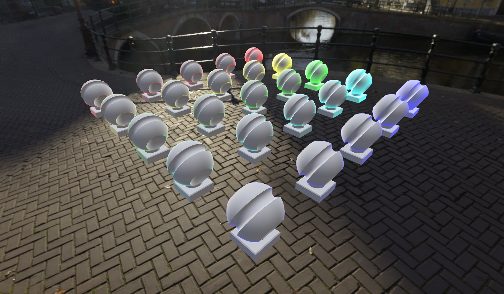

# Fresnel effect

The fresnel effect material feature is a non-physically correct, purely ad-hoc effect to highlight gracing view angles on an object. It is based on the physical observation of objects becoming more reflective at these angles, which is also incorporated in the [PBR material model](../../overview/features/pbr-materials.md) used in Azure Remote Rendering. Contrary to the physically based model, the fresnel effect material feature is just an additive color effect that is not dependent on [Lights](../../overview/features/lights.md) or the [Sky environment](../../overview/features/sky.md).

In practice, activating the fresnel effect feature results in object edges naturally curving away from the viewer being highlighted by a sort of shine. The parameters which govern the effect's appearance as well as examples of the rendering results can be viewed in the following sections.

## Enabling the fresnel effect

To use the fresnel effect feature, it needs to be enabled on the materials in question. You can enable it by setting either of the [PbrMaterialFeatures](https://docs.microsoft.com/dotnet/api/microsoft.azure.remoterendering.pbrmaterialfeatures) or [ColorMaterialFeatures](https://docs.microsoft.com/dotnet/api/microsoft.azure.remoterendering.pbrmaterialfeatures) FresnelEffect bit on the features of the [PBR material](../../overview/features/pbr-materials.md) or [Color material](../../overview/features/color-materials.md) respectively. See the [code samples](../../overview/features/fresnel-effect.md#Code) section for a demonstration of this.

After enabling the fresnel effect will immediately be visible. By default the shine will be completely white (1, 1, 1, 1) and have an exponent of 1. You can customize these settings using the parameter setters below.

## Customizing the effect appearance

Currently, the fresnel effect can be customized per material using the following properties:

| Material property | Type | Explanation |
|-------------------|------|-------------|
| FresnelEffectColor | Color4 | The color that gets added at most as the fresnel shine. The alpha channel is currently ignored. |
| FresnelEffectExponent | float | The spread of the fresnel shine. Ranges from 0.01 (spread over all of the object) to 10 (only the most gracing angles). |

In practice, different color and exponent settings will look like this:



As you can see, progressively increasing the fresnel effect's exponent visually pulls the fresnel shine more and more to the very edges of the viewed objects.

## Code samples

The following code samples show enabling and customizing the fresnel effect for both a [PBR material](../../overview/features/pbr-materials.md) and a [Color material](../../overview/features/color-materials.md):

```cs
    void SetFresnelEffect(AzureSession session, Material material)
    {
        if (material.MaterialSubType == MaterialType.Pbr)
        {
            var pbrMaterial = material as PbrMaterial;
            pbrMaterial.PbrFlags |= PbrMaterialFeatures.FresnelEffect;
            pbrMaterial.FresnelEffectColor = new Color4(1.0f, 0.5f, 0.1f, 1.0f);
            pbrMaterial.FresnelEffectExponent = 3.141592f;
        }
        else if (material.MaterialSubType == MaterialType.Color)
        {
            var colorMaterial = material as ColorMaterial;
            colorMaterial.ColorFlags |= ColorMaterialFeatures.FresnelEffect;
            colorMaterial.FresnelEffectColor = new Color4(0.25f, 1.0f, 0.25f, 1.0f);
            colorMaterial.FresnelEffectExponent = 7.654321f;
        }
    }
```

```cpp
void SetFresnelEffect(ApiHandle<AzureSession> session, ApiHandle<Material> material)
{
    if (material->GetMaterialSubType() == MaterialType::Pbr)
    {
        auto pbrMaterial = material.as<PbrMaterial>();
        auto featureFlags = PbrMaterialFeatures((int32_t)pbrMaterial->GetPbrFlags() | (int32_t)PbrMaterialFeatures::FresnelEffect);
        pbrMaterial->SetPbrFlags(featureFlags);
        pbrMaterial->SetFresnelEffectColor(Color4{ 1.f, 0.5f, 0.1f, 1.f });
        pbrMaterial->SetFresnelEffectExponent(3.141592f);

    }
    else if (material->GetMaterialSubType() == MaterialType::Color)
    {
        auto colorMaterial = material.as<ColorMaterial>();
        auto featureFlags = ColorMaterialFeatures((int32_t)colorMaterial->GetColorFlags() | (int32_t)ColorMaterialFeatures::FresnelEffect);
        colorMaterial->SetColorFlags(featureFlags);
        colorMaterial->SetFresnelEffectColor(Color4{ 0.25f, 1.f, 0.25f, 1.f });
        colorMaterial->SetFresnelEffectExponent(7.654321f);
    }
}
```

## API documentation

* [C# PbrMaterialFeatures](https://docs.microsoft.com/dotnet/api/microsoft.azure.remoterendering.pbrmaterialfeatures)
* [C++ PbrMaterialFeatures](https://docs.microsoft.com/cpp/api/remote-rendering/pbrmaterialfeatures)
* [C# ColorMaterialFeatures](https://docs.microsoft.com/dotnet/api/microsoft.azure.remoterendering.colormaterialfeatures)
* [C++ ColorMaterialFeatures](https://docs.microsoft.com/cpp/api/remote-rendering/colormaterialfeatures)

## Next steps

* [Materials](../../concepts/materials.md)
* [PBR Materials](../../overview/features/pbr-materials.md)
* [Color Materials](../../overview/features/color-materials.md)