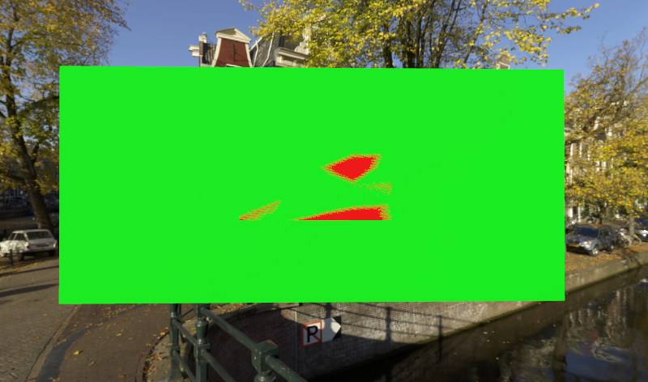
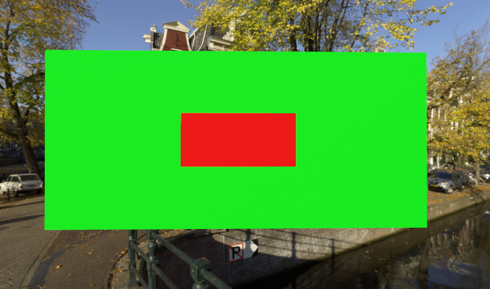

# Z-fighting mitigation

When two surfaces overlap, it is not clear which one should be rendered on top of the other. The result even varies per pixel, resulting in view-dependent artifacts. Consequently, when the camera or the mesh moves, these patterns flicker noticeably. This artifact is called *z-fighting*. For AR and VR applications, the problem is intensified because head-mounted devices naturally always move. To prevent viewer discomfort z-fighting mitigation functionality is available in Azure Remote Rendering.

## Z-fighting mitigation modes

|Situation                        | Result                               |
|---------------------------------|:-------------------------------------|
|Regular z-fighting               ||
|Z-fighting mitigation enabled    ||
|Checkerboard highlighting enabled||

The following code enables z-fighting mitigation:

```cs
void EnableZFightingMitigation(AzureSession session, bool highlight)
{
    ZFightingMitigationSettings settings = session.Actions.ZFightingMitigationSettings;

    // enabling z-fighting mitigation
    settings.Enabled = true;

    // enabling checkerboard highlighting of z-fighting potential
    settings.Highlighting = highlight;
}
```

```cpp
TODO
```


> [!NOTE]
> Z-fighting mitigation is a global setting that affects all rendered meshes.

## Reasons for z-fighting

Z-fighting happens mainly for two reasons:

1. when surfaces are very far away from the camera, the precision of their depth values degrades and the values become indistinguishable
1. when surfaces in a mesh physically overlap

The first problem can always happen and is difficult to eliminate. If this happens in your application, make sure that the ratio of the *near plane* distance to the *far plane* distance is as low as practical. For example, a near plane at distance 0.01 and far plane at distance 1000 will create this problem much earlier, than having the near plane at 0.1 and the far plane at distance 20.

The second problem is an indicator for badly authored content. In the real world, two objects can't be in the same place at the same time. Depending on the application, users might want to know whether overlapping surfaces exist and where they are. For example, a CAD scene of a building that is the basis for a real world construction, shouldn't contain physically impossible surface intersections. To allow for visual inspection, the highlighting mode is available, which displays potential z-fighting as an animated checkerboard pattern.

## Limitations

The provided z-fighting mitigation is a best effort. There is no guarantee that it removes all z-fighting. Also it will automatically prefer one surface over another. Thus when you have surfaces that are too close to each other, it might happen that the "wrong" surface ends up on top. A common problem case is when text and other decals are applied to a surface. With z-fighting mitigation enabled these details could easily just vanish.

## Performance considerations

* Enabling z-fighting mitigation incurs little to no performance overhead.
* Additionally enabling the z-fighting overlay does incur a non-trivial performance overhead, though it may vary depending on the scene.

## Next steps

* [Rendering modes](../../concepts/rendering-modes.md)
* [Late stage reprojection](late-stage-reprojection.md)
