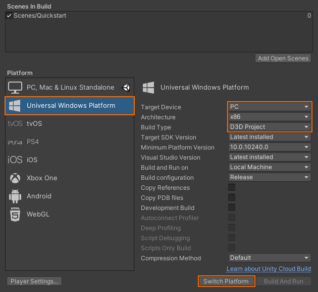

# Quickstart: Deploy Unity sample to Desktop

This quickstart covers how to deploy and run the quickstart sample app for Unity to a desktop PC.

In this quickstart you will learn how to:

> [!div class="checklist"]
>
>* Build the quickstart sample app for desktop
>* Deploy the sample to a PC
>* Run the sample on a PC

## Prerequisites

In this quickstart we will deploy the sample project from [Quickstart: Render a model with Unity](render-model.md).

Make sure your credentials are saved properly with the scene and you can connect to a session from within the Unity editor.

## Disable virtual reality support

Only flat desktop apps are currently supported on desktop so VR support has to be disabled.

1. Open *Edit > Project Settings...*
1. Select **Player** on the left.
1. Select the **Universal Windows Platform settings** tab.
1. Expand the **XR Settings**.
1. Disable **Virtual Reality Supported**.
    
1. Above *XR Settings*, expand **Publishing Settings**.
1. In **Supported Device Families**, make sure **Desktop** is checked.

## Build the sample project

1. Open *File > Build Settings*.
1. Change *Platform* to **Universal Windows Platform**.
1. Set *Target Device* to **PC**.
1. Set *Architecture* to **x86**.
1. Set *Build Type* to **D3D Project**.
  
1. Select **Switch to Platform**.
1. When pressing **Build** (or 'Build And Run'), you will be asked to select some folder where the solution should be stored.
1. Open the generated **Quickstart.sln** with Visual Studio.
1. Change the configuration to **Release** and **x86**.
1. Switch the debugger mode to **Local Machine**.
  
1. Build the solution (F7).

> [!WARNING]
> Make sure to select **x86** as **x64** is currently not supported, see [platform limitations](../reference/limits.md#platform-limits).

## Launch the sample project

Start the Debugger in Visual Studio (F5). It will automatically deploy the app to the PC.

The sample app should launch and then start a new session. After a while, the session is ready and the remotely rendered model will appear in front of you.
If you want to launch the sample a second time later, you can also find it from the Start menu now.

## Next steps

In the next quickstart, we will take a look at converting a custom model.

> [!div class="nextstepaction"]
> [Quickstart: Convert a model for rendering](convert-model.md)
