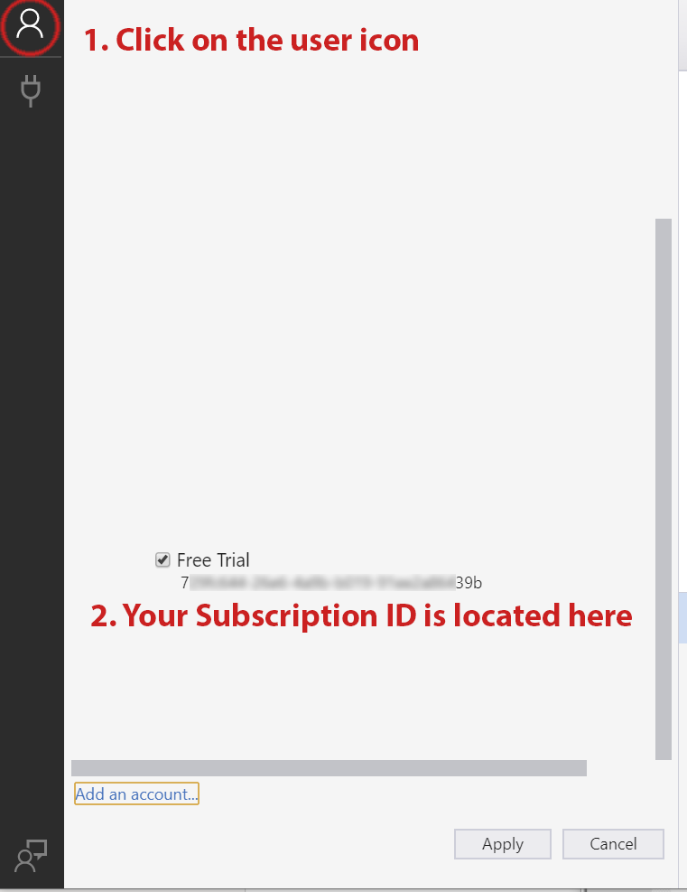
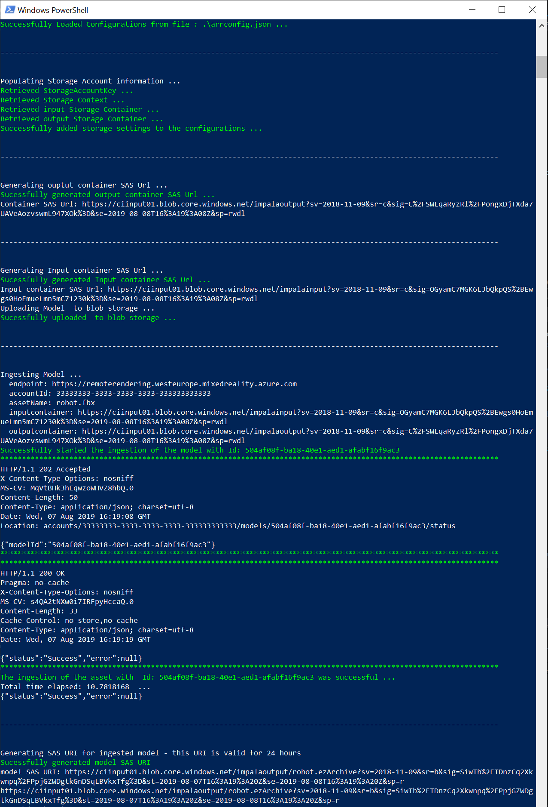

# Quickstart: Convert a model for rendering

In the [previous quickstart](quickstart-render-model.md), you learned how to use the Unity sample project to render a built-in model. This guide shows how to convert your own models.

You'll learn how to:

> [!div class="checklist"]
>
> * Set up Azure blob storage for input and output.
> * Configure the conversion script with your credentials and storage information.
> * Run the conversion and retrieve the URL of the converted model.

## Prerequisites

Additionally to the [previous quickstart](quickstart-render-model.md) the following software must be installed:

* Azure Storage Explorer [(download)](https://azure.microsoft.com/features/storage-explorer/ "Microsoft Azure Explorer")
* Azure Powershell [(documentation)](https://docs.microsoft.com/powershell/azure/)
  * Open a Powershell with admin rights
  * Run `Install-Module -Name Az -AllowClobber`

## Overview

The renderer on the server can't work directly with source model formats such as FBX or GLTF. Instead, it requires the model to be in a proprietary binary format.
The conversion service consumes models from Azure blob storage and writes converted models back to a provided Azure blob storage container.
You need:

* An Azure subscription
* A Storage v2 account in your subscription
* A blob storage container for your input model
* A blob storage container for your output data

ARR supports the conversion of these source formats:

* FBX
* GLTF
* GLB

## Azure setup

If you do not have an account yet, go to [https://azure.microsoft.com/get-started/](https://azure.microsoft.com/get-started/), click on the free account option, and follow the instructions.

Once you have an Azure account, go to [https://ms.portal.azure.com/#home](https://ms.portal.azure.com/#home).

### Storage account creation

To create blob storage, you first need a storage account.

On the Portal homepage, click the *Storage accounts* link on the left-hand side.
You should see a list of all storage accounts under your subscription. For a newly created account, there will be none.

Press the **+Add** button.


* Create a new *Resource Group* from the link below the drop-down box and name it **ARR_Tutorial**.
* For the storage account name, enter **arrtutorialstorage**.
* Select a location close to you.
* Set *Performance* to ‘Standard’.
* Set *Account kind* to ‘StorageV2 (general purpose v2)’.
* Set *Replication* to ‘Read-access geo-redundant storage (RA-GRS)’.
* Set *Access tier* to ‘Hot’.

### Blob storage creation

Next we need two blob containers, one for input and one for output.

On the dashboard, click the *Blob Services* button. On the next page, press the **+Container** button to create a blob storage container.
Use the following settings when creating it:

* Name = *arrinput*
* Public access level = *Private*

After the container has been created, click **+Container** again and repeat with these settings for the second container:

* Name = *arroutput*
* Public access level = *Private*

You should now have two blob storage containers:


At this point, switch to the Azure Storage Explorer (which you installed earlier) – it provides information in one central location and makes it easier to configure Azure Remote Rendering.
After signing in, you will be presented with a tree structure. Navigate to your blob containers like in the image below:


As you can see, the tool displays all the information needed via the properties menu.

## Conversion settings

To make it easier to run the model conversion service, we provide a utility script. It is located in the *Scripts* folder and is called **Ingestion.ps1**. The script reads its configuration from the file *Scripts\arrconfig.json*. Open the JSON file in a text editor.

```json
{
    "accountSettings": {
        "arrAccountId": "8*******-****-****-****-*********d7e",
        "arrAccountKey": "R***************************************l04=",
        "region": "westus2"
    },
    "renderingSessionSettings": {
        "vmSize": "small",
        "maxLeaseTime": "1:00:00"
    },
    "azureStorageSettings": {
        "azureSubscriptionId": "7*******-****-****-****-*********39b",
        "resourceGroup": "ARR_Tutorial",
        "storageAccountName": "arrtutorialstorage",
        "blobInputContainerName": "arrinput",
        "blobOutputContainerName": "arroutput"
    },
    "modelSettings": {
        "modelLocation": "D:\\tmp\\robot.fbx"
    }
}
```

Make sure to change **resourceGroup**, **storageAccountName**, **blobInputContainerName**, and **blobOutputContainerName** as seen above. Those are the settings you used during storage account creation and blob container setup. Change **modelLocation** to point to the file on your disk that you intend to convert. Be careful to properly escape backslashes ("\\") in the path using double backslashes ("\\\\").

To fill out **azureSubscriptionId**, open Azure Storage Explorer and click on the user icon on the left-hand side. Scroll down the list of subscriptions until you find the account used for this tutorial. **The SubscriptionID is located under the account name:**



## Running the conversion script

The script is now ready to upload your model, call the conversion API, and retrieve a link to the converted model.

Open a Powershell, make sure you installed the *Azure Powershell* as mentioned in the prerequisites. Then log into your subscription:

```powershell
PS> Connect-AzAccount -Subscription "<your Azure subscription id>"
```

Change to the `\ARR\arrClient\Scripts` directory and run the conversion script:

```powershell
PS> .\Ingestion.ps1
```

You should see something like this:


The conversion script generates a **Shared Access Signature (SAS)** URI for the converted model. You can now copy this URI as the *model name* into the Unity sample app (see the [previous quickstart](quickstart-render-model.md)) to have it render you custom model!

## Re-creating a SAS URI

The SAS URI created by the conversion script will only be valid for 24 hours. However, after it expired you do not need to convert your model again. Instead, open Azure Storage Explorer and navigate to the *arroutput* blob storage container.
You will find the converted model file in there (either an *ezArchive* or and *arrAsset* file).
Right-click on the entry and select **Get Shared Access Signature**:


## Next steps

Now that you know the basics, have a look at our tutorials to gain more in-depth knowledge.

> [!div class="nextstepaction"]
> [Tutorial 1](../tutorials/tutorial-1-getting-started.md)
