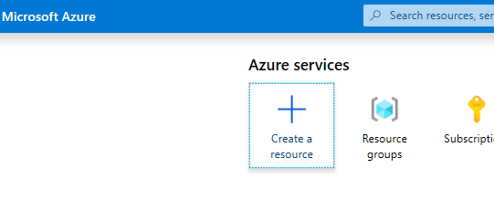
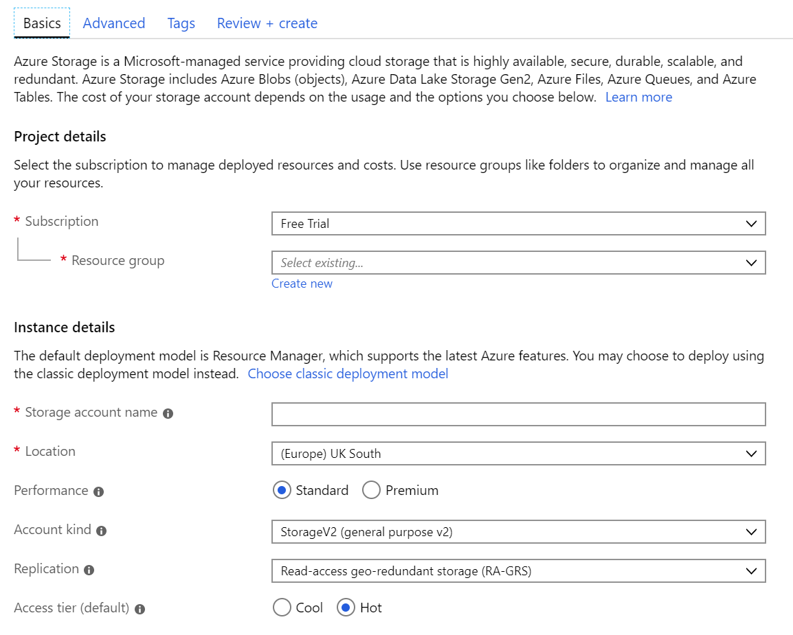

# Quickstart: Convert a model for rendering

In the previous quickstart, you have learnt how to set up a Unity project to render a model with the Remote Rendering service. That quickstart used a built-in model to render. In this quickstart you will learn how to convert your own model, for example an .FBX file. Once converted, you can modify the sample from the first quickstart to actually render it.

You'll learn how to:

> [!div class="checklist"]
> * Set up Azure blob storage for input and output
> * Configure the conversion script with your credentials and storage information
> * Run the conversion and get back the URL of the converted model


## Overview
The renderer on the server consumes a model in a proprietary binary format, not a source model format (.FBX, .GLTF, ...) directly. To convert a model from source format to target format, we need to call the conversion REST API, which will be shown in this article.

The conversion REST API can consume models from Azure blob storage and will write the converted model back to a provided Azure blob storage container.
You will need to have:
- An Azure Subscription
- A 'StorageV2' account in your subscription
- A blob storage container for your input model
- A blob storage container for your output data

ARR supports the conversion of the following source formats: FBX, GLTF, and GLB files.

## Prerequisites
The following must be installed to complete this quickstart:
- You need a remote rendering service account: [Create an account](../azure/create-an-account.md)
- Install the Azure Storage Explorer ([download](https://azure.microsoft.com/features/storage-explorer/ "Storage Explorer"))
- Make sure you have the [Azure Powershell](https://docs.microsoft.com/powershell/azure/) package installed. To install the package, run the following command in powershell with admin rights:
```powershell
PS> Install-Module -Name Az -AllowClobber
```


## Azure setup
For this guide, we will describe how to use Azure Remote Rendering with a free Azure account.
The same setup will apply if you are an existing user.

Go to  [https://azure.microsoft.com/get-started/](https://azure.microsoft.com/get-started/) or if you already have an account go to [https://ms.portal.azure.com/#home](https://ms.portal.azure.com/#home).
If you do not have an Azure account, then click on the free account option on the home page and follow those instructions.
Once completed, you will be forwarded to the portal page in the second link.

First, a Storage Account must be created so that will be the first task to complete. To accomplish that, click on the "Create a resource" button:



From the new screen, choose **Storage** on the left side and then **Storage account - blob, file, table, queue** from the next column:


This will bring up the following new screen with storage properties to fill out:



Fill out the form in the following manner:

  *	Create a new Resource Group from the link below the drop-down box and name this **ARR_Tutorial**
  *	For the **Storage account name**, enter a unique name here. **This name must be globally unique**, otherwise there will be a prompt that informs you that the name is already given. In the scope of this quickstart, we name it **arrtutorialstorage**. Accordingly, you need to replace it with your name for any occurrence in this quickstart.
  *	Select a **location** close to you. Ideally use the same location as used for setting up the rendering in the other quickstart.
  *	**Performance** set to ‘Standard’
  *	**Account kind** set to ‘StorageV2 (general purpose v2)’
  *	**Replication** set to ‘Read-access geo-redundant storage (RA-GRS)’
  *	**Access tier** set to ‘Hot’

None of the properties in other tabs have to be changed. When finished, click on the "Review + create" button at the bottom and follow the steps to complete the setup.

The website now informs you about the progress of your deployment and reports "Your deployment is complete" eventually. Click on the **"Go to resource"** button for the next steps:


Now you need to create blob containers – you will need one for input and one for output, so creating these two containers is the next step.

## Blob storage creation

From the **"Go to resource"** button above you get into a screen with a panel on the left. Close to the bottom, in the **"Blob service"** category, click on the **"Containers"** button:


Press the **"+ Container"** button to create your first blob storage container.
Use the following settings when creating it:
  * Name = arrinput
  * Public access level = Private

Once the container has been created, repeat the process by clicking the **"+ Container**" button, but this time use the following settings:
  * Name = arroutput
  * Public access level = Private

You should now have two blob storage containers:


At this point, switch to using the Microsoft Azure Storage Explorer tool – this provides information in one central location and makes it easier to configure Azure Remote Rendering.
Once you sign in using your Microsoft Azure account created in the previous steps, you will be presented with the following.
(You may need to expand a few items in the tree to see everything.)


As you can see from the image above, the tool displays all the information needed in setting up and linking our Azure Storage accounts to the Azure Remote Rendering tools, via the properties menu.

It also will allow you to generate sharable links, which will be needed later in the process.
For now, the next step is to configure a .json file so that the script can upload and convert your model.

## Ingestion.ps1 settings in arrconfig.json

Similar to the process of starting a rendering session, we provide a script to launch a conversion.
It is located in `Scripts` folder and is called `Ingestion.ps1`.
`Ingestion.ps1` uses `Scripts\arrconfig.json` to configure itself. First open `Scripts\arrconfig.json` in a text editor of your choice.

The values in the **`accountSettings`** category should still be filled out from running the [render a model quickstart](../quickstarts/quickstart-render-model.md). If not, put in your `arrAccountId` and `arrAccountKey` (primary or secondary key) as described in the [Create an account](../azure/create-an-account.md) section.

In addition to the values for spinning up the rendering session you also need to provide values for the following properties:

The `azureStorageSettings` section contains values used by the Ingestion.ps1 script. Fill it out if you want to upload a model to Azure Blob Storage and convert it by using our model conversion service.

* `azureStorageSettings.azureSubscriptionId` :  Open Azure Storage Explorer and click on the user icon on the left-hand side. Scroll down the tree list panel of subscriptions until you find the account used for this tutorial (in this case, the free trial account). **The SubscriptionID is located under the account name**


Unfortunately the ID cannot be copied as text from here, but the can also be gathered from the web portal.


* `azureStorageSettings.resourceGroup` :  **ARR_Tutorial** (The resource group created at the start).
* `azureStorageSettings.storageAccountName` : **arrtutorialstorage** (Your picked unique name of the Storage account created above).
* `azureStorageSettings.blobInputContainerName` : **arrinput** (The blob input container created above).
* `azureStorageSettings.blobOutputContainerName`: **arroutput** (The blob output container created above).
* `modelSettings.modelLocation` : the local file path of the model you want to convert with the conversion service. In this example, there is a robot.fbx file at the path `D:\\tmp\\robot.fbx`.
Make sure to properly escape "\\" in the path using "\\\\".

Here is an example `arrconfig.json` file for a `robot.fbx` at the path mentioned above. Change it to point to a local file you want to convert using the ARR conversion service.
```json
{
    "accountSettings": {
        "arrAccountId": "8*******-****-****-****-*********d7e",
        "arrAccountKey": "R***************************************l04=",
        "region": "westus2"
    },
    "renderingSessionSettings": {
        "vmSize": "small",
        "maxLeaseTime": "1:00:00"
    },
    "azureStorageSettings": {
        "azureSubscriptionId": "7*******-****-****-****-*********39b",
        "resourceGroup": "ARR_TUTORIAL",
        "storageAccountName": "arrtutorialstorage",
        "blobInputContainerName": "arrinput",
        "blobOutputContainerName": "arroutput"
    },
    "modelSettings": {
        "modelLocation": "D:\\tmp\\robot.fbx"
    }
}
```

> [!NOTE]
> The example Powershell script only allows for handling of one self contained file in the `modelLocation` property. However, if files are uploaded for example through Storage Explorer, the REST API supports handling external files as well.

## Running the asset conversion script
You are now ready to have the script upload your model, call the conversion REST API, and retrieve a link to the conversion model in your output container.

Open a powershell window. Make sure you have the [Azure Powershell](https://docs.microsoft.com/powershell/azure/) package installed. To install the package, run the following command in powershell with admin rights:
```powershell
PS> Install-Module -Name Az -AllowClobber
```
Installation of the Azure Powershell is a one-time step (see prerequisites).

## Make sure you are logged into your subscription
If you want to use the asset conversion service and upload files to Azure Blob Storage, you will need to log into your subscription.
In a powershell window (does not need admin rights):
```powershell
PS> Connect-AzAccount -Subscription "<your Azure subscription id>"
```

## Run Ingestion.ps1
Make sure you are within the `\ARR\arrClient\Scripts` directory, and run the script with:

```powershell
PS> .\Ingestion.ps1
```

You should see something like this:


The conversion script generates a Shared Access Signature (SAS) URI for the converted model for you to use.
Copy the SAS URI now. Note that this URI will be only valid for 24 h - after that you can create a SAS URI yourself by following these steps without reconverting the model.

Open Azure Storage Explorer and navigate to the arroutput blob storage container.
You will find the converted model ezArchive file in there.
Right click on this entry and select **Get Shared Access Signature**:


Set the expiry date to a date you would like and press Create.
Copy the URL link that is generated.

This URL is what you set as a model name in the [render a model quickstart](../quickstarts/quickstart-render-model.md):


Rerunning the sample with the changed model name should now load and render your model.
