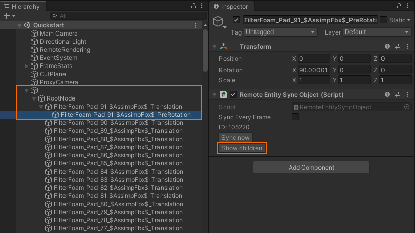

# Quickstart: Render a model with Unity

This quickstart covers how to run a Unity sample that renders a built-in model remotely using the Azure Remote Rendering (ARR) service.

The focuses is on rendering the first model based on an existing Unity sample app. This quickstart does not go into detail regarding the API itself or how to set up a Unity project from scratch. To learn how to set a up a Unity project and adding relevant API calls to the scripts, refer to [Tutorial-1: Getting started](./../tutorials/tutorial-1-getting-started)

In this quickstart you will learn how to:
> [!div class="checklist"]
>- set up your local development environment
>- get and build the Unity example app
>- render a model in the Unity example app

## Prerequisites
The following must be installed to complete this quickstart:
- GIT [(download)](https://git-scm.com/downloads "GIT")
- Windows SDK 10.0.18362.0 [(download)](https://developer.microsoft.com/windows/downloads/windows-10-sdk "Windows SDK")
- Unity 2019.3 [(download)](https://unity3d.com/get-unity/download "Unity")
- The nuget command-line and a companion credential manager:
  - These should be downloaded from the [https://dev.azure.com/arrClient/arrClient](https://dev.azure.com/arrClient/arrClient) site.
	- Click on Artifacts and change the dropdown from ArrClient to ArrPackages and click on ‘Connect to feed’.

	

	- Download the NuGet command line tool and the Credential Provider package from the link displayed.
	- Extract this to a directory of your choosing and add the location to your Path by editing the system environment variables.
    - Add the "arrPackages" feed with the following NuGet command:
        `NuGet.exe sources Add -Name "ArrPackages" -Source "https://pkgs.dev.azure.com/arrClient/_packaging/ArrPackages/nuget/v3/index.json"`
- Latest version of Visual Studio 2017 [(download)](https://visualstudio.microsoft.com/vs/older-downloads/ "Visual Studio 2017")
- Azure Storage Explorer [(download)](https://azure.microsoft.com/features/storage-explorer/ "Microsoft Azure Explorer")

## Clone the sample app

Open a command window (Windows Key then type CMD) and change to a directory somewhere of your choice.
Run the following commands:
  *	`mkdir ARR`
  *	`cd ARR`
  * `git clone https://dev.azure.com/arrClient/arrClient/_git/arrClient`

The last command creates a directory called arrClient in your ARR directory containing the sample app and a copy of the documentation.

The sample Unity app is found in the subdirectory Unity/AzureRemoteRenderingSample but **do not open it yet**:
It expects Unity packages to be present in directory beside it, which you need to first obtain using NuGet.

## Getting the Unity NuGet packages

You need to use NuGet commands to pull the packages from the ARR depot – from the same command prompt window within the ARR directory, run the following:
  * `cd arrClient\Unity`
  *	`nuget install com.microsoft.azure.remote_rendering -ExcludeVersion`
  *	`nuget install ScriptableRenderPipeline -ExcludeVersion`

If the NuGet command results in authentication prompts, make sure you are using the NuGet + credential provider installation from the prerequisites steps above.

The two commands above will download NuGet packages carrying Unity packages.
You will now have an ‘ARR/ArrClient/Unity’ directory contains three folders:
  * AzureRemoteRenderingSample - The sample project
  * com.microsoft.azure.remote_rendering - The Unity package, which provides the client functionality of Azure Remote Rendering
  * ScriptableRenderPipeline - A customized version of the Unity's ScriptableRenderPipeline.

## Rendering a first model with the Unity example project

The default model we render will be a built-in model provided by ARR. We will show how to convert a custom model using the ARR conversion service in the next quickstart.

Open the Unity Hub and add the sample project, which is the ARR\arrClient\Unity\AzureRemoteRenderingSample folder.
Open the project, if necessary allowing Unity to upgrade the project to your installed version.

### Enter your account info as a one time step

Select the RemoteRendering dropdown menu and open the AccountInfo window. Enter your account credentials.

You only need to set the 'AccountDomain' and the 'Account Id/Key' value. You can ignore the two fields under 'Account Token'.

The credentials will be saved to Unity's editor preferences. If the sample should be run against a new account, then the information must be reentered.

### Create a session and view the default model

When the project opens, open the SampleScene scene, and select the **RRRoot** node:

Selecting the **RRRoot** node shows the following properties in the Inspector panel:

Now press **play** to start the session. 
If the account has been set up correctly, then the Inspector panel updates with additional status information at the bottom:

The session will undergo a series of automatic state transitions with no user input required. The session will first start as 'Starting'. After a few minutes, the session should transition to the 'Ready' state. Once Ready, the session connects to the runtime. The session will enter the 'Connecting' state and, once successfully connected, a remotely rendered Engine will appear in the viewport as shown below.

Congratulations! you are viewing a remotely rendered model!

Note that the rendered image will only appear in the 'Game' panel, not in the camera preview.

You can now explore the scene graph by selecting the new node and clicking **Show children** in the Inspector. This has to be repeated for each game object to explore the hierarchy.
 

You can now move remote objects or the cut plane (**InteractionSample/CutPlane**) around in the editor. To synchronize transforms either click **Sync now** or check the **Sync every frame** option. For component properties, just changing them is enough.
 

