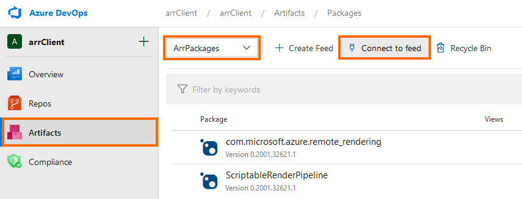
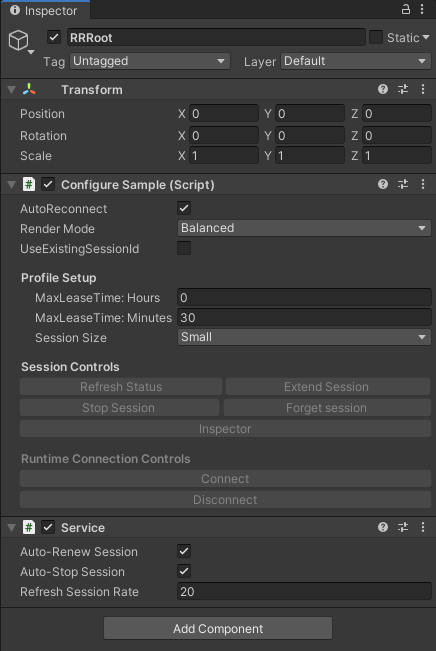

# Quickstart: Render a model with Unity

This quickstart covers how to run a Unity sample that renders a built-in model remotely, using the Azure Remote Rendering (ARR) service.

We won't go into detail about the ARR API itself or how to set up a Unity project from scratch. To learn how to set up a Unity project and adding relevant ARR API calls to the scripts, refer to [Tutorial-1: Getting started](../tutorials/tutorial-1-getting-started.md).

In this quickstart you will learn how to:
> [!div class="checklist"]
>
>- Set up your local development environment
>- Get and build the Unity sample app
>- Render a model in the Unity sample app

## Prerequisites

The following software must be installed:

- Windows SDK 10.0.18362.0 [(download)](https://developer.microsoft.com/windows/downloads/windows-10-sdk "Windows SDK")
- The latest version of Visual Studio 2017 [(download)](https://visualstudio.microsoft.com/vs/older-downloads/ "Visual Studio 2017")
- GIT [(download)](https://git-scm.com/downloads "GIT")
- Unity 2019.3 [(download)](https://unity3d.com/get-unity/download "Unity")
- The NuGet command line and companion credential manager:
  - Go to [this site](https://dev.azure.com/arrClient/arrClient).
  - Click on *Artifacts*, change the dropdown to *ArrPackages*, and click on *Connect to feed*.

  

  - Download the NuGet command-line tool and the Credential Provider package from the link displayed.
  - Extract to a directory of your choice and add the location to your `PATH` environment variable.
    - Add the "arrPackages" feed with the following NuGet command:
        `NuGet.exe sources Add -Name "ArrPackages" -Source "https://pkgs.dev.azure.com/arrClient/_packaging/ArrPackages/nuget/v3/index.json"`

## Clone the sample app

Open a command prompt (type `cmd` in the Windows start menu) and change to a directory where you want to store your ARR project.

Run the following commands:

  *	`mkdir ARR`
  *	`cd ARR`
  * `git clone https://dev.azure.com/arrClient/arrClient/_git/arrClient`

The last command creates a directory called arrClient in your ARR directory containing the sample app and a copy of the documentation.

The sample Unity app is found in the subdirectory Unity/AzureRemoteRenderingSample but **do not open it yet**:
It expects Unity packages to be present in directory beside it, which you need to first obtain using NuGet.

## Getting the Unity NuGet packages

You need to use NuGet commands to pull the packages from the ARR depot – from the same command prompt window within the ARR directory, run the following:
  * `cd arrClient\Unity`
  *	`nuget install com.microsoft.azure.remote_rendering -ExcludeVersion`
  *	`nuget install ScriptableRenderPipeline -ExcludeVersion`

If the NuGet command results in authentication prompts, make sure you are using the NuGet + credential provider installation from the prerequisites steps above.

The two commands above will download NuGet packages carrying Unity packages.
You will now have an ‘ARR/ArrClient/Unity’ directory contains three folders:
  * AzureRemoteRenderingSample - The sample project
  * com.microsoft.azure.remote_rendering - The Unity package, which provides the client functionality of Azure Remote Rendering
  * ScriptableRenderPipeline - A customized version of the Unity's ScriptableRenderPipeline.

## Rendering a first model with the Unity example project

The default model we render will be a built-in model provided by ARR. We will show how to convert a custom model using the ARR conversion service in the next quickstart.

Open the Unity Hub and add the sample project, which is the ARR\arrClient\Unity\AzureRemoteRenderingSample folder.
Open the project, if necessary allowing Unity to upgrade the project to your installed version.

### Enter your account info as a one time step

Select the RemoteRendering dropdown menu and open the AccountInfo window. Enter your account credentials. The [Create an account](../azure/create-an-account.md) chapter explains where to find the account credentials.

You only need to set the *AccountDomain* and *Account Id/Key* values. You can ignore the two fields under *Account Token*.

These credentials will be saved to Unity's editor preferences.

### Create a session and view the default model

From Unity's asset browser, open the scene **SampleScene**. Then select the **RRRoot** node:

Selecting the **RRRoot** node shows the following properties in the Inspector panel:

Now press Unity's **Play** button to start the session.
If the account has been set up correctly, then the Inspector panel updates with additional status information at the bottom:

The session will undergo a series of state transitions. In the **Starting** state the remote VM is spun up, which may take several minutes. Upon success, it transitions to the **Ready** state. Now the session enters the **Connecting** state, where it tries to reach the rendering runtime on that VM. When successful, it finally transitions to the **Connected** state. Shortly after, a remotely rendered model will appear in the viewport.

Congratulations! You are now viewing a remotely rendered model!

Be aware that the rendered image will only appear in the 'Game' panel, not in the camera preview.

You can now explore the scene graph by selecting the new node and clicking **Show children** in the Inspector window.

Try moving objects or the [cut plane](../sdk/features-cut-planes.md) around in the editor. To synchronize transforms, either click **Sync now** or check the **Sync every frame** option. For component properties, just changing them is enough.

## Next steps

Advance to the next article to learn how to...

> [!div class="nextstepaction"]
> [Convert a model for rendering](quickstart-convert-model.md)
