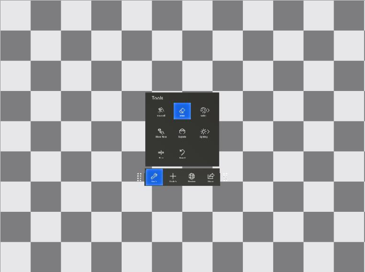

# VM sizes

The rendering service can operate on two different types of machines in Azure, called `Standard` and `Premium`.

## Polygon limits

There is a hard limitation of **20 million polygons** for the `Standard` VM size. There is no such limitation for the `Premium` size.

When the renderer on a standard VM hits this limitation, it switches rendering to a checkerboard background:



## Allocating the VM

The desired type of VM has to be specified at rendering session initialization time. It cannot be changed within a running session. The following code examples show the place where the VM size must be specified:

```cs
async void CreateRenderingSession(AzureFrontend frontend)
{
    RenderingSessionCreationParams sessionCreationParams = new RenderingSessionCreationParams();
    sessionCreationParams.Size = RenderingSessionVmSize.Standard; // or  RenderingSessionVmSize.Premium

    AzureSession session = await frontend.CreateNewRenderingSessionAsync(sessionCreationParams).AsTask();
}
```

```cpp
void CreateRenderingSession(ApiHandle<AzureFrontend> frontend)
{
    RenderingSessionCreationParams sessionCreationParams;
    sessionCreationParams.Size = RenderingSessionVmSize::Standard; // or  RenderingSessionVmSize::Premium

    if (auto createSessionAsync = frontend->CreateNewRenderingSessionAsync(sessionCreationParams))
    {
        // ...
    }
}
```

For the [example powershell scripts](../samples/powershell-example-scripts.md), the VM size has to be specified inside the `arrconfig.json` file:

```json
{
  "accountSettings": {
    ...
  },
  "renderingSessionSettings": {
    "vmSize": "<standard or premium>",
    ...
  },
```

### How the renderer evaluates the number of polygons

The number of polygons that are considered for the limitation test are the number of polygons that are actually passed to the renderer. This geometry is typically the sum of all instantiated models, but there are also exceptions. The following geometry is **not included**:
* Loaded model instances that are fully outside the view frustum.
* Models or model parts that are switched to invisible, using the [hierarchical state override component](../overview/features/override-hierarchical-state.md).

Accordingly, it is possible to write an application for the standard size that loads multiple models that have polygon counts close to the limit but which only shows a single model at a time.

### How to determine the number of polygons

There are two ways to determine the number of polygons of a model or scene that contribute to the budget limit of the standard size VM:
* On the model conversion side, retrieve the [conversion output json file](../how-tos/conversion/get-information.md), and check the `numFaces` entry in the [*inputStatistics* section](../how-tos/conversion/get-information.md#the-inputstatistics-section)
* If your application is dealing with dynamic content, the number of rendered polygons can be queried dynamically during runtime. For that, use a [performance assessment query](../overview/features/performance-queries.md#performance-assessment-queries) and check for the `polygonsRendered` member in the `FrameStatistics` struct. The checkerboard background is faded in with a bit of latency to ensure user action can be taken after this asynchronous query. User action can for instance be hiding or deleting model instances.

## Pricing

For detailed breakdown of the pricing for each type of VM, refer to the [Remote Rendering pricing](https://azure.microsoft.com/pricing/details/remote-rendering) page.

## Next steps
* [Example PowerShell scripts](../samples/powershell-example-scripts.md)
* [Model conversion](../how-tos/conversion/model-conversion.md)

