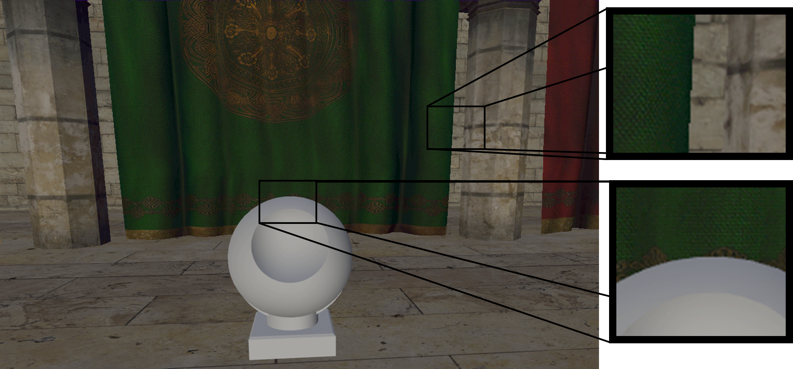
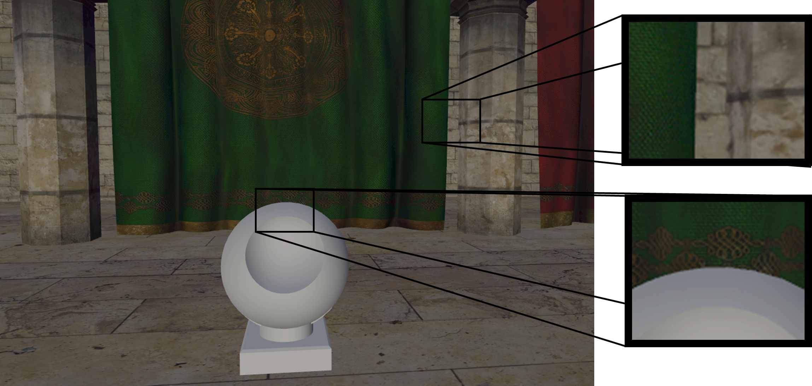

# Rendering modes

Remote Rendering offers two main modes of operation, *Balanced* mode and *Quality* mode. These modes fundamentally govern how assets are rendered and can't be changed at runtime. They represent trade-offs between resource usage, performance, and rendering quality and are built to accommodate different use cases. The modes allow the user to choose the best suitable approach for their needs.

Use these guidelines to quickly decide which mode is most appropriate for you:

* If it proves to be running well, prefer *Quality* mode to avoid inaccuracies.
* For everything else, especially complex scenes, use *Balanced* mode.
* If in doubt, use the special *Default* enum value, which is set to the recommended mode.

## Usage

The render mode used on a Remote Rendering VM is specified during `AzureSession.ConnectToRuntime` via the `ConnectToRuntimeParams`. A single VM can have multiple rendering modes during different connections.

```cs
async void ExampleConnect(AzureSession session)
{
    ConnectToRuntimeParams parameters = new ConnectToRuntimeParams();

    // Connect with one rendering mode
    parameters.mode = ServiceRenderMode.Quality;
    await session.ConnectToRuntime(parameters).AsTask();

    session.DisconnectFromRuntime();

    // Wait until session.IsConnected == false

    // Reconnect with a different rendering mode
    parameters.mode = ServiceRenderMode.Default;
    await session.ConnectToRuntime(parameters).AsTask();
}
```

## Modes

### 'Balanced' mode

*Balanced* mode is optimized for a wide range of scenarios. It maximizes the utilization of the VM's CPU, GPU, main memory, and graphics memory and is well suited for complex scenes.

The trade-off is that it can't deliver the best possible rendering quality in all situations, as shown in the image below:



Have a look at the multi-sampling quality. Between the sculpture and the green curtain, it looks mostly correct. However, at the border between the green curtain and the wall it's noticeably worse. For most users, these sporadic occurrences are difficult to perceive, though.

In terms of performance, this mode is usually better than *Quality* mode. It should be used if the artifacts mentioned above are not an issue. There is one scenario where it can perform worse than *Quality* mode, though, which is for scenes consisting mostly or exclusively of transparent objects.

### 'Quality' mode

*Quality* mode offers the best rendering quality, at the cost of resource consumption. Especially in terms of memory usage, this mode will consume vastly more of the VMs resources, which makes this mode unsuitable for huge scenes (many objects/triangles, a large amount of large textures). The main advantage of *Quality* mode is that the rendering artifacts mentioned for *Balanced* mode will be reduced significantly, which can be seen below:



Additionally, this mode is more efficient when rendering mostly transparent objects.

Quality mode has a substantially higher resource consumption. Therefore it is only recommended for small to medium-sized models. When this mode is active, the remote rendering service may even reject loading some models.

## See also

* [SDK concepts](../concepts/sdk-concepts.md)
