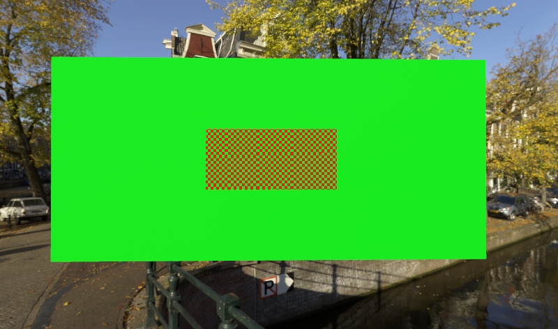

# Z-fighting mitigation

Generally, z-fighting refers to a problem in rasterization-based rendering, where two or more surfaces in close proximity to each other seemingly intersect in specific and view dependent patterns. In practice this creates visible flickering, called z-fighting, while the camera moves. This problem is intensified for AR and VR due to the fact that head-mounted devices naturally always move, thus changing the camera. To reduce viewer discomfort a z-fighting mitigation functionality is available in the Remote Rendering API.

|Situation                        | Result                              |
|---------------------------------|:-----------------------------------|
|Regular z-fighting               ||
|Z-fighting mitigation enabled    ||
|Checkerboard highlighting enabled||

## Reasons for z-fighting

Z-fighting is created mainly in two situations:

* Surfaces are positioned very far from the camera where their depth values quantize badly
* Surfaces being (nearly) coplanar

While the former is a problem, which is difficult to eliminate due to the technical reality of floating-point precision, the latter can actually be an indicator of badly conditioned scenes. In physical reality surfaces are never coplanar so depending on the use case of the scene the user might want to know if such surfaces exist and where they are in the scene. For example, a CAD scene building the basis for a real world construction ideally should not contain physically impossible surface intersections. To allow for visual investigation of the scene for such problems a visual highlighter is available, which will display z-fighting potential as an animated checkerboard alternation between the respective surfaces.

> [!CAUTION]
> Due to technical limitations the z-fighting mitigation is a best effort method, i.e. depending on the scene and the frequency of z-fighting there might still be some visible z-fighting left. Also, all approximately co-planar surfaces in a scene will be affected, even if they did not exhibit z-fighting.

## API usage

The ZFightingMitigationSettings state provides the necessary object to toggle the mitigation and employ additional configuration. These settings affect rendering globally. That is, every loaded and rendered model and cannot be toggled for individual models or subparts in a model.

> [!NOTE]
> To see the checkerboard highlighting the ordinary z-fighting mitigation needs to be enabled as well.

### Example calls

Enabling the z-fighting mitigation and the checkerboard intersection highlighting can be done as follows in the c++ and c# APIs:

``` cs
public void exampleZFightingMitigation(AzureSession session)
{
    ZFightingMitigationSettings settings = session.Actions.GetZFightingMitigationSettings();

    // enabling z-fighting mitigation
    settings.Enabled = true;

    // enabling checkerboard highlighting of z-fighting potential
    settings.Highlighting = true;
}
```
