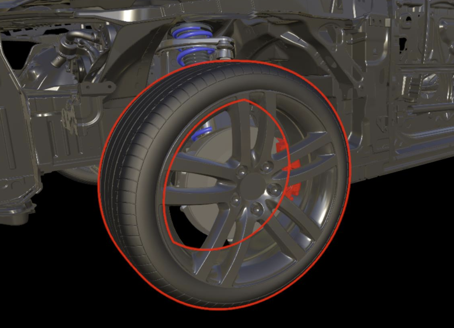

# Overriding hierarchical states

In many cases, it is necessary to dynamically change the appearance of parts of a mesh, for example hiding subgraphs of a mesh or switching parts to transparent rendering. Changing the materials of each part involved is not practical since it requires to iterate over the whole scene graph and manage material cloning and assignment on each node.

To accomplish this use case with least possible overhead, there is a component called HierarchicalStateOverrideComponent. This component imposes hierarchical state updates on arbitrary branches of the scene graph. That means, a state can be defined on any level in the scene graph and it trickles down the hierarchy until either being overridden by a new state or being applied to leaf object geometry. Accordingly, a use case where the whole car should be switched to transparent rendering except for the inner engine part involves only two instances of the component:

 * The first component is assigned to root level and turns on transparent rendering ('see-through', see below) for the whole object
 * The second component is assigned to the root node of the engine part and overrides the state by explicitly turning off see-through mode again.

## Features

The set of distinct states that can be overridden encompasses the following fixed set of features:

* **Hidden**: Respective meshes in the scene graph are hidden
* **Tint color**: A rendered object can be color-tinted with its individual tint color and tint weight. The following image shows color tinting the rim of the wheel.

* **See-through**: The geometry is rendered semi-transparently, for example to reveal the inner parts of an object. The following image shows the entire car being rendered in see-through mode, except for the red chock:

* **Selected**: The geometry is rendered with a selection outline. The rendering properties for outlines are global rather than per-object. For details, refer to chapter [Global outlines properties](../sdk/features-outlines.md).

* **DisableCollision**: The geometry is made invisible to [physics ray casts](../sdk/concepts-spatial-queries.md). Note that the **Hidden** flag by default does not turn off collision, so these two flags often come in pair.

## Hierarchical Property Updates

Each feature can be considered a binary on/off state. However, to work properly in a hierarchical scene graph context, the component needs to be able to set whether it wants to turn a feature on or off, or whether the respective value should be inherited from the parent. The API accounts for that through a three state enum value (```ForceOn```, ```ForceOff```, ```InheritFromParent```) that can be assigned to each feature in the following manner:

``` cs
component.HiddenState = HierarchicalEnableState.ForceOn;
// or:
component.SetState(HierarchicalStateFlags.Hidden, HierarchicalEnableState.ForceOn);
```

The second alternative above has the advantage that a state can be assigned to multiple features simultaneously:

``` cs
HierarchicalStateFlags combinedFeatures = HierarchicalStateFlags.Hidden | HierarchicalStateFlags.SeeTHrough | HierarchicalStateFlags.DisableCollision;
component.SetState(combinedFeatures, HierarchicalEnableState.ForceOn);

```


While each feature's enabled state is binary, the tint color itself is an exception. A dedicated tint color can be set on the component and thus vary per object.

## Assign Render States to the Scene Graph

To assign a state to a subgraph, just create and assign a component of type ```HierarchicalStateOverrideComponent``` to the root object of the subgraph that should change appearance. Since there can only be one component of a type for an object, an instance of ```HierarchicalStateOverrideComponent``` manages the state likewise for hidden, see-through, selected, color tint and collision. The respective state can be set through the ```SetState``` function for each feature individually.
The feature to use tint color can be enabled or disabled and on top of that a unique tint color can be specified per component. The alpha portion of the tint color defines the weight of the tinting effect: If set to 0.0, no tint color is visible and if set to 1.0 the object will be rendered with pure tint color. For in-between values the final color will be mixed with the tint color. The tint color can be changed on a per-frame basis to achieve a color animation or to fade in/out the tint effect.

Unlike the tint color, the selection outline color cannot be changed per object. Instead, it is a global rendering setting.

To turn off states on a hierarchy level, the flags on the ```HierarchicalStateOverrideComponent``` can either be disabled or the component can be removed entirely.

## Performance Considerations

An instance of ```HierarchicalStateOverrideComponent``` itself does not add much runtime overhead. However it is always good practice to keep the number of active components low. For instance, when implementing a selection system that highlights the picked object, it is recommended to delete the component again when the selection is removed as opposed to keeping the components around with neutral features (that is, inherited from parent).
Transparent ('see-through') rendering puts more workload to the server's GPUs than standard rendering. Accordingly, if large parts of the scene graph are switched to see-through mode with many layers of geometry being visible this may become a performance bottleneck and thus compromise stable frame rates. The same is valid for objects with selection outline, but not to the same extent as see-through.

## See also
* [Global outlines properties](../sdk/features-outlines.md)
* [Physics ray casts](../sdk/concepts-spatial-queries.md)