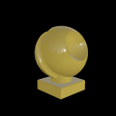
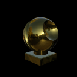
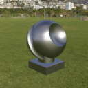
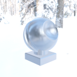
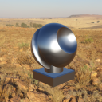
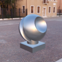
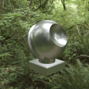
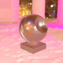
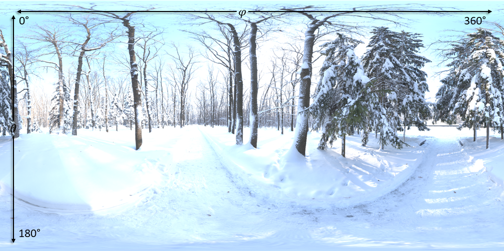

# Sky

Currently, the scene is exclusively lit by a global sky environment map. This environment map is identical to a typical sky box and differs only in so far as it not being visible to the observer directly (that is, as a virtual sky) but indirectly via diffuse, glossy and highly specular reflections on rendered objects. Using such a sky environment allows for smoothly varying lighting to give the scene a natural and realistic look compared to other typically more constricted light sources like point or directional lights. Examples of sky lighting results on rendered geometry can be found as follows:

| Roughness | 0 | 0.25 | 0.5 | 0.75 | 1 |
|:---------:|:-:|:----:|:---:|:----:|:-:|
| Non-Metal |  |  |  | |  |
| Metal     |  |  |  | |  |

The lighting received from a rendered object is dependent on its [material's](../sdk/concepts-materials.md) properties. Azure Remote Rendering uses a physically based lighting model. With this, the rougher the surface material gets the more smeared out reflective specular lighting appears and the more visible diffuse ambient light will be. Also, material behavior is modeled differently for metallic than for non-metallic (that is, dielectric) materials to obtain a physically plausible behavior. For more information, please refer to the [Materials](../sdk/concepts-materials.md) chapter.

## API usage

The global environment map may be changed via the client API through SkyReflectionSettings state and specifying the texture object ID of the desired environment map. Regarding specific details for obtaining a texture object from a texture file, refer to the [Textures](../sdk/concepts-textures.md) chapter. The call itself will be executing client-side checks for texture validity and applicability and will signal the server to change the sky reflection environment map to the one provided.

### Example calls

``` cs
private LoadTextureAsync _pendingTexture = null;
public void ExampleSkyEnvironment(AzureSession session)
{
    _pendingTexture .LoadTextureAsync(new TextureLoadParams("builtin://SnowyForestPath", Texture.TextureType.CubeMap));
    _pendingTexture.Completed +=
        (LoadTextureAsync res) =>
        {
            if (res.IsRanToCompletion)
            {
                try
                {
                    session.Actions.GetSkyReflectionSettings().SkyReflectionTexture = res.Result;
                }
                catch (RRException exception)
                {
                    Console.WriteLine("Setting sky reflection failed!");
                }
            }
            else
            {
                Console.WriteLine("Texture loading failed!");
            }
        };
}
```

Naturally, the textures can be loaded separately and the respectively received texture objects used at a later point in time for modifying `SkyReflectionSettings`.

### Built-in and external skies

Azure Remote Rendering contains a few built-in sky environments that can be loaded by prepending their respective identifier with `builtin://` during the call to `RemoteRenderingClient.LoadTextureAsync()`. For reference, these skies are listed below:

|Identifier               | Type    | Description                                             | Illustration                                                      |
|-------------------------|:-------:|:-------------------------------------------------------|:-----------------------------------------------------------------:|
|GreenPointPark           | Cubemap | Sunny day with slowly varying surfaces                  | 
|SataraNight              | Cubemap | Dark night sky and ground with many surrounding lights  | 
|SnowyForestPath          | Cubemap | Mostly uniformly distributed white-blue light           | 
|SunnyVondelpark          | Cubemap | Bright sunlight and shadow contrast                     | 
|Syferfontein             | Cubemap | Clear sky light with moderate ground lighting           | 
|TearsOfSteelBridge       | Cubemap | Moderately varying sun and shade                        | 
|VeniceSunset             | Cubemap | Evening sunset light approaching dusk                  | 
|WhippleCreekRegionalPark | Cubemap | Bright, lush-green and white light tones, dimmed ground | 
|WinterEvening            | Cubemap | Localized Gray, yellow, pink light sources              | 
|WinterRiver              | Cubemap | Daytime with bright ambient ground light                | 
|DefaultSky               | Cubemap | Same as TearsOfSteelBridge                              | 

Besides these built-in skies, the user may also use textures from external storage by specifying the respective web URI as the identifier. This way, textures can be downloaded from Azure blob storages and other http-accessible locations.

## Sky types

Azure Remote Rendering supports two distinct types of sky environment maps, the commonly used cube maps and the less frequently encountered but equally viable 2D sphere maps.  The following section will distinguish these types in more detail.

### Cube environment maps


Typically, sky boxes or environment maps are provided as a cube map (see [Textures](../sdk/concepts-textures.md)). That is, the sphere of all possible directions is approximated as six 2D-Textures placed on a virtual cube around the observer. Such a sky environment cube is shown in the [cubemap example](#cube-environment-maps) above. If a texture file containing a cube map should be used, it has to be loaded accordingly by specifying cube map usage during the call to `AzureSession.Actions.LoadTextureAsync()`.

> [!CAUTION]
> The cube map orientation scheme used by Azure Remote Rendering is shown with the axis directions in the [cubemap example](#cube-environment-maps). Please note that some game engines and other respective computer graphics related software might use a different scheme for cube maps.

### Sphere environment maps



Additionally, Azure Remote Rendering also has built-in support for 2D sphere environment maps. In contrast to environment cube maps, they consist of only one 2D texture of which the texture coordinates represent the [spherical coordinate space](https://en.wikipedia.org/wiki/Spherical_coordinate_system) defined by azimuthal angle φ and polar angle θ (see above [sphere map example](#sphere-environment-maps))). To correctly load a 2D sphere map texture, specify the 2D usage during the call to `AzureSession.Actions.LoadTextureAsync()`. No distinction is necessary when specifying the texture object when setting `SkyReflectionSettings.SkyReflectionTexture`.

## Miscellaneous

Mipmaps do not need to be provided. The textures are processed internally to allow optimal interaction with the rendering engine and do not need additional processing by the user. However, the cube and sphere environment maps have to be in DDS file format to be correctly loaded during `AzureSession.Actions.LoadTextureAsync()`.

## Next steps

* [Materials](../sdk/concepts-materials.md)
* [Textures](../sdk/concepts-textures.md)
