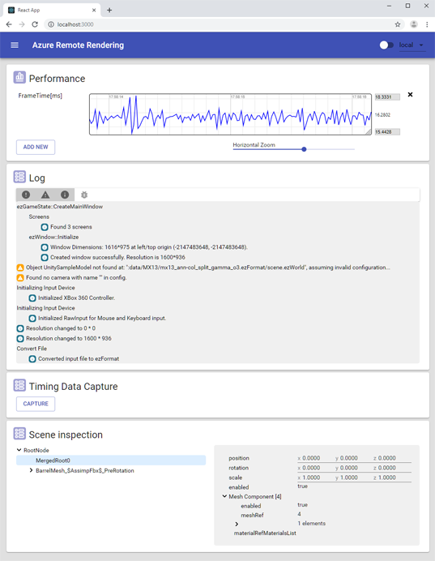
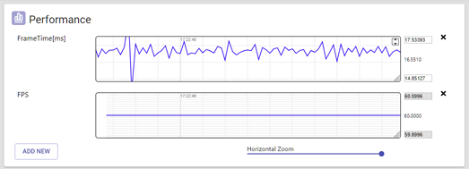
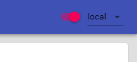
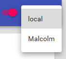

# The ArrInspector inspection tool

The ArrInspector is a web-based tool used to inspect a running Azure Remote Rendering session. It is meant to be used for debugging purposes, to inspect the structure of the scene being rendered, show the log messages and monitor the live performance on the server side.

## Connecting to the ArrInspector

Once you obtain the hostname (ending in "mixedreality.azure.com") of your ARR server, connect using the [ConnectToArrInspectorAsync](../sdk/azure-frontend-authentication.md) API. The tool is compatible with Edge, Firefox and Chrome.

If you want to browse ArrInspector on the PC you can:

1. Call ConnectToArrInspectorAsync on the PC
2. Call ConnectToArrInspectorAsync on the device. This will create a 'StartArrInspector.html' file, which you can download to the PC and open:
   * Point the Windows Device Portal to your HoloLens
   * Go to System/File Explorer
   * Navigate to 'User Folders\LocalAppData\\[your_app]\AC\Temp\'
   * Save 'StartArrInspector.html'
   * Open 'StartArrInspector.html' - this will load the sessions' ArrInspector. This file is only valid for 24 hours after the ConnectToArrInspectorAsync API call

## The Performance Panel

This panel can show graphs of any per-frame performance value exposed by the server. The values currently include the frame time and FPS, cpu and memory usage, memory stats like overall RAM usage, object counts etc.

To visualize one of these parameters, click on the button "Add New" and select one of the available values shown in the dialog. This action will add a new scrolling chart to the panel, tracing the values in real time. You can add as many charts as you want, and remove them with the "X" button on the top right corner.

On the right side you can see the minimum and maximum values (associated to the top and bottom of the chart), and the current value, in the middle.

The graphs can be resized vertically by dragging the lower right corner.

The user can freely pan the graph, by dragging its content with the mouse. By dragging while pressing CTRL, the user can also zoom vertically and horizontally. The graph can be panned horizontally only when it's in a paused state, otherwise it will be always aligned to show the current time on the right end.

Horizontal zoom can also be controlled with the slider at the bottom of the panel.

The vertical range is by default computed based on the values currently displayed, and min and max values are shown in the text-boxes on the right. Whenever the values are changed by the user, either by typing them directly in the text-box, or by panning/zooming, the graph will use the user-defined mix/max. To restore the automatic vertical framing, click on the icon on the top-right corner.

## The Log Panel

The log panel shows a list of log messages generated on the server side. On connection it will show up to 200 previous log messages, and will print new ones as they happen.

You can filter the list based on the log type \[Error/Warning/Info/Debug\] by clicking on the toggle buttons on the top. 

## The Timing Data Capture Panel

This panel is used to capture timing information from the server and download it. The format of the downloaded file is the [Chrome Tracing JSON format](https://docs.google.com/document/d/1CvAClvFfyA5R-PhYUmn5OOQtYMH4h6I0nSsKchNAySU/edit). To inspect the data, you can open Chrome on the URL Chrome://tracing and drag-and-drop the downloaded file on the page.
The timing data is a dump of the fixed-size buffers continuously collecting timing information in the engine, so it refers to a capture in the immediate past.

## The Scene Inspection Panel

This panel shows the structure of the rendered scene. On the left you can see the object hierarchy, as an expandable tree. When selecting one of the objects, On the right side you can see the content of the object (for example the transform matrix and the values in its components). The panel is read-only and it is updated in real time.

## The VM Debug Information Panel

This panel allows you to trigger the ARR instance to collect debug information on the VM. Debug information helps us analyze any issues that occur in a running ARR instance.

Upon clicking the collect button, a dialog will open. The dialog has a text field where you can optionally provide data you want to add to the debug information. This could include a short description of what happened and steps to reproduce, for example.

After clicking the start button, the dialog will close and the collection process will begin. Collecting all system and process information on the VM can take a few minutes.

Once the collection is finished, you will receive a notification in the Inspector window. This notification contains an ID that identifies this particular collection uniquely. Be sure to save it so you can later refer us to this specific collection of debug information.

## Pause Mode

On the top-right corner, a small switch will allow you to pause the live update of the panels. This can be useful to carefully inspect a specific state. In this state, you can still change the min/max range in the profiling graphs.

When restoring the live update, all of the panels are reset.

## Host configuration

By default the tool connects to the local ARR server (running on the same host that serves the ArrInspector), but you can configure it to inspect another server, assuming it's running an ARR instance with a tooling port activated. To do this you can access the main menu on the left of the header bar and click on host configuration.

You can add new hosts by clicking on "add new host", and entering name and hostname (just the hostname ending in "mixedreality.azure.com", no http:// or port), or remove them by clicking on the bin icon on the right side.

To connect to one of the hosts, just select the entry in the list and press OK. 

To quickly switch from one host to another, you can use a combo box, located on the right side of the main header bar.

The host list is stored in the browser local storage, so it will be preserved when reopening the same browser.
