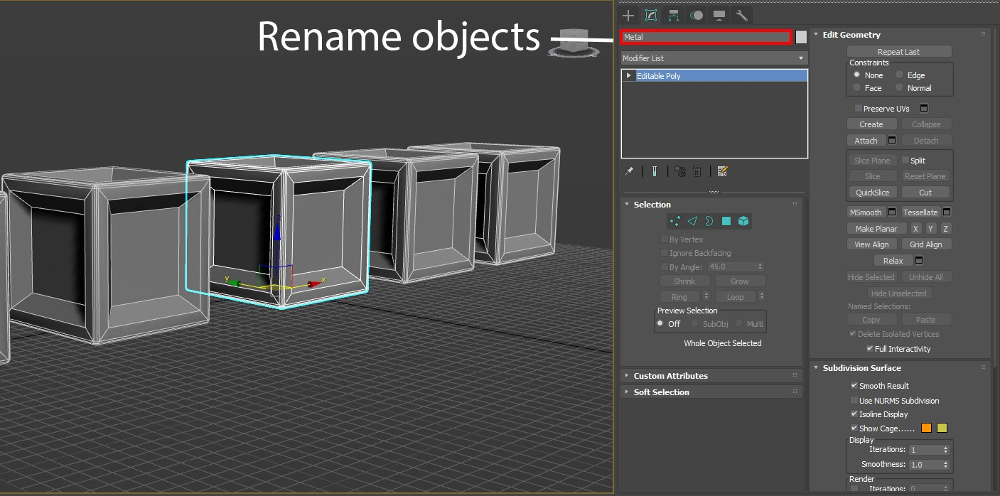
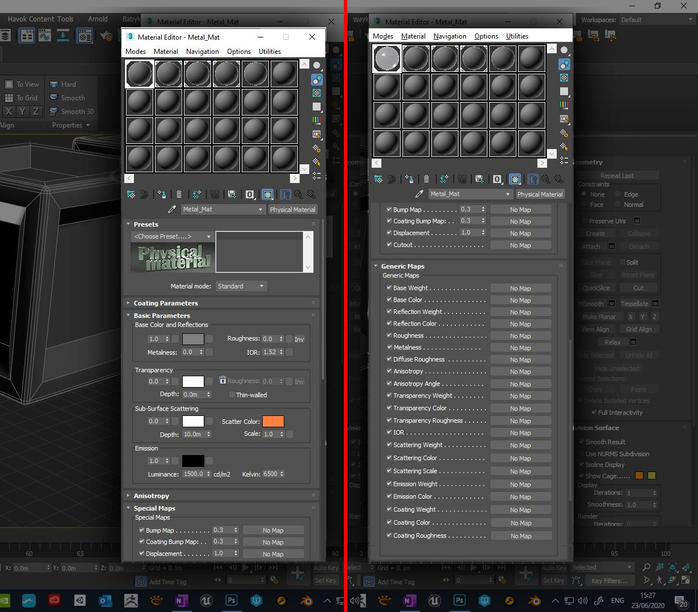
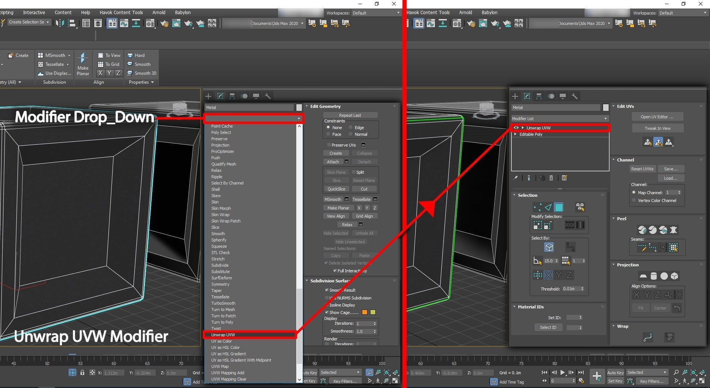
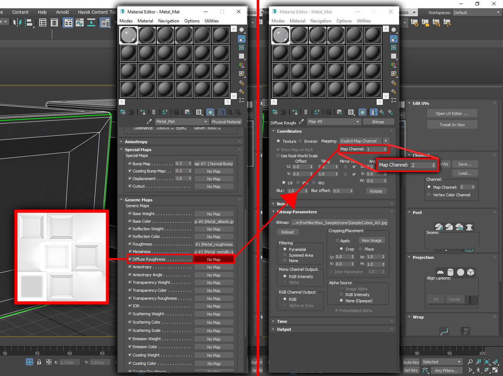
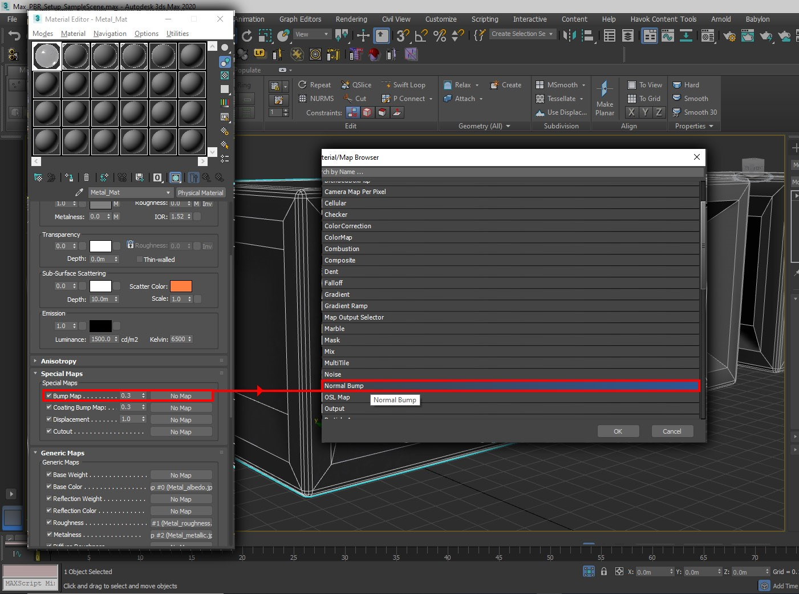
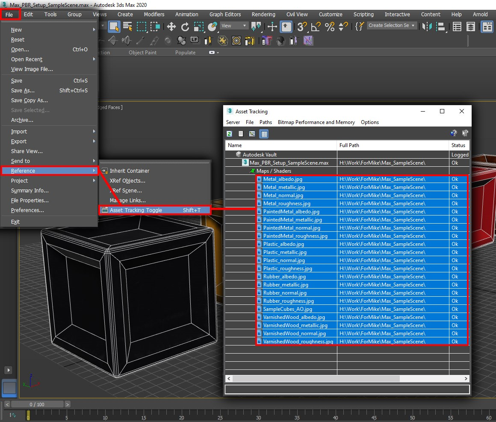
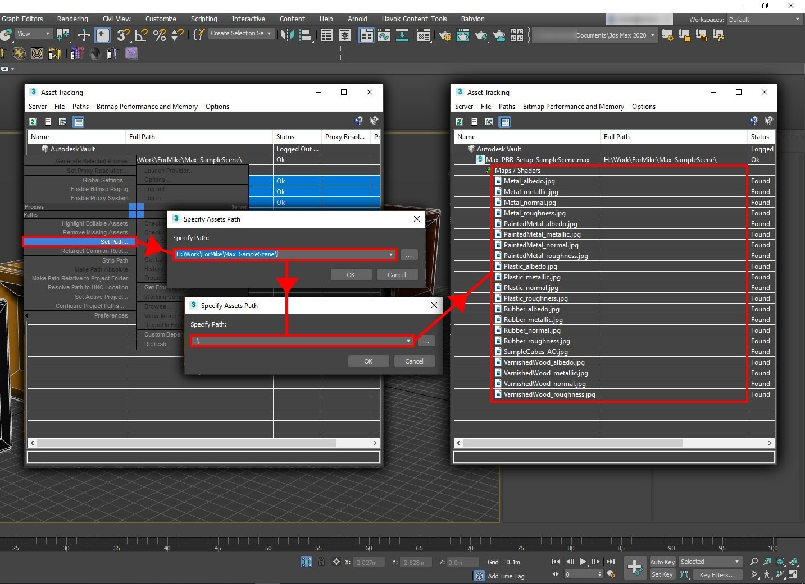
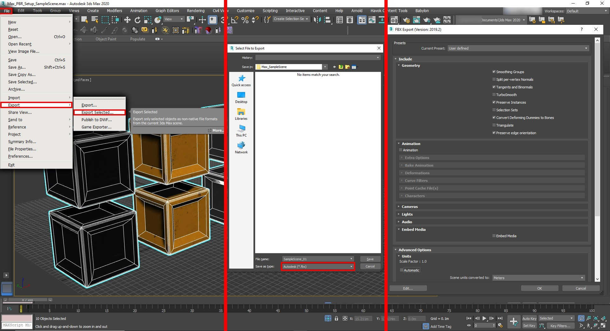
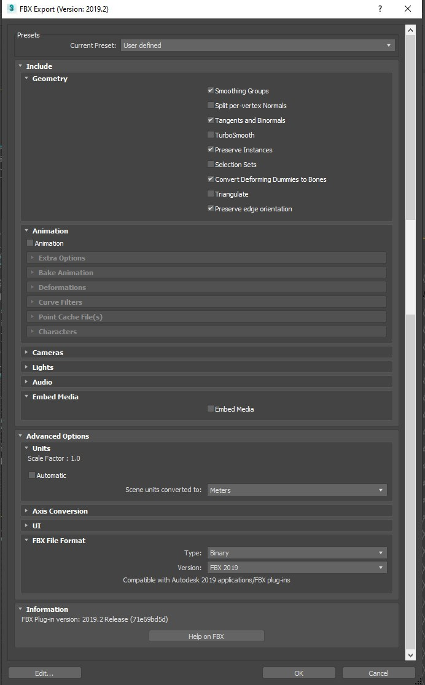
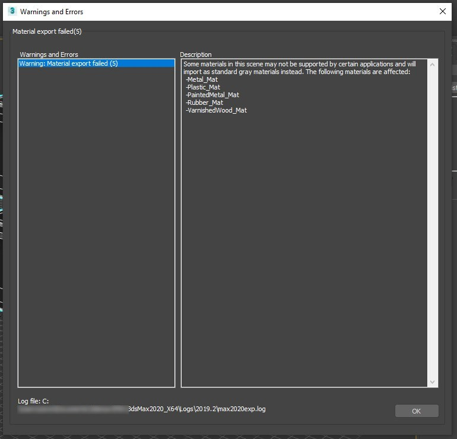

# Tutorial: Set up physically based rendering materials in Maya

## Overview
In this tutorial, you'll learn how to:

> [!div class="checklist"]
>
> * Assign materials with advanced lighting to objects in the scene.
> * Handle instancing of objects and materials.
> * Export a scene to FBX format, and select important options.

Creating [physically based rendering (PBR) materials](../../overview/features/pbr-materials.md) in 3D Studio Max (3DSMax) is a relatively straightforward task. It's similar in many ways to PBR setup in other content-creation apps like Maya. This tutorial is a guide to basic PBR shader setup and FBX export for Azure Remote Rendering projects.

The sample scene in this tutorial contains a number of polygon box objects. They're assigned different materials, such as wood, metal, painted metal, plastic, and rubber. Broadly speaking, each material contains all or most of the following textures:

* **Albedo**, which is the materials color map and is also called **Diffuse** or **BaseColor**.
* **Metalness**, which determines if a material is metallic and which parts are metallic. 
* **Roughness**, which determines how rough or smooth a surface is and affects the sharpness or blurriness of the reflections and highlights on a surface.
* **Normal**, which adds detail to a surface without having to add more polygons. Examples of detail might be pitting and dents on a metal surface or grain in wood.
* **Ambient Occlusion**, which is used to add soft shading and contact shadows to a model. It's a grayscale map that indicates which areas of a model receive full lighting (white) or full shade (black).

## Assign materials
In **3D Studio Max**, the process for setting up a PBR material is as follows.

To begin with, as you will see in the Sample Scene, we have created a number of Box objects, each of which represents a different type of material:

* It is worth noting before starting to create assets for ARR that it uses **meters** for measurement.
> [!TIP]
Therefore it is advisable to set your scene System Units to Meters. Furthermore, it is advisable when exporting to set Units to meters in the FBX Export settings.

* The Following image details the steps to take to set the System Units to meters in 3D Studio Max; In the main menu, go to **Customize** > **Units Setup** > **System Units Setup** and in the **System Units Scale** dropdown select **Meters**. 

With system units set to meters, we can begin to create our models. In our sample scene, we create several box objects, each representing a different material type - for example, metal, rubber, plastic etc. 

> [!TIP]
>It is good practice when creating assets to name the appropriately as you go. This will make them easier to find later if the scene has a lot of objects

With some objects created in our scene - in this case a number of cubes, we can begin the PBR setup:

* In the main tool bar, click the **Material Editor** icon as shown in the following image. You can also hit **M** on your keyboard to open the editor. The material editor has two modes that can be selected in the **Modes** dropdown - the compact material editor mode and the slate material mode. As this scene is a relatively simple, we will use the **compact mode**.

* Inside the material editor, you will see a number of spheres - these spheres are our materials. We will assign one of these materials to each object - box - in our scene. To do this assignment, first select one of the objects in the main viewport. With this selection made, click on the first sphere in the material editor window. Once assigned to an object, your selected material will be highlighted as shown in the next image.

* Click the **Assign Material to Selection** button as shown. The selected material has now been assigned to the selected object.

In the Material Editor, you can select types of materials from a wide selection, depending on your use case. Typically, the material type is set to **Standard** by default. This material is a basic material that is not suitable for PBR setup, so we will need to change the material type to a PBR material. The preferred **3DSMax** material for the Azure remote rendering projects is the **Physical Material**, which is equivalent to both the **Maya Standard Surface** material and the **Arnold Standard Surface** material in **Maya**. Though the **Maya Standard Surface** material is not yet exportable in FBX format.

* In the material editor, click on the **Standard** tab and in the material/map browser that opens up select **Physical Material**. This action will convert the assigned **Standard** material to a PBR **Physical Material**.

* In the material editor, you will now see the properties for the physical material (see below) and we can begin assigning textures to the asset.

As can be seen from the above image, there are a wide range of maps and textures that can be added to the material. For our purposes though, we will apply only five textures to the material.

> [!TIP]
It is good practice to name your materials appropriately (as shown in the image above) - perhaps to reflect an object or material type.

We can now begin to consider assigning textures to our material. How you generate your textures may vary according to preference or even  according to usage. For example, you may be happy to use tiling textures that can be applied to any asset or you may require specific parts of a project/asset to have their own custom set of textures. You may want to use generic tiling textures obtained online or create them yourself in apps such as **Photoshop**, **Quixel Suite**, **Substance Suite** etc. 

Before we begin to assign our textures though we will need to consider our assets texture coordinates (UVW). While it is best practice when applying any textures to a model to ensure that the model has been unwrapped (textures will not display properly without proper UV unwrapping), it is doubly important for our purposes if we intend to use an **Ambient Occlusion** map on our model. Unlike the **Stingray Shader** in **Maya**, the **Physical Material** in **3DSMax** does not have a dedicated **Ambient Occlusion** texture slot. Therefore we will apply the AO map to another slot and to allow it to be used separately from the other textures (tiling textures for example), we will assign it a UVW map channel of its own. 

We will begin by assigning an **Unwrap UVW modifier** to our model as shown below:

* In the selected objects properties editor, click the Modifier List and in the drop-down that opens up scroll down and select Unwrap UVW. This action will apply an Unwrap UVW modifier to our asset.

* The map channel is set to one. It is in map channel one that your main unwrapping will typically be done. In our case, the object has been unwrapped with no overlapping texture coordinates (UV).

If you are happy with your UV mapping, the next step is to create a second UV map channel.

* Close the UV editor if it is open and in the channel section of the **Edit UV's** menu change the channel number to two. Map channel 2 is the expected channel for Ambient Occlusion maps. 

* In the **Channel Change Warning** dialogue that opens up you will be given the option to either **Move** the existing UV's in channel 1 into the new channel 2 or **Abandon** the existing UV's that will create a new **UV Unwrap** automatically. Only select **Abandon** if you intend to create a new **UV unwrap** for the ambient occlusion map that differs from the UV's in map channel 1 (for example if you want to use tiling textures in channel 1). For our purposes, we will **Move** the UV's from channel one to channel 2 as we do not need to edit the new UV channel.

    > [!NOTE]
Even if you have copied - **Moved** - the UV unwrap from map channel 1 into map channel 2 you can make any edits you need to make to the new channel UV's without affecting the original map channel.

    

With the new map channel created we can return to the physical material in the material editor and begin to add our textures to it. We will first add the ambient occlusion (**AO**) map as there is a further step to take to allow it to work correctly. Once the AO map is plugged in to our material, we need to instruct it to use map channel 2.

* As mentioned earlier, there is no dedicated slot for AO maps in the **3DSMax Physical Material**. We will instead apply it the AO map to the **Diffuse Roughness** slot.

* In the physical material's **Generic Maps** list, click on the **Diffuse Roughness**'s **No Map** slot and load your AO map.

* In the AO textures properties, you will see map channel set to one by default. Change this value to 2. This action completes the steps necessary for adding your ambient occlusion map.

    > [!IMPORTANT]
This is an important step, particularly if your channel 2 UV's are different to those in channel 1, as the AO will not map correctly with the wrong channel selected.

    

We will now tackle assigning our normal-map to our PBR Material. This action differs somewhat from **Maya** in that the normal-map is not applied directly to the bump map slot (there is no normal-map slot in the **3DSMax Physical Material** as such), but is instead added to a normal-map modifier, which itself is plugged into the **normals** slot.

* In the **Special Maps** section of our physical material properties (in the material editor), click on the **Bump Map**'s **No Map** slot. 

* In the material/map browser, locate and click on **Normal Bump**. This action will add a normal bump modifier to our material.

* In the normal bump modifier, click on **Normal**'s **No Map** and locate, then load your normal-map.

* Check that the method is set to **Tangent** (it should be that by default) and if necessary toggle **Flip Green (Y)**.

    
    

With our normal-map assigned correctly, we can proceed to assign the remaining textures to complete our physical material setup. This process is a simple process with no special settings to consider. The following image shows the full set of textures assigned to our material: 

With your PBR materials created and set up, it is worth thinking about instancing objects in your scene. Instancing similar objects in your scene - such as nuts, bolts, screws washers - essentially any objects that are the same can yield significant savings in terms of file size. Instances of a master object can have their own scale, rotation, and transforms so can be placed as required in your scene. In **3D Studio Max**, the process of **Instancing** is simple.

* In the main viewport, select the object/objects you want to export.

* Hold **Shift** and drag the assets upwards using the transform (move) tool 

* In the **Clone Options** dialogue that opens up, set **Object** to **Instance** and click **OK**. 

This action will create an instance of your object that can be moved rotated or scaled independently of its parent and of other instances of that parent.
> [!IMPORTANT]
However - any changes you make to an instance while in sub-object mode will be transmitted to all instances of your object, so if you are working with an instanced objects components - vertices, polygon faces etc be sure first that you want any changes you make to affect all of these instances. Remember that any instanced Object can be made into a unique object at any time. 

> [!TIP]
Best Practice regarding instancing in your scene is to create them as you go along, as replacing **Copies** with Instanced objects later is extremely difficult. 

One final thing to take into consideration before we move on to the export process is how you might want to package your scene/asset for sharing. Ideally if you pass the asset on to a client or team member you will want them to be able to open and view the asset as it should be seen with a minimum amount of fuss. It is important therefore to relativize your assets texture paths. If the texture paths for your asset are pointing to a local drive or absolute path/location, they will not load in to the scene if opened on a different computer, even if the **.max** file is sitting in the same folder as the textures. Making the texture paths relative in 3D Studio Max solves this issue and is fairly simple.

* In the main toolbar, go to **File** > **Reference** > **Asset Tracking Toggle**. 

* In the asset tracking browser that opens up you will see all or most of the textures that you have applied to your PBR materials listed under the **Maps/Shaders** column.

* Next to them in the **Full Path** column you will see the file path to the location of your textures, most likely to their location on your local machine.

* Finally, you will see a column called **Status**. This column indicates whether a given texture has been located and applied to your scene or not, and will flag this texture with one of the following terms **OK**, **Found**, or **File Missing**. The first two indicate that the file has been found and loaded, while the last, obviously means that the tracker has failed to locate a file.

You may notice that not all of your textures are listed in the asset tracker when you first open it. There is nothing to be concerned about, as running through the path-finding process once or twice usually finds all of the scene textures. The path-finding process is as follows: 

* In the asset tracker window, **Shift**+**click** on the top texture in the **Maps/Shaders** list and continuing to hold Shift click on the last texture in the list. This action will select all the textures in the list. The selected textures will now be highlighted in blue (see the image above).

* Right click on the selection and in the popup menu that opens up, select **Set Path**.

* In the **Specify Asset Path** box that opens up, select the local path to your textures shown and replace it with the following `.\`  and click **OK**. 

* After a period of time (which will vary depending on how many textures are in your scene and on how large your scene is) the asset tracker should resolve itself as follows (see image).

Notice that the **Full Path** column is now blank. It means that the scene is no longer looking to find the relevant textures in a specific (absolute) location but will always find them as long as the max file or related FBX file is sitting in the same folder as the textures. 

> [!NOTE]
It may sometimes occur that you have to repeat this process a couple of times to find and resolve all textures and paths. This is nothing to be concerned about, just repeat until you are happy that all relevant assets are accounted for. It may also be the case that some files are no longer to be found. In this case, simply select all assets in the list and click **Remove Missing Paths** (see image above)

## FBX export

With the asset tracking complete, we can now move on to the FBX export. Again, the process is simple and can be done in a couple of ways. 

> [!TIP]
It is good practice that unless you wish to export your entire scene, you select for export only those assets which are needed. In particularly heavy scenes, export can take a long time so it makes sense to export only what you need
>
> It is advisable that if you have used modifiers such as **Turbosmooth** or **Open SubDiv** etc that you collapse them before export as they can cause problems during export. Always save your scene before doing this! 

* In the scene, select those assets that you want to export and in the main toolbar, go to **File** > **Export** > **Export Selected**

* In the **Select File to Export** dialog, give you file a name and in the **Save as Type** options select **Autodesk (*.fbx)** This action will open the FBX export menu. 

* Remember, if you have created instances in your scene that it is important that **Preserve Instances** is toggled on in the FBX export settings. 

Remember that previously it was mentioned that there were a couple of ways to export our file. If the intention when exporting is that the FBX is to be shared along with its textures files in a folder/directory, then the settings shown in the image below should apply and work well. Once you have selected your settings, click **OK**.

However, if you would prefer not to share large folders/directories of textures along with the FBX you can choose to **Embed** the textures in the FBX. It means that the entire asset - textures included - will be added to a single FBX. Be aware though, while it combines your export into a single asset that the FBX file will be considerably larger as a result.

> [!IMPORTANT]
If your result FBX file is bigger than 2.4GB then the minimum version of FBX export settings (see above) should be 2016 or newer. Because newer versions have 64 bit support and that why it could support bigger files.

* In the FBX export settings, toggle on **Embed Media, then click **OK** to export with textures included. 

On exporting to FBX while using the Physical Material, you will likely see the following warning pop-up after clicking 'OK' in the export dialogue: 

This warning simply informs the user that the exported materials may not be compatible with other software packages. As the physical material is compatible with Azure Remote Rendering, it is nothing to worry about. Simply click **OK** to complete the process and close the window.

## Conclusion

In general, this type of material looks more realistic because it's based on the real-world physics of light. It creates an additional immersive effect so that the scene appears to exist in the real world.

## Next steps

You now know how to set up materials with advanced lighting for objects in a scene. You also know how to export the objects to FBX format that's supported by Azure Remote Rendering. The next step is to convert the FBX file and visualize it in Azure Remote Rendering.

> [!div class="nextstepaction"]
> [Quickstart: Convert a model for rendering](../../quickstarts\convert-model.md)