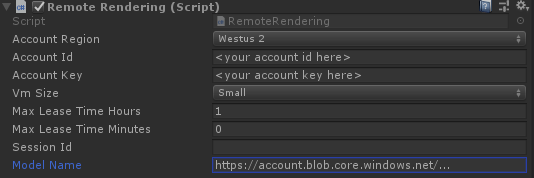

# Tutorial 3 - Changing the environment and materials

This tutorial requires a model that contains [PBR](https://en.wikipedia.org/wiki/Physically_based_rendering) materials. The Khronos Group has a repository of [glTF Sample Models](https://github.com/KhronosGroup/glTF-Sample-Models) that are in the correct format for Azure Remote Rendering.

Once you have completed conversion of the new model, generate a SAS url for the `.arrAsset` file and change the _RemoteRendering ModelName_ property from "builtin://UnitySampleModel" to the url.\


## Modify materials

In the previous tutorial, when the mouse was over a part of the model, it had changed its [HierarchicalState](../sdk/features-override-hierarchical-state.md)'s tint property, which changed the object's color. To instead change an object's material, you need to modify the [material](../sdk/concepts-materials.md) property.

The material property is part of the `RemoteComponent.Mesh` object. Continuing on from the previous RemoteModelEntity.cs file, add the following properties:

```csharp
    public Color HighlightColor = new Color(1.0f, 0.0f, 0.0f, 0.1f);
    private Color4? originalColor = null;
```

A trivial function would be to swap the albedo color for the material. Add the following to the file:

```csharp
    private void ToggleMaterialColor()
    {
        if (!meshComponent.IsComponentValid)
        {
            return;
        }

        var materials = meshComponent.RemoteComponent.Mesh.Materials;
        if (materials == null || materials.Count == 0)
        {
            return;
        }

        toggleColor = !toggleColor;

        if (materials[0].MaterialSubType == MaterialType.Color)
        {
            var materialColor = materials[0] as ColorMaterial;

            // store the original albedo color
            if (originalColor.HasValue)
            {
                originalColor = materialColor.AlbedoColor;
            }

            // set the color with either original or highlight color
            if (toggleColor)
            {
                materialColor.AlbedoColor = HighlightColor.toRemoteColor4();
            }
            else
            {
                materialColor.AlbedoColor = originalColor.Value;
            }
        }
        else if (materials[0].MaterialSubType == MaterialType.Pbr)
        {
            var materialColor = materials[0] as PbrMaterial;

            // store the original albedo color
            if (originalColor.HasValue)
            {
                originalColor = materialColor.AlbedoColor;
            }

            // set the color with either original or highlight color
            if (toggleColor)
            {
                materialColor.AlbedoColor = HighlightColor.toRemoteColor4();
            }
            else
            {
                materialColor.AlbedoColor = originalColor.Value;
            }
        }
    }
```

To trigger the color change, use the previous OnFocus function and change the SetState call to ToggleMaterialColor:

```csharp
    public bool SetFocus()
    {
        ...

        //SetStateOverride();

        ToggleMaterialColor();

        return true;
    }

    public bool ResetFocus()
    {
        ...

        if (changeColor)
        {
            ToggleMaterialColor();
        }
    }
```

## Modify textures

To change the [texture](../sdk/concepts-textures.md) on a material you first need a valid SAS url for the  file that you want to use.

Continuing with the RemoteModelEntity.cs, add the following:

```csharp
// to prevent namespace conflicts
using ARRTexture = Microsoft.Azure.RemoteRendering.Texture;
```

```csharp
    [SerializeField]
    private string textureFile = "<sas url to a texture>";
    private bool toggleTexture = false;
    private ARRTexture originalTexture = null;
```

```csharp
    private async void ToggleTexture()
    {
        if (!meshComponent.IsComponentValid)
        {
            return;
        }

        var materials = meshComponent.RemoteComponent.Mesh.Materials;
        if (materials == null || materials.Count == 0)
        {
            return;
        }

        toggleTexture = !toggleTexture;

        ARRTexture newTexture = originalTexture;

        if (toggleTexture)
        {
            var textureParams = new LoadTextureParams(textureFile, TextureType.Texture2D);

            newTexture = await RemoteManagerUnity.CurrentSession.Actions.LoadTextureAsync(textureParams).AsTask();
        }

        if (materials[0].MaterialSubType == MaterialType.Color)
        {
            var materialColor = materials[0] as ColorMaterial;

            // store the original albedo texture
            if (originalTexture == null)
            {
                originalTexture = materialColor.AlbedoTexture;
            }

            materialColor.AlbedoTexture = newTexture;
        }
        else if(materials[0].MaterialSubType == MaterialType.Pbr)
        {
            var materialColor = materials[0] as PbrMaterial;

            // store the original albedo texture
            if (originalTexture == null)
            {
                originalTexture = materialColor.AlbedoTexture;
            }

            materialColor.AlbedoTexture = newTexture;
        }
    }
```

Again, change _SetFocus/ResetFocus_ to use the new function:

```csharp
    public bool SetFocus()
    {
        ...

        ToggleTexture();

        //ToggleMaterialColor();
    }

    public void ResetFocus()
    {
        ...

        if (toggleTexture)
        {
            ToggleTexture();
        }
    }
```

## Modify sky box

If your object has any type of PBR materials with reflections, using a sky box will help simulate the lighting and reflections in the scene. Remote Rendering supports using a [sky box](../sdk/features-sky.md) texture and has several built-in textures you can choose from.

In the scene _Hierarchy_ panel, create a new _GameObject_ and set its name to "RemoteSky". Then create a new component called RemoteSky.cs and add the following code:

```csharp
    private int index = 0;

    private LoadTextureParams[] builtIns =
    {
        new LoadTextureParams("builtin://GreenPointPark", TextureType.CubeMap),
        new LoadTextureParams("builtin://SataraNight", TextureType.CubeMap),
        new LoadTextureParams("builtin://SnowyForestPath", TextureType.CubeMap),
        new LoadTextureParams("builtin://SunnyVondelpark", TextureType.CubeMap),
        new LoadTextureParams("builtin://Syferfontein", TextureType.CubeMap),
        new LoadTextureParams("builtin://TearsOfSteelBridge", TextureType.CubeMap),
        new LoadTextureParams("builtin://VeniceSunset", TextureType.CubeMap),
        new LoadTextureParams("builtin://WhippleCreekRegionalPark", TextureType.CubeMap),
        new LoadTextureParams("builtin://WinterEvening", TextureType.CubeMap),
        new LoadTextureParams("builtin://WinterRiver", TextureType.CubeMap),
        new LoadTextureParams("builtin://DefaultSky", TextureType.CubeMap)
    };
```

```csharp
    public async void ToggleSky()
    {
        if (!RemoteManagerUnity.IsConnected)
        {
            return;
        }

        var textureParams = builtIns[index++ % builtIns.Length];

        if (textureParams.TextureType == TextureType.Texture3D)
        {
            Debug.LogError($"ToggleSky() : Not a valid texture type.");

            return;
        }

        var texture = await RemoteManagerUnity.CurrentSession.Actions.LoadTextureAsync(textureParams).AsTask();

        var settings = RemoteManagerUnity.CurrentSession.Actions.GetSkyReflectionSettings();

        settings.SkyReflectionTexture = texture;
    }
```

```csharp
    private void OnGUI()
    {
        int y = Screen.height - 50;

        if (RemoteManagerUnity.IsConnected)
        {
            if (GUI.Button(new Rect(250, y, 175, 30), "Toggle Sky"))
            {
                ToggleSky();
            }
        }
    }
```
