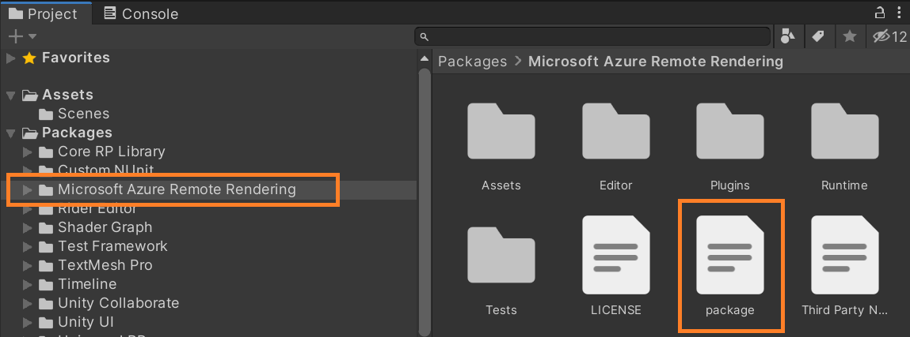
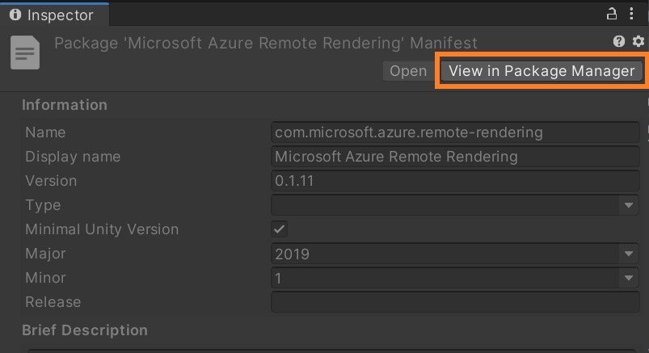
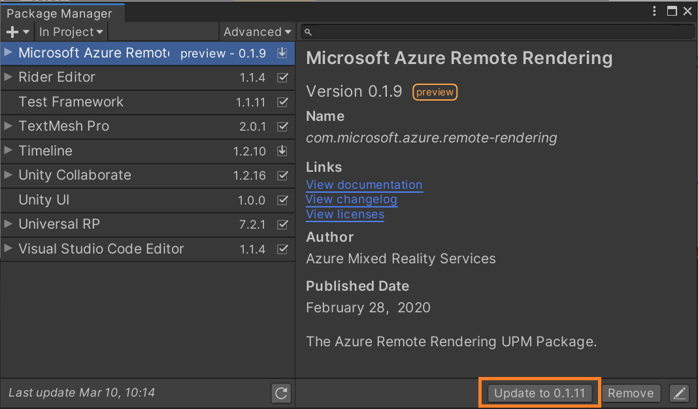
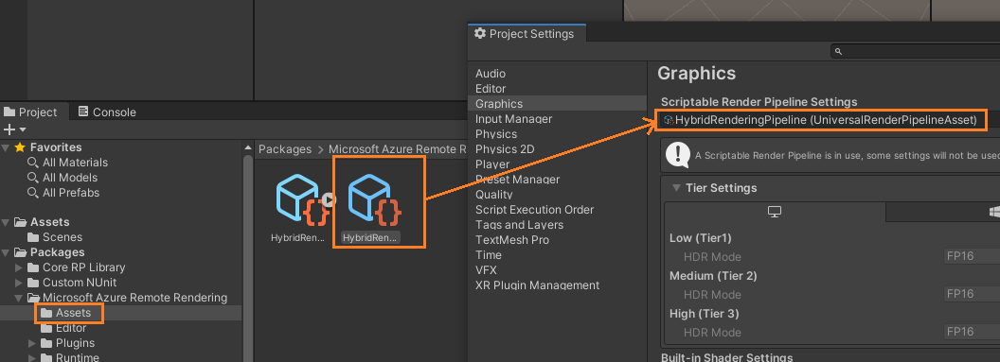

       
# Tutorial: Viewing a Remotely Rendered Model

In this tutorial, you learn how to:

> [!div class="checklist"]
>
> * Provision an Azure Remote Rendering instance.
> * Create and stop a rendering session.
> * Reuse an existing rendering session.
> * Connect and disconnect from sessions.
> * Load models into a rendering session.

## Prerequisites

For this tutorial you need:

* An Azure account.
* Windows SDK 10.0.18362.0 [(download)](https://developer.microsoft.com/windows/downloads/windows-10-sdk)
* The latest version of Visual Studio 2019 [(download)](https://visualstudio.microsoft.com/vs/older-downloads/)
* GIT [(download)](https://git-scm.com/downloads)
* Unity 2019.3.1 [(download)](https://unity3d.com/get-unity/download)
  * Install these modules in Unity:
    * **UWP** - Universal Windows Platform Build Support
    * **IL2CPP** - Windows Build Support (IL2CPP)

## Provision an Azure Remote Rendering instance

To get access to the Azure Remote Rendering service, you first need to [create an account](../../../how-tos/create-an-account.md#create-an-account).

You're required to complete the "Create an account" section for this tutorial, optionally you can complete the "Link storage accounts" section which is required for a future tutorial [Commercial Ready: Model Library](../7-commercial-ready/commercial-ready.md#model-library).

## Create a new Unity project

> [!TIP]
> The [ARR samples repository](https://github.com/Azure/azure-remote-rendering) contains prepared Unity projects for all tutorials. You can use those projects as a reference.

From the Unity Hub, create a new project.
In this example, we'll assume the project is being created in a folder called `RemoteRendering`.

:::image type="content" source="./media/unity-new-project.PNG" alt-text="New Unity Project":::

## Include the Azure Remote Rendering Package

You need to modify the file `Packages/manifest.json` that is located in your Unity project folder. Open the file in a text editor and append the lines listed below:

```json
{
    "scopedRegistries": [
    {
        "name": "Azure Mixed Reality Services",
        "url": "https://api.bintray.com/npm/microsoft/AzureMixedReality-NPM/",
        "scopes": ["com.microsoft.azure"]
    }
    ],
    "dependencies": {
    "com.microsoft.azure.remote-rendering": "0.1.22",
    "com.unity.render-pipelines.universal": "7.2.1",
    ...existing dependencies...
    }
}
```

The Universal render pipeline package is optional but recommended for performance reasons.
After you modified and saved the manifest, Unity will automatically refresh. Confirm the packages have been loaded in the *Project* window:

:::image type="content" source="./media/confirm-packages.png" alt-text="confirm package imports":::

## Ensure you have the latest version of the package

The following steps ensure that your project is using the latest version of the remote-rendering package.

1. Select the package in the Project window and click on the package icon:

1. In the Inspector, click "View in Package Manager":

1. In the package manager page for remote rendering package, see if the update button is available. If it is, then clicking it will update the package to the latest available version:

1. Sometimes updating the package may lead to errors in the console. If this occurs, try closing and reopening the project.

## Configure the camera

Select the **Main Camera** node.

1. Reset its *Transform*:

    

1. Set **Clear flags** to *Solid Color*

1. Set **Background** to *Black*

1. Set the **Clipping Planes** to *Near = 0.3* and *Far = 20*. This means rendering will clip geometry that is closer than 30 cm or farther than 20 meters.

    

## Adjust the project settings

1. Open *Edit > Project Settings...*
1. In the list on the left select Quality.
1. Change the **Default Quality Level** to *Low*

    

1. Select **Graphics** on the left.
1. Change the **Scriptable Rendering Pipeline** setting to *HybridRenderingPipeline*. Skip this step if the Universal render pipeline is not used.

    
    Sometimes the UI does not populate the list of available pipeline types from the packages, in which case the *HybridRenderingPipeline* asset must be dragged onto the field manually:
    
1. Select **Player** on the left.
1. Select the **Universal Windows Platform settings** tab
1. Change the **XR Settings** to support Windows Mixed Reality:
    
1. Select the settings as in the screenshot above:
    1. Enable **Virtual Reality Supported**
    1. Set **Depth Format** to *16-Bit Depth*
    1. Enable **Depth Buffer Sharing**
    1. Set **Stereo Rendering Mode** to *Single Pass Instanced*

1. In the same window, above *XR Settings*, expand **Publishing Settings**
1. Scroll down to **Capabilities** and select:
    * **InternetClient**
    * **InternetClientServer**
    * **SpatialPerception**
    * Optional for development: **PrivateNetworkClientServer**

      This option is needed if you want to connect the Unity remote debugger to your device.

1. In **Supported Device Families**, enable **Holographic** and **Desktop**

1. If you want to use the Mixed Reality Toolkit, see the [MRTK documentation](https://docs.microsoft.com/windows/mixed-reality/unity-development-overview), for more information on recommended settings and capabilities.

## Validate project setup

Perform the following steps to validate that the project settings are correct.

1. Choose the ValidateProject entry from the RemoteRendering menu in the Unity editor toolbar.
1. Use the ValidateProject window to check for and fix project settings where necessary.

    

## Create a script to coordinate Azure Remote Rendering connection and state

Create a [new script](https://docs.unity3d.com/Manual/CreatingAndUsingScripts.html) and give it the name **RemoteRenderingCoordinator**. Open the script file and replace its entire content with the code below:

```csharp
using Microsoft.Azure.RemoteRendering;
using Microsoft.Azure.RemoteRendering.Unity;
using System;
using System.Linq;
using System.Threading.Tasks;
using UnityEngine;

#if UNITY_WSA
using UnityEngine.XR.WSA;
#endif

/// <summary>
/// Remote Rendering Coordinator is the controller for all Remote Rendering operations.
/// </summary>

//Require the GameObject with a RemoteRenderingCoordinator to also have the ARRServiceUnity component
[RequireComponent(typeof(ARRServiceUnity))]
public class RemoteRenderingCoordinator : MonoBehaviour
{
    public static RemoteRenderingCoordinator instance = null;

    // Fill out the variables below with your account details, hard coded credentials should only be used in testing
    // AccountDomain must be '<region>.mixedreality.azure.com' - if no '<region>' is specified, connections will fail
    // For most people '<region>' is either 'westus2' or 'westeurope'
    public string AccountDomain = "westus2.mixedreality.azure.com";
    public string AccountId = "<enter your account id here>";
    public string AccountKey = "<enter your account key here>";

    // These settings are important. All three should be set as low as possible, while maintaining a good user experience
    // See the documentation around session management and the technical differences in session VM size
    public RenderingSessionVmSize renderingSessionVmSize = RenderingSessionVmSize.Standard;
    public uint maxLeaseHours = 0;
    public uint maxLeaseMinutes = 5;

    /// <summary>
    /// When Automatic Mode is true, the coordinator will attempt to automatically proceed through the process of connecting and loading a model
    /// </summary>
    public bool automaticMode = false;


    public enum RemoteRenderingState
    {
        NotSet = 0,
        NotInitialized = 1,
        NoSession = 2,
        ConnectingToExistingRemoteSession = 3,
        ConnectingToNewRemoteSession = 4,
        RemoteSessionReady = 5,
        ConnectingToRuntime = 6,
        RuntimeConnected = 7
    }

    private static RemoteRenderingState currentCoordinatorState = RemoteRenderingState.NotSet;
    public static RemoteRenderingState CurrentCoordinatorState
    {
        get => currentCoordinatorState;
        private set
        {
            if (currentCoordinatorState != value)
            {
                currentCoordinatorState = value;
                Debug.Log($"State changed to: {currentCoordinatorState}");
                OnCoordinatorStateChange?.Invoke(currentCoordinatorState);
            }
        }
    }

    public static event Action<RemoteRenderingState> OnCoordinatorStateChange;

    private ARRServiceUnity arrSessionService;

    private ARRServiceUnity ARRSessionService
    {
        get
        {
            if (arrSessionService == null)
                arrSessionService = GetComponent<ARRServiceUnity>();
            return arrSessionService;
        }
    }

    /// <summary>
    /// Keep the last used SessionID, when launching, connect to this session if its available
    /// </summary>
    private string LastUsedSessionID
    {
        get
        {
            if (PlayerPrefs.HasKey("LastUsedSessionID"))
                return PlayerPrefs.GetString("LastUsedSessionID");
            else
                return null;
        }
        set
        {
            PlayerPrefs.SetString("LastUsedSessionID", value);
        }
    }

    public void Awake()
    {
        if (instance == null)
            instance = this;
        else
            Destroy(this);

        OnCoordinatorStateChange += AutomaticMode;

        CurrentCoordinatorState = RemoteRenderingState.NotInitialized;
    }

    /// <summary>
    /// Automatic mode attempts to automatically progress through the connection and loading steps. Doesn't handle error states.
    /// </summary>
    /// <param name="currentState">The current state</param>
    private async void AutomaticMode(RemoteRenderingState currentState)
    {
        if (!automaticMode)
            return;

        //Add a small delay for visual effect
        await Task.Delay(1500);
        switch (currentState)
        {
            case RemoteRenderingState.NotInitialized:
                InitializeARR();
                break;
            case RemoteRenderingState.NoSession:
                JoinRemoteSession();
                break;
            case RemoteRenderingState.RemoteSessionReady:
                ConnectRuntimeToRemoteSession();
                break;
        }
    }

    /// <summary>
    /// Initializes ARR, associating the main camera and creating a new remote session manager
    /// </summary>
    public void InitializeARR()
    {
        //Implement me!
    }

    /// <summary>
    /// Attempts to join an existing session or start a new session
    /// </summary>
    public async void JoinRemoteSession()
    {
        //Implement me!
    }

    public void StopRemoteSession()
    {
        //Implement me!
    }

    private async Task<bool> IsSessionAvailable(string sessionID)
    {
        var allSessions = await ARRSessionService.Frontend.GetCurrentRenderingSessionsAsync().AsTask();
        return allSessions.Any(x => x.Id == sessionID && (x.Status == RenderingSessionStatus.Ready || x.Status == RenderingSessionStatus.Starting));
    }

    /// <summary>
    /// Connects the local runtime to the current active session, if there's a session available
    /// </summary>
    public void ConnectRuntimeToRemoteSession()
    {
        //Implement me!
    }

    public void DisconnectRuntimeFromRemoteSession()
    {
        //Implement me!
    }

    /// <summary>
    /// The session must have its runtime pump updated.
    /// The Actions.Update() will push messages to the server, receive messages, and update the frame-buffer with the remotely rendered content.
    /// </summary>
    private void LateUpdate()
    {
        ARRSessionService?.CurrentActiveSession?.Actions?.Update();
    }

    public async Task<Entity> LoadModel(string modelName, ProgressHandler progress, Transform parent)
    {
        //Implement me!
        return null;
    }

    private async void OnRemoteSessionStatusChanged(ARRServiceUnity caller, AzureSession session)
    {
        var properties = await session.GetPropertiesAsync().AsTask();

        switch (properties.Status)
        {
            case RenderingSessionStatus.Error:
            case RenderingSessionStatus.Expired:
            case RenderingSessionStatus.Stopped:
            case RenderingSessionStatus.Unknown:
                CurrentCoordinatorState = RemoteRenderingState.NoSession;
                break;
            case RenderingSessionStatus.Starting:
                CurrentCoordinatorState = RemoteRenderingState.ConnectingToNewRemoteSession;
                break;
            case RenderingSessionStatus.Ready:
                CurrentCoordinatorState = RemoteRenderingState.RemoteSessionReady;
                break;
        }
    }

    private void OnLocalRuntimeStatusChanged(ConnectionStatus status, Result error)
    {
        switch (status)
        {
            case ConnectionStatus.Connected:
                CurrentCoordinatorState = RemoteRenderingState.RuntimeConnected;
                break;
            case ConnectionStatus.Connecting:
                CurrentCoordinatorState = RemoteRenderingState.ConnectingToRuntime;
                break;
            case ConnectionStatus.Disconnected:
                CurrentCoordinatorState = RemoteRenderingState.RemoteSessionReady;
                break;
        }
    }
}
```

## Create the Azure Remote Rendering GameObject

The remote rendering coordinator and a script it depends on (*ARRServiceUnity*) are both MonoBehaviours and are required to be attached to a GameObject in the scene.

1. Create a new GameObject in the scene and name it **RemoteRenderingCoordinator**.
1. Add the *RemoteRenderingCoordinator* script to the **RemoteRenderingCoordinator** GameObject. 
1. Confirm the *ARRServiceUnity* script is automatically added to the GameObject, this is a result of adding the attribute `[RequireComponent(typeof(ARRServiceUnity))]`.

## Initialize Azure Remote Rendering

When using ARR, we first need to initialize Azure Remote Rendering, tell it which camera object to use for rendering, which account credentials to use when managing remote sessions and listen for state change events. We'll do this in the `InitializeARR()` method by completing it as follows:

> [!CAUTION] Modifying the script and saving it while the play mode is active in Unity may result in Unity freezing and you are forced to shut it down through the task manager. Therefore, always stop the play mode before editing the RemoteRendering script.

There are four basic stages to showing remotely rendered models, shown in the below graph. Each of these stages is required to be performed in order. Now that we have the framework for our coordinator, we will implement each of the four stages. In all cases except the **Initialize** stage, there is also an associated "undo" process that reverses that stage.


```csharp
/// <summary>
/// Initializes ARR, associating the main camera and creating a new remote session manager
/// Note: This must be called on the main Unity thread
/// </summary>
public void InitializeARR()
{
    RemoteUnityClientInit clientInit = new RemoteUnityClientInit(Camera.main);
    RemoteManagerUnity.InitializeManager(clientInit);

    ARRSessionService.Initialize(new AzureFrontendAccountInfo(AccountDomain, AccountId, AccountKey));

    ARRSessionService.OnSessionStatusChanged += OnRemoteSessionStatusChanged;

    CurrentCoordinatorState = RemoteRenderingState.NoSession;
}
```

This code handles the first stage.


## Create or join a remote session

Now we need to connect to a remote session where our models will be rendered. The `JoinRemoteSession()` method will attempt to join an existing session (if we're the one that created it, tracked with the `LastUsedSessionID` property). If no sessions are available, it will create a new session. Creating a new session is, unfortunately, a time consuming operation. Therefore one should try to create sessions rarely, and reuse them whenever possible (see [Commercial Ready: Session pooling, scheduling, and best practices](..\7-commercial-ready\commercial-ready.md#session-pooling-scheduling-and-best-practices) for more). `StopRemoteSession()` will end the currently active session. To prevent charges, you should always stop sessions when they are not needed anymore.

Replace the `JoinRemoteSession()` and `StopRemoteSession()` with the completed examples below.

```csharp
/// <summary>
/// Attempts to join an existing session or start a new session
/// </summary>
public async void JoinRemoteSession()
{
    //If there's a session available that previously belonged to us, and it's ready, use it. Otherwise start a new session.
    RenderingSessionProperties joinResult;
    if ((await IsSessionAvailable(LastUsedSessionID)))
    {
        CurrentCoordinatorState = RemoteRenderingState.ConnectingToExistingRemoteSession;
        joinResult = await ARRSessionService.OpenSession(LastUsedSessionID);
    }
    else
    {
        CurrentCoordinatorState = RemoteRenderingState.ConnectingToNewRemoteSession;
        joinResult = await ARRSessionService.StartSession(new RenderingSessionCreationParams(renderingSessionVmSize, maxLeaseHours, maxLeaseMinutes));
    }

    if (joinResult.Status == RenderingSessionStatus.Ready || joinResult.Status == RenderingSessionStatus.Starting)
    {
        LastUsedSessionID = joinResult.Id;
    }
    else
    {
        //The session should be ready or starting, if it's not, something went wrong
        await ARRSessionService.StopSession();
        CurrentCoordinatorState = RemoteRenderingState.NoSession;
    }
}

public void StopRemoteSession()
{
    if (ARRSessionService.CurrentActiveSession != null)
    {
        ARRSessionService.CurrentActiveSession.StopAsync();
    }
}
```

We've now implemented the second stage.


Due to the **Auto-Stop Session** property on the *ARRServiceUnity* component, which is on by default, the session will be stopped automatically for you. If everything fails, due to crashes or connection issues, your session may run for as long as your *MaxLeaseTime* before it is shut down by the server.

> [!NOTE]
> Stopping a session will take immediate effect and cannot be undone. Once stopped, you have to create a new session, with the same startup overhead.

If you want to reuse sessions, avoiding the time to create a new session, make sure to deactivate the option **Auto-Stop Session** in the *ARRServiceUnity* component. Otherwise every session that you create will be automatically stopped when you stop the simulation, and attempting to reuse it will fail.

## Connect the local runtime to the remote session

Next the application needs to connect it's local ARR runtime to a remote session. Additionally, the application needs to listen for events about the connection between the runtime and the current session, those state changes are handled in `OnLocalRuntimeStatusChanged`. Replace the `ConnectRuntimeToRemoteSession()` and `DisconnectRuntimeFromRemoteSession()` methods with the completed versions below. Additionally, add the Unity method `LateUpdate` and update the current active session. This allows the current session to send/receive messages and update the frame buffer with the frames received from the remote session.

```csharp
/// <summary>
/// Connects the local runtime to the current active session, if there's a session available
/// </summary>
public void ConnectRuntimeToRemoteSession()
{
    if (ARRSessionService == null || ARRSessionService.CurrentActiveSession == null)
    {
        Debug.LogError("Not ready to connect runtime");
        return;
    }

    //Connect the local runtime to the currently connected session
    //This session is set when connecting to a new or existing session

    ARRSessionService.CurrentActiveSession.ConnectionStatusChanged += OnLocalRuntimeStatusChanged;
    ARRSessionService.CurrentActiveSession.ConnectToRuntime(new ConnectToRuntimeParams());
    CurrentCoordinatorState = RemoteRenderingState.ConnectingToRuntime;
}

public void DisconnectRuntimeFromRemoteSession()
{
    if (ARRSessionService == null || ARRSessionService.CurrentActiveSession == null || ARRSessionService.CurrentActiveSession.ConnectionStatus != ConnectionStatus.Connected)
    {
        Debug.LogError("Runtime not connected!");
        return;
    }

    ARRSessionService.CurrentActiveSession.DisconnectFromRuntime();
    ARRSessionService.CurrentActiveSession.ConnectionStatusChanged -= OnLocalRuntimeStatusChanged;
    CurrentCoordinatorState = RemoteRenderingState.RemoteSessionReady;
}

/// <summary>
/// The session must have its runtime pump updated.
/// The Actions.Update() will push messages to the server, receive messages, and update the frame-buffer with the remotely rendered content.
/// </summary>
private void LateUpdate()
{
    ARRSessionService?.CurrentActiveSession?.Actions?.Update();
}
```

Connecting to the runtime is the third stage.


## Loading a model

The application is now connected to a remote session and ready to render! Next the application has to tell the remote session to load a model and start rendering it. Then we'll start receiving frames from the remote session, and displaying them with the local runtime. The `LoadModel` method is designed to accept a model path, progress handler and parent Transform. These arguments will be used to load a model into the remote session, update the user on the loading progress and orient the remotely rendered model based on the parent Transform.

```csharp
public async Task<Entity> LoadModel(string modelName, ProgressHandler progress, Transform parent)
{
    //Create a root object to parent a loaded model to
    var modelEntity = ARRSessionService.CurrentActiveSession.Actions.CreateEntity();

    //Get the game object representation of this entity
    var modelGameObject = modelEntity.GetOrCreateGameObject(UnityCreationMode.DoNotCreateUnityComponents);

    //Ensure the entity will sync translations with the server
    var sync = modelGameObject.GetComponent<RemoteEntitySyncObject>();
    sync.SyncEveryFrame = true;

    //Parent the new object under the defined parent
    modelGameObject.transform.SetParent(parent, false);

#if UNITY_WSA
    //Anchor the model in the world
    modelGameObject.AddComponent<WorldAnchor>();
#endif

    modelEntity.BindToUnityGameObject(modelGameObject);

    //Load a model that will be parented to the entity
    var loadModelParams = new LoadModelFromSASParams(modelName, modelEntity);
    var async = ARRSessionService.CurrentActiveSession.Actions.LoadModelFromSASAsync(loadModelParams);
    async.ProgressUpdated += progress;
    var result = await async.AsTask();
    return result.Root;
}
```

The model path, progress handler and Transform will be defined in another script, and will use the `LoadModel` method. This will allow us to create GameObjects that contain all the data and visuals required to load, orient and display the loading progress of a model.

Create a new script called `RemoteRenderedModel` and add the following code:

```csharp
using Microsoft.Azure.RemoteRendering;
using Microsoft.Azure.RemoteRendering.Unity;
using System;
using UnityEngine;
using UnityEngine.Events;

public class RemoteRenderedModel : MonoBehaviour
{
    public string ModelName;

    public bool AutomaticallyLoad = true;

    public event Action ModelLoaded;
    public event Action ModelUnloaded;

    public UnityEvent OnStartLoad;
    public UnityEvent OnStopLoad;

    //Create a Unity Event that includes a float value
    [Serializable] public class UnityFloatEvent : UnityEvent<float> { }

    public UnityFloatEvent LoadProgress;

    private Entity modelEntity;
    private bool modelEntityActive = false;

    //Attach to and initialize current state (in case we're attaching late)
    private void OnEnable()
    {
        RemoteRenderingCoordinator.OnCoordinatorStateChange += Instance_OnCoordinatorStateChange;
        Instance_OnCoordinatorStateChange(RemoteRenderingCoordinator.CurrentCoordinatorState);
    }

    private void OnDisable()
    {
        RemoteRenderingCoordinator.OnCoordinatorStateChange -= Instance_OnCoordinatorStateChange;
    }

    /// <summary>
    /// Asks the coordinator to create a model entity and listens for coordinator state changes
    /// </summary>
    [ContextMenu("Load Model")]
    public async void LoadModel()
    {
        if (modelEntityActive)
            return; //We're already loaded or loading

        modelEntityActive = true;
        OnStartLoad?.Invoke();
        modelEntity = await RemoteRenderingCoordinator.instance?.LoadModel(ModelName, ShowProgress, this.transform);
        ModelLoaded?.Invoke();
        OnStopLoad?.Invoke();
    }

    /// <summary>
    /// Listen for state changes on the coordinator, clean up this model's ARR objects if we're no longer connected.
    /// Automatically load if required
    /// </summary>
    /// <param name="state"></param>
    private void Instance_OnCoordinatorStateChange(RemoteRenderingCoordinator.RemoteRenderingState state)
    {
        switch (state)
        {
            case RemoteRenderingCoordinator.RemoteRenderingState.NotSet:
            case RemoteRenderingCoordinator.RemoteRenderingState.NotInitialized:
            case RemoteRenderingCoordinator.RemoteRenderingState.NoSession:
            case RemoteRenderingCoordinator.RemoteRenderingState.ConnectingToExistingRemoteSession:
            case RemoteRenderingCoordinator.RemoteRenderingState.ConnectingToNewRemoteSession:
            case RemoteRenderingCoordinator.RemoteRenderingState.RemoteSessionReady:
            case RemoteRenderingCoordinator.RemoteRenderingState.ConnectingToRuntime:
                UnloadModel();
                break;
            case RemoteRenderingCoordinator.RemoteRenderingState.RuntimeConnected:
                if (AutomaticallyLoad)
                    LoadModel();
                break;
        }
    }

    /// <summary>
    /// Clean up the local model instances
    /// </summary>
    public void UnloadModel()
    {
        modelEntityActive = false;
        if (modelEntity == null)
            return;

        modelEntity.DestroyGameObject(EntityExtensions.DestroyGameObjectFlags.DestroyEmptyParents);
        modelEntity.Destroy();
        modelEntity = null;

        ModelUnloaded?.Invoke();
    }

    /// <summary>
    /// Update the Unity method
    /// </summary>
    /// <param name="progressValue"></param>
    public void ShowProgress(float progressValue)
    {
        Debug.Log($"Loading {ModelName} progress: {Math.Round(progressValue * 100, 2)}%");
        LoadProgress?.Invoke(progressValue);
    }
}
```

Finally, we have all the code in place for the four stages.


## Loading the Test Model

The application now has everything in place required to load a view a remotely rendered model. Now we need to define the model to load and where to load it.

1. Create a new GameObject in the scene and name it **TestEngine**.
1. Add the *RemoteRenderedModel* script to **TestEngine**.\
 
1. Position the **TestEngine** object in front of the camera, at position **x = 0, y = 0, z = 3**.\
 
1. Ensure **AutomaticallyLoad** is turned on.
1. Press **Play** in the Unity Editor to test the application.

Watch the Console panel as the application progresses through its states. Keep in mind, some states may take some time to complete without a progress update. Eventually, you'll see the logs from the model loading and then the test model will be rendered in the scene. Try moving and rotating the **TestEngine** GameObject you created to see the model rendered from different perspectives.


## Next steps


Congratulations! You've created a basic application capable of viewing remotely rendered models. In the next tutorial, we will learn how to ingest and render your own models.

> [!div class="nextstepaction"]
> [Next: Loading Custom Models](../2-custom-models/custom-models.md)
