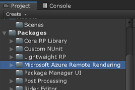
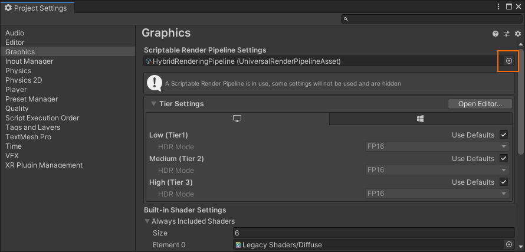
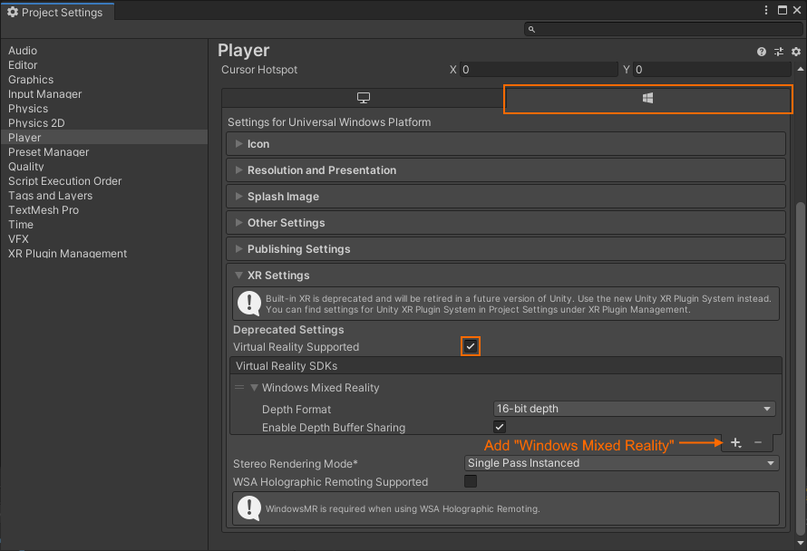

# Tutorial: Setting up a Unity project from scratch

In this tutorial you will learn:

> [!div class="checklist"]
>
> * Getting the required NuGet packages.
> * Configuring a scratch Unity project for ARR.
> * Creating and stopping rendering sessions.
> * Reusing existing sessions.
> * Connecting and disconnecting from sessions.
> * Loading models into a rendering session.
> * Displaying connection stats.

## Prerequisites

For this tutorial you need:

* The prerequisites from [Quickstart: Render a model with Unity](../../quickstarts/render-model.md#prerequisites).
* Your account information (account ID, account key, subscription ID)

> [!TIP]
> The [arrClient repository](https://dev.azure.com/arrClient/arrClient/_git/arrClient) contains prepared Unity projects for all tutorials, that you can use as reference.

## Prepare a folder

1. Create a folder that will hold the NuGet packages and Unity project folder, for example `C:\RemoteRendering\`. You can use this folder to store multiple Unity projects, if needed.

1. Install the latest NuGet packages:

    ```ps
    nuget.exe install com.microsoft.azure.remote_rendering -ExcludeVersion
    ```

    ```ps
    nuget.exe install ScriptableRenderPipeline -ExcludeVersion
    ```

    If any of the NuGet commands fail, make sure you set up [these prerequisites](../../quickstarts/render-model.md#prerequisites) correctly.

## Create a new Unity project

From the Unity Hub, create a new project in the folder created above (for example, `C:\RemoteRendering\`).


## Configure the project's manifest

You need to modify the file `Packages/manifest.json` that's located in your Unity project folder. Open the file in a text editor and append the lines listed below:

```json
{
  "dependencies": {
    ...existing dependencies...,
    "com.microsoft.azure.remote_rendering": "file:../../com.microsoft.azure.remote_rendering",
    "com.unity.render-pipelines.core": "file:../../ScriptableRenderPipeline/com.unity.render-pipelines.core",
    "com.unity.render-pipelines.lightweight": "file:../../ScriptableRenderPipeline/com.unity.render-pipelines.lightweight",
    "com.unity.shadergraph": "file:../../ScriptableRenderPipeline/com.unity.shadergraph",
    "com.unity.render-pipelines.universal": "file:../../ScriptableRenderPipeline/com.unity.render-pipelines.universal"
  }
}
```

> [!IMPORTANT]
> The relative paths used above expect that the NuGet packages were installed next to the Unity project. If you installed them somewhere else you need to adjust the paths accordingly.

After you modified and saved the manifest, Unity will automatically refresh. Confirm the packages have been loaded in the *Project* window:



## Configure the camera

Select the **Main Camera** node.

1. Reset its *Transform*:

    

1. Set **Clear flags** to *Solid Color*

1. Set **Background** to *Black*

1. Set the **Clipping Planes** to *Near = 0.3* and *Far = 20*

    

## Adjust the project settings

1. Open *Edit > Project Settings...*
1. In the list on the left select Quality.
1. Change the **Default Quality Level** to *Low*

    

1. Select **Graphics** on the left.
1. Change the **Scriptable Rendering Pipeline** setting to *HybridRenderingPipeline*

    

1. Select **Player** on the left.
1. Select the **Universal Windows Platform settings** tab
1. Change the **XR Settings** to support Windows Mixed Reality:
    
1. Select the settings as in the screenshot above:
    1. Enable **Virtual Reality Supported**
    1. Set **Depth Format** to *16-Bit Depth*
    1. Enable **Depth Buffer Sharing**
    1. Set **Stereo Rendering Mode** to *Single Pass Instanced*

1. In the same window, above *XR Settings*, expand **Publishing Settings**
1. Scroll down to **Capabilities** and select:
    * **InternetClient**
    * **InternetClientServer**
    * **SpatialPerception**
    * Optional for development: **PrivateNetworkClientServer**

      This option is needed if you want to connect the Unity remote debugger to your device.

1. In **Supported Device Families**, enable **Holographic**

1. If you want to use the Mixed Reality Toolkit, see the [MRTK documentation](https://docs.microsoft.com/windows/mixed-reality/unity-development-overview), for more information on recommended settings and capabilities.

## Create a script to initialize Azure Remote Rendering

Create a [new script](https://docs.unity3d.com/Manual/CreatingAndUsingScripts.html) and give it the name **RemoteRendering**. Open the script file and replace its entire content with the code below:

```csharp
using System.Collections;
using System.Collections.Generic;
using UnityEngine;
using Microsoft.Azure.RemoteRendering;
using Microsoft.Azure.RemoteRendering.Unity;

#if UNITY_WSA
    using UnityEngine.XR.WSA;
#endif

// ask Unity to automatically append an ARRServiceUnity component when a RemoteRendering script is attached
[RequireComponent(typeof(ARRServiceUnity))]
public class RemoteRendering : MonoBehaviour
{
    // fill out the variables below with your account details

    // AccountDomain must be '<region>.mixedreality.azure.com' - if no '<region>' is specified, connections will fail
    // See the documentation for the list of available regions.
    public string AccountDomain = "westus2.mixedreality.azure.com";
    public string AccountId = "<enter your account id here>";
    public string AccountKey = "<enter your account key here>";

    public uint MaxLeaseTimeHours = 0;
    public uint MaxLeaseTimeMinutes = 10;
    public RenderingSessionVmSize VMSize = RenderingSessionVmSize.Standard;

    private ARRServiceUnity arrService = null;

    private void Awake()
    {
        // initialize Azure Remote Rendering for use in Unity:
        // it needs to know which camera is used for rendering the scene
        RemoteUnityClientInit clientInit = new RemoteUnityClientInit(Camera.main);
        RemoteManagerUnity.InitializeManager(clientInit);

        // lookup the ARRServiceUnity component and subscribe to session events
        arrService = GetComponent<ARRServiceUnity>();
        arrService.OnSessionStarted += ARRService_OnSessionStarted;
        arrService.OnSessionStatusChanged += ARRService_OnSessionStatusChanged;
        arrService.OnSessionEnded += ARRService_OnSessionEnded;
    }

    private void OnDestroy()
    {
        arrService.OnSessionStarted -= ARRService_OnSessionStarted;
        arrService.OnSessionStatusChanged -= ARRService_OnSessionStatusChanged;
        arrService.OnSessionEnded -= ARRService_OnSessionEnded;

        RemoteManagerStatic.ShutdownRemoteRendering();
    }

    private void CreateFrontend()
    {
        if (arrService.Frontend != null)
        {
            // early out if the front-end has been created before
            return;
        }

        // initialize the ARR service with our account details
        AzureFrontendAccountInfo accountInfo = new AzureFrontendAccountInfo();
        accountInfo.AccountKey = AccountKey;
        accountInfo.AccountId = AccountId;
        accountInfo.AccountDomain = AccountDomain;

        arrService.Initialize(accountInfo);
    }

    public void CreateSession()
    {
        CreateFrontend();

        // StartSession will call ARRService_OnSessionStarted once the session becomes available
        arrService.StartSession(new RenderingSessionCreationParams(VMSize, MaxLeaseTimeHours, MaxLeaseTimeMinutes));
    }

    public void StopSession()
    {
        arrService.StopSession();
    }

    private void ARRService_OnSessionEnded(AzureSession session)
    {
        LogSessionStatus(session);
    }

    private void ARRService_OnSessionStarted(AzureSession session)
    {
        LogSessionStatus(session);
    }

    private void ARRService_OnSessionStatusChanged(AzureSession session)
    {
        LogSessionStatus(session);
    }

    private async void LogSessionStatus(AzureSession session)
    {
        if (session != null)
        {
            var sessionProperties = await session.GetPropertiesAsync().AsTask();
            LogSessionStatus(sessionProperties);
        }
        else
        {
            var sessionProperties = arrService.LastProperties;
            Debug.Log($"Session ended: Id={sessionProperties.Id}");
        }
    }

    private void LogSessionStatus(RenderingSessionProperties sessionProperties)
    {
        Debug.Log($"Session '{sessionProperties.Id}' is {sessionProperties.Status}. Size={sessionProperties.Size}" +
            (!string.IsNullOrEmpty(sessionProperties.Hostname) ? $", Hostname='{sessionProperties.Hostname}'" : "") +
            (!string.IsNullOrEmpty(sessionProperties.Message) ? $", Message='{sessionProperties.Message}'" : ""));
    }

#if UNITY_EDITOR
    private void OnGUI()
    {
        if (arrService.CurrentActiveSession == null)
        {
            if (GUI.Button(new Rect(10, 10, 175, 30), "Create Session"))
            {
                CreateSession();
            }
        }
        else
        {
            if (GUI.Button(new Rect(10, 10, 175, 30), "Stop Session"))
            {
                StopSession();
            }
        }
    }
#endif
}
```

This script initializes Azure Remote Rendering, tell it which camera object to use for rendering, and places a **Create Session** button into the viewport, when *Play Mode* is activated.

> [!CAUTION]
> Modifying the script and saving it while the play mode is active in Unity may result in Unity freezing and you are forced to shut it down through the task manager. Therefore, always stop the play mode before editing the *RemoteRendering* script.

## Test Azure Remote Rendering session creation

Create a new GameObject in the scene and add the *RemoteRendering* component to it. Fill in the appropriate *Account Domain*, *Account Id*, and *Account Key* for your Remote Rendering account:


Start the application in the editor (**press Play** or CTRL+P). You should see the **Create Session** button appear in the viewport. Click it to start your first ARR session:


If this fails, make sure you entered your account details correctly into the RemoteRendering component properties. Otherwise, a message will appear in the console window showing the session ID assigned to you, and stating that the session is currently in the *Starting* state:


At this point Azure is provisioning a server for you and starting up a remote rendering virtual machine. This typically **takes 3 to 5 minutes**. When the VM is ready, our Unity script's `OnSessionStatusChanged` callback is executed and will print the new session status:


This is it! For the time being nothing more will happen. To prevent charges, you should always stop sessions when they are not needed anymore. In this sample you can either do this by clicking the **Stop Session** button or by stopping the Unity simulation. Due to the **Auto-Stop Session** property on the *ARRServiceUnity* component, which is on by default, the session will be stopped automatically for you. If everything fails, due to crashes or connection issues, your session may run for as long as your *MaxLeaseTime* before it is shut down by the server.

> [!NOTE]
> Stopping a session will take immediate effect and cannot be undone. Once stopped, you have to create a new session, with the same startup overhead.

## Reusing sessions

Creating a new session is, unfortunately, a time consuming operation. Therefore one should try to create sessions rarely, and reuse them whenever possible.

Insert the following code into the *RemoteRendering* script and remove the old versions of the duplicate functions:

```csharp
    public string SessionId = null;

    private async void ARRService_OnSessionStarted(AzureSession session)
    {
        LogSessionStatus(session);

        SessionId = session.SessionUUID;

        if (arrService.CurrentActiveSession != null)
        {
            var sessionProperties = await arrService.CurrentActiveSession.GetPropertiesAsync().AsTask();


            if (sessionProperties.Status != RenderingSessionStatus.Ready &&
                sessionProperties.Status != RenderingSessionStatus.Starting)
            {
                Debug.LogError($"Existing session has status '{sessionProperties.Status}'");
                StopSession();
            }
        }
    }

    public async void QueryActiveSessions()
    {
        CreateFrontend();

        var allSessionsProperties = await arrService.Frontend.GetCurrentRenderingSessionsAsync().AsTask();

        Debug.Log($"Number of active sessions: {allSessionsProperties.Length}");

        foreach (var sessionProperties in allSessionsProperties)
        {
            if (string.IsNullOrEmpty(SessionId))
            {
                Debug.Log($"Number of active sessions: {allSessionsProperties.Length}");
                SessionId = sessionProperties.Id;
            }

            LogSessionStatus(sessionProperties);
        }
    }

    public void UseExistingSession()
    {
        CreateFrontend();

        // OpenSession will call ARRService_OnSessionStarted once the session becomes available
        arrService.OpenSession(SessionId);
    }

#if UNITY_EDITOR
    private void OnGUI()
    {
        if (arrService.CurrentActiveSession == null)
        {
            if (GUI.Button(new Rect(10, 10, 175, 30), "Create Session"))
            {
                CreateSession();
            }

            if (GUI.Button(new Rect(10, 50, 175, 30), "Query Active Sessions"))
            {
                QueryActiveSessions();
            }

            if (!string.IsNullOrEmpty(SessionId))
            {
                if (GUI.Button(new Rect(10, 90, 175, 30), "Use Existing Session"))
                {
                    UseExistingSession();
                }
            }
        }
        else
        {
            if (GUI.Button(new Rect(10, 10, 175, 30), "Stop Session"))
            {
                StopSession();
            }
        }
    }
#endif
```

> [!CAUTION]
> Before you run this code, make sure to deactivate the option **Auto-Stop Session** in the RemoteRendering component. Otherwise every session that you create will be automatically stopped when you stop the simulation, and attempting to reuse it will fail.

When you press *Play*, you now get three buttons in the viewport: **Create Session**, **Query Active Sessions**, and **Use Existing Session**. The first button always creates a new session. The second button queries which *active* sessions exist. If you did not manually specify a session ID to try to use, this action will automatically select that session ID for future use. The third button attempts to connect to an existing session. Either one that you specified manually through the *Session Id* component property, or one found by *Query Active Sessions*.

> [!TIP]
> It is possible to open sessions that have been stopped, expired or are in an error state. While they cannot be used for rendering anymore, you can query their details, once you opened an inactive session. The code above checks a session's status in `ARRService_OnSessionStarted`, to automatically stop when the session has become unusable.

With this functionality, you can now create and reuse sessions, which should improve your development workflow significantly.

Typically, creating a session would be triggered outside of the client application because of the time required to spin up the server.

## Connect to an active session

So far we have created or opened sessions. The next step is to *connect* to a session. Once connected, the rendering server will produce images and send a video stream to our application.

Insert the following code into the *RemoteRendering* script and remove the old versions of the duplicate functions:

```csharp
    private bool isConnected = false;

    private async void ARRService_OnSessionStarted(AzureSession session)
    {
        LogSessionStatus(session);

        SessionId = session.SessionUUID;

        session.OnConnectionStatusChanged += AzureSession_OnConnectionStatusChanged;

        if (arrService.CurrentActiveSession != null)
        {
            var sessionProperties = await arrService.CurrentActiveSession.GetPropertiesAsync().AsTask();


            if (sessionProperties.Status != RenderingSessionStatus.Ready &&
                sessionProperties.Status != RenderingSessionStatus.Starting)
            {
                Debug.LogError($"Existing session has status '{sessionProperties.Status}'");
                StopSession();
            }
        }
    }

    private void ARRService_OnSessionEnded(AzureSession session)
    {
        LogSessionStatus(session);

        if (session != null)
        {
            session.OnConnectionStatusChanged -= AzureSession_OnConnectionStatusChanged;
        }
    }

    private void AzureSession_OnConnectionStatusChanged(ConnectionStatus status, Result result)
    {
        Debug.Log($"Connection status: '{status}', result: '{result}'");
        isConnected = (status == ConnectionStatus.Connected);
    }

    public void ConnectSession()
    {
        arrService.CurrentActiveSession?.ConnectToRuntime(new ConnectToRuntimeParams());
    }

    public void DisconnectSession()
    {
        if (isConnected)
        {
            arrService.CurrentActiveSession?.DisconnectFromRuntime();
        }
    }

    private void LateUpdate()
    {
        // The session must have its runtime pump updated.
        // The update will push messages to the server, receive messages, and update the frame-buffer with the remotely rendered content.
        arrService.CurrentActiveSession?.Actions.Update();
    }

    private void OnDisable()
    {
        DisconnectSession();
    }

#if UNITY_EDITOR
    private void OnGUI()
    {
        if (arrService.CurrentActiveSession == null)
        {
            if (GUI.Button(new Rect(10, 10, 175, 30), "Create Session"))
            {
                CreateSession();
            }

            if (GUI.Button(new Rect(10, 50, 175, 30), "Query Active Sessions"))
            {
                QueryActiveSessions();
            }

            if (!string.IsNullOrEmpty(SessionId))
            {
                if (GUI.Button(new Rect(10, 90, 175, 30), "Use Existing Session"))
                {
                    UseExistingSession();
                }
            }
        }
        else
        {
            if (GUI.Button(new Rect(10, 10, 175, 30), "Stop Session"))
            {
                StopSession();
            }

            if (arrService.LastProperties.Status == RenderingSessionStatus.Ready)
            {
                if (!isConnected)
                {
                    if (GUI.Button(new Rect(10, 50, 175, 30), "Connect"))
                    {
                        ConnectSession();
                    }
                }
                else
                {
                    if (GUI.Button(new Rect(10, 50, 175, 30), "Disconnect"))
                    {
                        DisconnectSession();
                    }
                }
            }
        }
    }
#endif
```

To test this functionality:

1. Press **Play** in Unity.
1. Open a session:
    1. If you already have a session, press **Query Active Sessions** and then **Use Existing session**.
    1. Otherwise, press **Create Session**.
1. Press **Connect**.
1. After a few seconds, the console output should print that you are connected.
1. For now, nothing else should happen.
1. Press **Disconnect** or stop Unity's play mode.

>[!NOTE]
> Multiple users can *open* a session to query its information, but only one user can be *connected* to a session at a time. If another user is already connected, the connection will fail with a **handshake error**.

## Load a model

Insert the following code into the *RemoteRendering* script and remove the old versions of the duplicate functions:

```csharp

    public string ModelName = "builtin://UnitySampleModel";

    private Entity modelEntity = null;
    private GameObject modelEntityGO = null;

#if UNITY_WSA
    private WorldAnchor modelWorldAnchor = null;
#endif

    public async void LoadModel()
    {
        // create a root object to parent a loaded model to
        modelEntity = arrService.CurrentActiveSession.Actions.CreateEntity();

        // get the game object representation of this entity
        modelEntityGO = modelEntity.GetOrCreateGameObject(UnityCreationMode.DoNotCreateUnityComponents);

        // ensure the entity will sync translations with the server
        var sync = modelEntityGO.GetComponent<RemoteEntitySyncObject>();
        sync.SyncEveryFrame = true;

        // set position to an arbitrary distance from the parent
        modelEntityGO.transform.position = Camera.main.transform.position + Camera.main.transform.forward * 2;
        modelEntityGO.transform.localScale = Vector3.one;

#if UNITY_WSA
        // anchor the model in the world
        modelWorldAnchor = modelEntityGO.AddComponent<WorldAnchor>();
#endif

        // load a model that will be parented to the entity
        var loadModelParams = new LoadModelParams(ModelName, modelEntity);
        var async = arrService.CurrentActiveSession.Actions.LoadModelAsync(loadModelParams);
        async.ProgressUpdated += (float progress) =>
        {
            Debug.Log($"Loading: {progress * 100.0f}%");
        };

        await async.AsTask();
    }

    public void DestroyModel()
    {
        if (modelEntity == null)
        {
            return;
        }

#if UNITY_WSA
        DestroyImmediate(modelWorldAnchor);
#endif

        modelEntity.Destroy();
        modelEntity = null;

        DestroyImmediate(modelEntityGO);
    }

    public void DisconnectSession()
    {
        if (isConnected)
        {
            arrService.CurrentActiveSession?.DisconnectFromRuntime();
        }

        DestroyModel();
    }

#if UNITY_EDITOR
    private void OnGUI()
    {
        if (arrService.CurrentActiveSession == null)
        {
            if (GUI.Button(new Rect(10, 10, 175, 30), "Create Session"))
            {
                CreateSession();
            }

            if (GUI.Button(new Rect(10, 50, 175, 30), "Query Active Sessions"))
            {
                QueryActiveSessions();
            }

            if (!string.IsNullOrEmpty(SessionId))
            {
                if (GUI.Button(new Rect(10, 90, 175, 30), "Use Existing Session"))
                {
                    UseExistingSession();
                }
            }
        }
        else
        {
            if (GUI.Button(new Rect(10, 10, 175, 30), "Stop Session"))
            {
                StopSession();
            }

            if (arrService.LastProperties.Status == RenderingSessionStatus.Ready)
            {
                if (!isConnected)
                {
                    if (GUI.Button(new Rect(10, 50, 175, 30), "Connect"))
                    {
                        ConnectSession();
                    }
                }
                else
                {
                    if (GUI.Button(new Rect(10, 50, 175, 30), "Disconnect"))
                    {
                        DisconnectSession();
                    }

                    if (modelEntity == null)
                    {
                        if (GUI.Button(new Rect(10, 90, 175, 30), "Load Model"))
                        {
                            LoadModel();
                        }
                    }
                    else
                    {
                        if (GUI.Button(new Rect(10, 90, 175, 30), "Destroy Model"))
                        {
                            DestroyModel();
                        }
                    }
                }
            }
        }
    }
#endif
```

When you now press play, open a session and connect to it, the **Load Model** button appears. After clicking it, the console output will show the loading progress and when it reaches 100% you should see the model of an engine appear:


The [WorldAnchor](https://docs.unity3d.com/ScriptReference/XR.WSA.WorldAnchor.html) is an important component used for [hologram stability](https://docs.microsoft.com/windows/mixed-reality/hologram-stability). However, it will only have effect when deployed on a Mixed Reality device.

> [!TIP]
> If you followed the [second quickstart guide](../../quickstarts/convert-model.md), you already know how to convert your own models. All you need to do now to render it, is to put the URI to a converted model into the *Model Name* property.

## Display frame statistics

Azure Remote Rendering tracks various information about the quality of the connection. For a quick way to display this information do the following:

Create a [new script](https://docs.unity3d.com/Manual/CreatingAndUsingScripts.html) and give it the name **RemoteFrameStats**. Open the script file and replace its entire content with the code below:

```csharp
using Microsoft.Azure.RemoteRendering;
using Microsoft.Azure.RemoteRendering.Unity;
using System;
using System.Collections.Generic;
using UnityEngine;
using UnityEngine.UI;

public class RemoteFrameStats : MonoBehaviour
{
    public Text FrameStats = null;

    ARRServiceStats arrServiceStats = null;

    private void OnEnable()
    {
        arrServiceStats = new ARRServiceStats();
    }

    void Update()
    {
        if (!RemoteManagerUnity.IsConnected)
        {
            FrameStats.text = string.Empty;
            return;
        }

        arrServiceStats.Update(RemoteManagerUnity.CurrentSession);

        if (FrameStats != null)
        {
            FrameStats.text = arrServiceStats.GetStatsString();
        }
    }
}
```

Create a GameObject and name it *FrameStats*. Attach it as a child node to the *Main Camera* object and set its position to **x = 0, y = 0, z = 0.325**. Add the **RemoteFrameStats** component to the object.

Add a **UI > Canvas** child object to the *FrameStats* object and set its properties like this:


Add a **UI > Text** object as a child of the canvas and set its properties like this:


Select the *FrameStats* object and populate the **FrameStats field** by clicking on the circle icon and selecting the **Text** object:


Now, when connected to the remote session, the text should show the streaming statistics:


## Next steps

In this tutorial, you learned all the steps necessary to take a blank Unity project and get it working with Azure Remote Rendering. In the next tutorial, we will take a closer look at how to work with remote entities.

> [!div class="nextstepaction"]
> [Tutorial: Working with remote entities in Unity](working-with-remote-entities.md)
